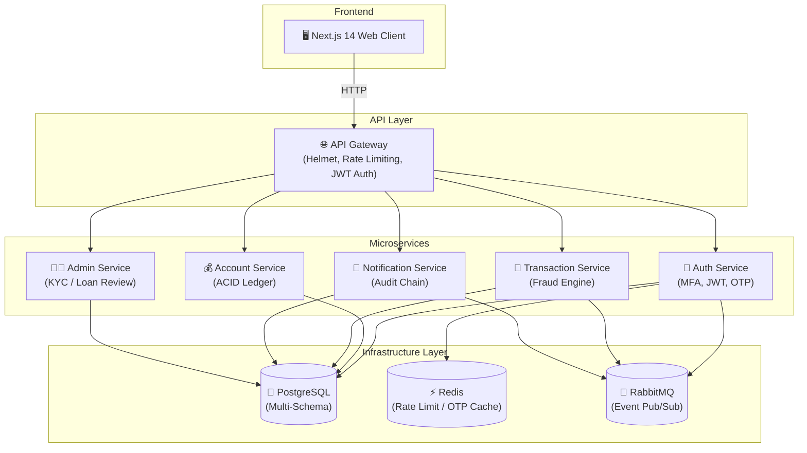

# 🛡️ AegisVault — Secure Digital Banking Platform

[](.github/workflows/ci.yml)
[](docs/architecture/system_architecture_guide.md)
[](docs/learn/03_azure_cloud_and_deployment.md)
[](docs/devops_and_security/security_audit_report.md)

**AegisVault** is a resilient, cloud-native microservice-based digital banking platform created for **Duothon 6.0**, a DevOps hackathon competition organized by the IEEE Student Branch of NSBM Green University. Built with Node.js, Next.js 14, Express, PostgreSQL, Redis, RabbitMQ, and deployed via GitHub Actions to Azure Container Apps, AegisVault showcases modern DevOps pipelines, security hardening, and real-time fraud monitoring.

---

## 🏗️ Microservice Architecture

AegisVault splits banking domains into decoupled microservices communicating asynchronously over RabbitMQ and synchronously over HTTP:



| Microservice            | Port                     | Primary Responsibilities                                                  |
| ----------------------- | ------------------------ | ------------------------------------------------------------------------- |
| **Client**              | `8080` (Internal `3000`) | Next.js 14 App Router, Tailwind CSS frontend                              |
| **API Gateway**         | `3000`                   | Central ingress, Helmet headers, Redis rate-limiting, JWT validation      |
| **Auth Service**        | `3001`                   | User registration, Bcrypt hashing, 6-digit MFA OTP, JWT issuance          |
| **Account Service**     | `3002`                   | Accounts management, atomic ACID money transfers, balance checks          |
| **Transaction Service** | `3003`                   | Transaction ledger, rule-based Real-time Fraud Engine                     |
| **Notification Svc**    | `3004`                   | Email notifications (SMTP), SHA-256 Cryptographic Hash-Chain Audit Engine |
| **Admin Service**       | `3005`                   | KYC approvals, loan processing, account lockout overrides                 |

---

## 🧰 Tech Stack

- **Frontend**: Next.js 14, React 18, Tailwind CSS, Lucide Icons
- **Backend**: Node.js 20 (Alpine Linux containers), Express.js
- **ORM & Database**: Prisma ORM, PostgreSQL 16 (isolated multi-schema design)
- **Caching & Rate Limiting**: Redis 7
- **Message Broker**: RabbitMQ 3.12 (AMQP protocol)
- **Containerization**: Docker, Docker Compose, Multi-stage builds
- **Cloud Infrastructure**: Azure Container Apps (ACA), Azure Container Registry (ACR), Azure Log Analytics
- **CI/CD**: GitHub Actions (change-detection matrix builds, Docker Buildx, parallel deployments)
- **Observability**: Winston JSON logger, Prometheus metrics, Grafana dashboards

---

## 🔐 Key Cybersecurity Features

- **Multi-Factor Authentication (MFA)**: 6-digit CSPRNG OTP generated via `crypto.randomInt()`, hashed with SHA-256 and stored in Redis with 5-minute TTL.
- **Constant-Time Verification**: `crypto.timingSafeEqual()` prevents side-channel timing attacks during OTP and token verification.
- **BCrypt Password Hashing**: Passwords stored using bcrypt with cost factor 12.
- **Account Lockout Protection**: Automatic account freeze after 5 consecutive failed login attempts.
- **Dual-Token JWT Auth**: Short-lived access tokens (15m) + long-lived refresh tokens (7d) stored securely.
- **Real-Time Fraud Engine**: Evaluates transactions against 3 rules (high amount > 500k LKR, velocity > 3 transfers in 10 mins, new recipient > 100k LKR).
- **Cryptographic Audit Trail**: Blockchain-inspired SHA-256 hash-chain linked list for immutable system audit logs.
- **ACID Transfers**: Atomic PostgreSQL transactions preventing double-spending and partial debits.

---

## 🚀 Quick Start (Local Development)

### Prerequisites

- [Docker Desktop](https://www.docker.com/products/docker-desktop/) installed and running
- [Node.js 20+](https://nodejs.org/) (optional for local non-containerized testing)

### Running with Docker Compose

1. **Clone the repository**:

   ```bash
   git clone https://github.com/sandaruns2004/Duothon_6.0_BigBug.git
   cd Duothon_6.0_BigBug
   ```

2. **Start all 10 containers**:

   ```bash
   docker compose up --build
   ```

3. **Access the application**:
   - **Frontend UI**: [http://localhost:8080](http://localhost:8080)
   - **API Gateway**: [http://localhost:3000](http://localhost:3000)
   - **RabbitMQ Dashboard**: [http://localhost:15672](http://localhost:15672) (Credentials: `guest` / `guest`)

4. **Verify Health**:
   ```bash
   curl http://localhost:3000/health
   ```

---

## 📚 Educational Documentation Suite (`docs/learn/`)

AegisVault includes a comprehensive 9-part self-study learning series on DevOps & Cybersecurity based directly on this codebase:

| Module | Title                                                                                   | Topics Covered                                                    |
| ------ | --------------------------------------------------------------------------------------- | ----------------------------------------------------------------- |
| **01** | [CI/CD Pipeline Deep Dive](docs/learn/01_cicd_pipeline_deep_dive.md)                    | GitHub Actions line-by-line, change detection, matrix builds      |
| **02** | [Docker & Containerization](docs/learn/02_docker_and_containerization.md)               | Multi-stage Dockerfiles, compose networking, health checks        |
| **03** | [Azure Cloud & Deployment](docs/learn/03_azure_cloud_and_deployment.md)                 | Azure Container Apps, internal/external ingress, Log Analytics    |
| **04** | [Kubernetes & Terraform](docs/learn/04_kubernetes_and_terraform.md)                     | K8s manifests, IaC, KEDA autoscaling, Envoy proxy                 |
| **05** | [Cybersecurity Features](docs/learn/05_cybersecurity_features_implemented.md)           | Auth chain, Bcrypt, CSPRNG, JWTs, ACID transfers, audit chain     |
| **06** | [Security Vulnerabilities & Fixes](docs/learn/06_security_vulnerabilities_and_fixes.md) | 13 vulnerabilities analyzed with attack vectors & fix diffs       |
| **07** | [DevOps & Security Glossary](docs/learn/07_devops_security_glossary.md)                 | 80+ terms across CI/CD, K8s, cloud, and cryptography              |
| **08** | [Monitoring & Operations](docs/learn/08_monitoring_and_production_operations.md)        | Observability, Winston JSON logs, KQL, Grafana, incident response |
| **09** | [Integration Testing Deep Dive](docs/learn/09_integration_testing_deep_dive.md)         | Supertest + Jest architecture, mock doubles, microservice tests   |

See the complete index in [docs/README.md](docs/README.md).

---

## 📄 License

This repository is maintained for competition and educational purposes.
