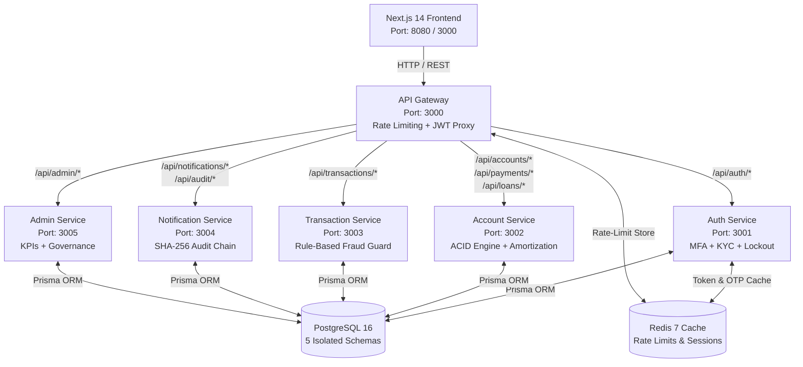

# 🛡️ AegisVault — Secure 5-Microservice Digital Banking Platform
**Duothan 6.0 | Phase 2 Complete Solution Package**

> **🌐 Live Azure Cloud Deployment:**  
> AegisVault is live and hosted on **Microsoft Azure (Azure Container Apps)**! You can evaluate and test the platform directly without any local installation at:  
> **👉 [https://client.mangofield-38522f67.eastus.azurecontainerapps.io/](https://client.mangofield-38522f67.eastus.azurecontainerapps.io/)**

---

## 🌟 Executive Overview
**AegisVault** is an enterprise-grade, highly resilient **5-microservice digital banking platform** built to withstand modern cybersecurity threats while offering high-speed, ACID-compliant financial transactions. Designed with a **Quantum-Resilient Dark-Theme Fintech UI (Next.js 14)** and backed by **PostgreSQL 16, Redis 7, and Node.js/Express Microservices**, AegisVault guarantees zero-trust authentication, immutable cryptographic audit trails, and real-time fraud detection. Hosted on **Microsoft Azure Container Apps** for high availability and cloud scalability.

---

## 🏗️ System Architecture & Service Topology



---

## 📦 1. Prerequisites
To run AegisVault on a clean machine without any local dependencies, ensure you have:
- **Docker Engine** (v24.0+ recommended)
- **Docker Compose** (v2.20+ recommended)
- *(Optional for local development)*: **Node.js 20 LTS** & **npm 10+**

---

## 🚀 2. Quick-Start Guide (Live Cloud Demo or Docker Setup)

### Option A: Instant Live Cloud Evaluation (Azure)
Test the entire 5-microservice banking platform live on Microsoft Azure Container Apps:
- **Live URL**: **[https://client.mangofield-38522f67.eastus.azurecontainerapps.io/](https://client.mangofield-38522f67.eastus.azurecontainerapps.io/)**

---

### Option B: Local Docker Compose Setup
#### Step 1: Clone & Navigate to Workspace
```bash
cd Duothon_6.0_BigBug
```

### Step 2: Launch Platform via Docker Compose
Run the following command to build and orchestrate all 5 microservices, the API Gateway, Next.js frontend, PostgreSQL database, and Redis cache:
```bash
docker compose up --build -d
```

### Step 3: Seed Demo Environment (Evaluator Sandbox)
Populate the database with pre-configured Admin and Customer evaluation accounts, sample transactions, fraud flags, and the initial SHA-256 genesis audit chain:
```bash
npm run seed:demo
```
*(Note: If running entirely within Docker, you can also execute `docker compose exec api-gateway node scripts/seed-demo.js` or run locally with `npm run seed:demo`).*

---

## 🔑 3. Evaluator Sandbox Credentials

> **🌐 Live Azure Cloud Login:** Test immediately without installation at **[https://client.mangofield-38522f67.eastus.azurecontainerapps.io/login](https://client.mangofield-38522f67.eastus.azurecontainerapps.io/login)**

| Account Type | Email Address | Password | Role / Access | Notes |
| :--- | :--- | :--- | :--- | :--- |
| **System Admin** | `admin@aegisvault.com` | `AdminSecure2026!` | `ADMIN` | Access to `/admin` Dashboard, KPI graphs, KYC verification, Fraud Review & SHA-256 Chain Verification |
| **Customer 1** | `customer1@aegisvault.com` | `CustomerSecure2026!` | `CUSTOMER` | Savings Account `#810000000001` (`1,500,000.00 LKR` balance), KYC Verified |
| **Customer 2** | `customer2@aegisvault.com` | `CustomerSecure2026!` | `CUSTOMER` | Current Account `#810000000002` (`750,000.00 LKR` balance), KYC Verified |

> **💡 Evaluator Pro-Tip:** On the `/login` and `/verify-otp` screens, use the **"Sandbox Demo Credentials"** button for instant one-click autofill! The demo OTP code is always `123456` in testing mode.
> **⚡ Just-In-Time (JIT) New User Provisioning:** When testing new user signups (`/register`), logging in automatically creates an isolated **SAVINGS** bank account with a unique 12-digit account number and **500,000.00 LKR** starting balance, ensuring zero demo fallbacks or empty account states!

---

## 🖥️ 4. Application Walkthrough & Key Screens

> **🌐 Live Cloud Walkthrough:** You can evaluate all screens and flows below live on Microsoft Azure Container Apps at **[https://client.mangofield-38522f67.eastus.azurecontainerapps.io/](https://client.mangofield-38522f67.eastus.azurecontainerapps.io/)**

### 🔐 A. Multi-Factor Authentication & Zero-Trust Security (`/login`, `/register`, `/verify-otp`)
- **Sri Lankan NIC Validation**: Registers users with automatic real-time format checks (`9 digits + V/X` or `12 digits`) and an interactive **4-Level Password Strength Meter**.
- **5-Attempt Account Lockout Guard**: Automatically blocks credential brute-forcing after 5 consecutive failed login attempts (`isLocked = true`), returning clear security alert notifications.
- **MFA Login Flow**: Login credentials trigger an immediate 6-digit OTP verification screen with a 60-second countdown timer.

### 🏛️ B. Customer Command Center (`/dashboard`)
- **Account Switcher & Toggleable Balance**: Switch between Savings and Current accounts with a privacy eye toggle (`•••••••• LKR`).
- **Real-Time Activity Ledger**: Displays recent transactions with status chips and visual **🚨 Fraud Guard Flagged** indicators.
- **Dynamic Account Resolution**: Seamlessly displays real account numbers (`810000000001`, `810000000002`, or JIT provisioned accounts) without hardcoded fallback masks.

### 💸 C. ACID Atomic Interbank Transfer (`/transfer`)
- **Dynamic Account Binding**: Initializes `fromAccount` dynamically from the user's active account number, ensuring clean multi-sandbox transfer execution.
- **Pre-Execution Confirmation Modal**: Prompts the customer with an ACID transaction summary (recipient, fee breakdown `0.50% > 100k LKR`, total debit amount) before execution.
- **Printable Success Receipt**: Automatically generates an immutable digital receipt upon transfer completion.

### 📜 D. Cryptographic Transaction History (`/transactions`)
- **Universal Ledger Visibility (Credits & Debits)**: Dynamically resolves all customer account numbers from `account-service` to ensure **100% incoming transaction visibility** (`CREDIT` and `ALL` tabs) for recipients.
- **Synchronous Utility Payment Recording**: All utility bill payments (`CEB`, `Water Board`, `SLT Fiber`, `Dialog 5G`) automatically log into the Cryptographic Transaction Ledger and generate real-time alerts in the navbar notification drawer.
- **Filterable Tabs**: Search and filter by `ALL`, `CREDIT`, `DEBIT`, or `🚨 Fraud Guard Flagged`.
- **Printable SHA-256 Receipts**: Click **"Receipt"** on any transaction to open a print-ready (`window.print()`) modal displaying the SHA-256 audit reference.

### ⚡ E. Utility Bill Pay & Quantum Loan Amortization (`/payments`)
> **🚧 NOTE: Feature Under Development (Beta Status):** The **Quantum Loan Amortization & Financing Module** is currently under active development and is not yet fully functional in production. While KYC prerequisite validation and Admin approval/rejection workflows can be previewed in the sandbox, full end-to-end loan origination and automated EMI deduction processing are still being finalized.
- **Utility Biller Selector**: Pay CEB Electricity, National Water Board, SLT Fiber, or Dialog 5G bills with real-time balance debiting, immediate Ledger logging, and instant notification alerts (`⚡ Bill Paid: LKR ...`).
- **KYC Governance Prerequisite for Financing (🚧 Under Development)**: Inspects the user's real-time identity verification state (`authApi.getMe()`):
  - **Verified (`VERIFIED`)**: Displays a `✅ Eligible for Financing` badge and unlocks the financing application form.
  - **Unverified (`PENDING`, `REJECTED`, or `UNVERIFIED`)**: Displays an interactive security banner explaining that identity verification is required, blocks loan application submission, and provides a one-click button link to **Profile & KYC (`/profile`)** to upload a Sri Lankan NIC or Passport document.
- **Loan Amortization Engine (🚧 Under Development)**: Interactive calculator computing monthly EMI payments, total interest, and amortization schedules across 12 to 60-month terms.

### 🛡️ F. Admin Governance & Cryptographic Hash-Chain Viewer (`/admin`)
- **Real-Time Recharts Analytics**: Interactive Area Chart displaying 24-hour transaction volume and bar graphs for hourly velocity.
- **User Directory & KYC Governance Console**: One-click administrative controls to **Verify** (`VERIFIED`) or **Reject** (`REJECTED`) customer KYC identity documents, **Suspend Account**, or **Unlock Account**, with real-time notification alerts sent to users.
- **Loan Application Review Console (🚧 Under Development)**: Dedicated **Pending Loans** tab allowing admins to preview credit risk review controls and test approving or rejecting loan applications in the development sandbox.
- **Cryptographic SHA-256 Audit Chain Viewer**: Inspect immutable system logs and click **"Verify Hash Chain"** to cryptographically prove that no audit records have been tampered with.

---

## 🔒 5. Key Security & Backend Features Verified

1. **ACID Atomic SQL Transactions (`account-service:3002`)**:
   - Executes transfers inside `BEGIN ... COMMIT` database transactions, guaranteeing zero fund discrepancies or partial debits.
2. **Rule-Based Fraud Velocity & Amount Guard (`transaction-service:3003`)**:
   - **Rule 1 (High Amount)**: Flags any transfer exceeding `500,000.00 LKR`.
   - **Rule 2 (Velocity Guard)**: Detects and flags $> 3$ transfers within 10 minutes.
   - **Rule 3 (New Recipient)**: Flags transfers $> 100,000.00$ LKR to unverified recipients.
3. **Immutable Cryptographic Hash-Chain (`notification-service:3004`)**:
   - Each audit record is linked via `hash = SHA256(previousHash + timestamp + action + userId + details)`. Any manual database tampering breaks the chain signature immediately.
4. **ISO 8583 Clearing Simulation**:
   - Simulates interbank clearing responses for VISA / Mastercard / SWIFT remittances with a 99.9% clearing rate.
5. **KYC Identity Verification & Financing Access Control (🚧 Under Development - `account-service` & `admin-service`)**:
   - Strictly enforces `kyc_status === 'VERIFIED'` in `POST /api/loans/apply`, returning `403 KYC_NOT_VERIFIED` for unverified or rejected accounts and blocking UI submissions.
6. **Universal Ledger & Notification Sync Engine**:
   - Uses multi-URL fallback resolution across microservices (`http://transaction-service:3003` -> `http://127.0.0.1:3003`) to ensure ACID transfers, utility payments, and loan disbursements are immutably logged in `txn_db.transactions` and broadcasted via RabbitMQ and HTTP fallback alerts.

---

## 🛠️ 6. Running Automated Tests & Audit Scripts
To run the full Jest + Supertest automated QA suites:
```bash
# Test Auth Service (Registration, 5-attempt lockout, JWT verification)
cd services/auth-service && npm test

# Test Transaction Service (ACID transfer, insufficient funds rollback, fraud flags)
cd ../transaction-service && npm test
```

### Live End-to-End Workflow Audit Scripts
You can also execute our suite of standalone automated verification scripts from the project root:
```bash
# Verify Utility Bill Payment -> Ledger & Notification synchronization
node scripts/verify-bill-payment-ledger-sync.js

# Verify Incoming Transaction Ledger queries and recipient alerts
node scripts/verify-ledger-notifications.js

# Verify KYC Verification/Rejection & Loan Eligibility/Approval/Rejection lifecycle
node scripts/verify-kyc-loans-workflow.js
```

---
**🌐 Live Azure Cloud Deployment:** [https://client.mangofield-38522f67.eastus.azurecontainerapps.io/](https://client.mangofield-38522f67.eastus.azurecontainerapps.io/)  
*Built with passion and precision for Duothan 6.0.*
