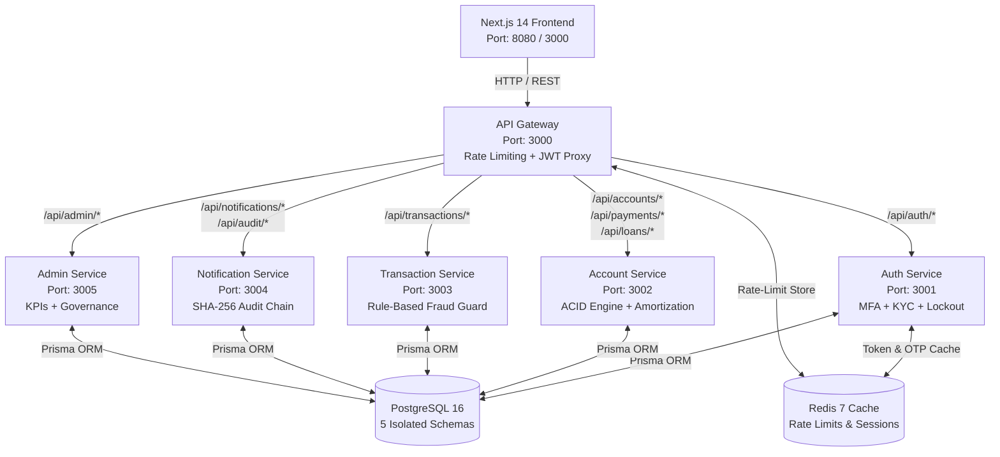

# 🛡️ AegisVault — Secure 5-Microservice Digital Banking Platform
**Duothan 6.0 | Phase 2 Complete Solution Package**

---

## 🌟 Executive Overview
**AegisVault** is an enterprise-grade, highly resilient **5-microservice digital banking platform** built to withstand modern cybersecurity threats while offering high-speed, ACID-compliant financial transactions. Designed with a **Quantum-Resilient Dark-Theme Fintech UI (Next.js 14)** and backed by **PostgreSQL 16, Redis 7, and Node.js/Express Microservices**, AegisVault guarantees zero-trust authentication, immutable cryptographic audit trails, and real-time fraud detection.

---

## 🏗️ System Architecture & Service Topology



---

## 📦 1. Prerequisites
To run AegisVault on a clean machine without any local dependencies, ensure you have:
- **Docker Engine** (v24.0+ recommended)
- **Docker Compose** (v2.20+ recommended)
- *(Optional for local development)*: **Node.js 20 LTS** & **npm 10+**

---

## 🚀 2. Quick-Start Guide (One-Command Docker Setup)

### Step 1: Clone & Navigate to Workspace
```bash
cd Duothon_6.0_BigBug
```

### Step 2: Launch Platform via Docker Compose
Run the following command to build and orchestrate all 5 microservices, the API Gateway, Next.js frontend, PostgreSQL database, and Redis cache:
```bash
docker compose up --build -d
```

### Step 3: Seed Demo Environment (Evaluator Sandbox)
Populate the database with pre-configured Admin and Customer evaluation accounts, sample transactions, fraud flags, and the initial SHA-256 genesis audit chain:
```bash
npm run seed:demo
```
*(Note: If running entirely within Docker, you can also execute `docker compose exec api-gateway node scripts/seed-demo.js` or run locally with `npm run seed:demo`).*

---

## 🔑 3. Evaluator Sandbox Credentials

| Account Type | Email Address | Password | Role / Access | Notes |
| :--- | :--- | :--- | :--- | :--- |
| **System Admin** | `admin@aegisvault.com` | `AdminSecure2026!` | `ADMIN` | Access to `/admin` Dashboard, KPI graphs, KYC verification, Fraud Review & SHA-256 Chain Verification |
| **Customer 1** | `customer1@aegisvault.com` | `CustomerSecure2026!` | `CUSTOMER` | Savings Account `#810000000001` (`1,500,000.00 LKR` balance), KYC Verified |
| **Customer 2** | `customer2@aegisvault.com` | `CustomerSecure2026!` | `CUSTOMER` | Current Account `#810000000002` (`750,000.00 LKR` balance), KYC Verified |

> **💡 Evaluator Pro-Tip:** On the `/login` and `/verify-otp` screens, use the **"Sandbox Demo Credentials"** button for instant one-click autofill! The demo OTP code is always `123456` in testing mode.

---

## 🖥️ 4. Application Walkthrough & Key Screens

### 🔐 A. Multi-Factor Authentication & Zero-Trust Security (`/login`, `/register`, `/verify-otp`)
- **Sri Lankan NIC Validation**: Registers users with automatic real-time format checks (`9 digits + V/X` or `12 digits`) and an interactive **4-Level Password Strength Meter**.
- **5-Attempt Account Lockout Guard**: Automatically blocks credential brute-forcing after 5 consecutive failed login attempts (`isLocked = true`), returning clear security alert notifications.
- **MFA Login Flow**: Login credentials trigger an immediate 6-digit OTP verification screen with a 60-second countdown timer.

### 🏛️ B. Customer Command Center (`/dashboard`)
- **Account Switcher & Toggleable Balance**: Switch between Savings and Current accounts with a privacy eye toggle (`•••••••• LKR`).
- **Real-Time Activity Ledger**: Displays recent transactions with status chips and visual **🚨 Fraud Guard Flagged** indicators.

### 💸 C. ACID Atomic Interbank Transfer (`/transfer`)
- **Pre-Execution Confirmation Modal**: Prompts the customer with an ACID transaction summary (recipient, fee breakdown `0.50% > 100k LKR`, total debit amount) before execution.
- **Printable Success Receipt**: Automatically generates an immutable digital receipt upon transfer completion.

### 📜 D. Cryptographic Transaction History (`/transactions`)
- **Filterable Tabs**: Search and filter by `ALL`, `CREDIT`, `DEBIT`, or `🚨 Fraud Guard Flagged`.
- **Printable SHA-256 Receipts**: Click **"Receipt"** on any transaction to open a print-ready (`window.print()`) modal displaying the SHA-256 audit reference.

### ⚡ E. Utility Bill Pay & Quantum Loan Amortization (`/payments`)
- **Utility Biller Selector**: Pay CEB Electricity, National Water Board, SLT Fiber, or Dialog 5G bills with real-time balance debiting.
- **Loan Amortization Engine**: Interactive calculator computing monthly EMI payments, total interest, and amortization schedules across 12 to 60-month terms.

### 🛡️ F. Admin Governance & Cryptographic Hash-Chain Viewer (`/admin`)
- **Real-Time Recharts Analytics**: Interactive Area Chart displaying 24-hour transaction volume and bar graphs for hourly velocity.
- **User Directory & Governance Console**: One-click actions to **Suspend Account**, **Verify KYC Documents**, or **Unlock Account**.
- **Cryptographic SHA-256 Audit Chain Viewer**: Inspect immutable system logs and click **"Verify Hash Chain"** to cryptographically prove that no audit records have been tampered with.

---

## 🔒 5. Key Security & Backend Features Verified

1. **ACID Atomic SQL Transactions (`account-service:3002`)**:
   - Executes transfers inside `BEGIN ... COMMIT` database transactions, guaranteeing zero fund discrepancies or partial debits.
2. **Rule-Based Fraud Velocity & Amount Guard (`transaction-service:3003`)**:
   - **Rule 1 (High Amount)**: Flags any transfer exceeding `500,000.00 LKR`.
   - **Rule 2 (Velocity Guard)**: Detects and flags $> 3$ transfers within 10 minutes.
   - **Rule 3 (New Recipient)**: Flags transfers $> 100,000.00$ LKR to unverified recipients.
3. **Immutable Cryptographic Hash-Chain (`notification-service:3004`)**:
   - Each audit record is linked via `hash = SHA256(previousHash + timestamp + action + userId + details)`. Any manual database tampering breaks the chain signature immediately.
4. **ISO 8583 Clearing Simulation**:
   - Simulates interbank clearing responses for VISA / Mastercard / SWIFT remittances with a 99.9% clearing rate.

---

## 🛠️ 6. Running Automated Tests
To run the full Jest + Supertest automated QA suites:
```bash
# Test Auth Service (Registration, 5-attempt lockout, JWT verification)
cd services/auth-service && npm test

# Test Transaction Service (ACID transfer, insufficient funds rollback, fraud flags)
cd ../transaction-service && npm test
```

---
*Built with passion and precision for Duothan 6.0.*
