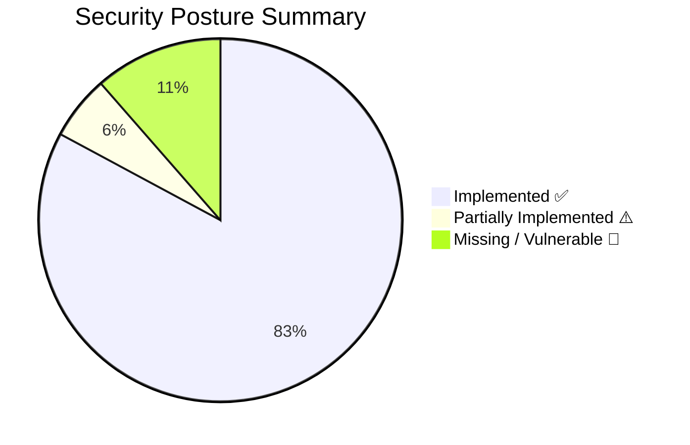

# AegisVault — Phase 3 (FORTIFY) Security Audit Report

> **Full-stack cybersecurity assessment** — What's implemented ✅, what's vulnerable ⚠️, and what to implement next 🔧

---

## Executive Summary

AegisVault has a **solid security foundation** with JWT authentication, MFA, rate limiting, ACID transactions, input validation, and a cryptographic audit trail. However, there are **critical gaps** around secret management, RBAC enforcement on backend services, BOLA/IDOR vulnerabilities, missing HTTPS enforcement, and CI/CD hardening that the judges **will** test in Phase 3.



---

## Table of Contents

1. [Authentication & Identity](#1-authentication--identity)
2. [Authorization (RBAC / BOLA / IDOR)](#2-authorization-rbac--bola--idor)
3. [Input Validation & Injection Defense](#3-input-validation--injection-defense)
4. [API Gateway & Network Security](#4-api-gateway--network-security)
5. [Secret Management](#5-secret-management)
6. [Data Encryption (At Rest & In Transit)](#6-data-encryption-at-rest--in-transit)
7. [Financial Transaction Security](#7-financial-transaction-security)
8. [Fraud Detection & Monitoring](#8-fraud-detection--monitoring)
9. [CI/CD Pipeline Security](#9-cicd-pipeline-security)
10. [Infrastructure & Cloud Security](#10-infrastructure--cloud-security)
11. [Observability & Incident Response](#11-observability--incident-response)
12. [Disaster Recovery & Resilience](#12-disaster-recovery--resilience)
13. [Priority Action Matrix](#13-priority-action-matrix)

---

## 1. Authentication & Identity

### ✅ Already Implemented

| Feature                                     | File(s)                                                                                                                                                                                  | Details                                                                 |
| ------------------------------------------- | ---------------------------------------------------------------------------------------------------------------------------------------------------------------------------------------- | ----------------------------------------------------------------------- |
| **Bcrypt password hashing (cost=12)**       | [auth.controller.js](../services/auth-service/src/controllers/auth.controller.js#L54)       | Industry-standard slow hashing (~250ms per hash). Resists brute-force.  |
| **MFA via OTP (6-digit)**                   | [auth.controller.js](../services/auth-service/src/controllers/auth.controller.js#L160-L188) | Two-step login: password → OTP email. OTP stored as SHA-256 hash.       |
| **Cryptographically secure OTP generation** | [otp.js](../services/auth-service/src/utils/otp.js#L12-L17)                                 | Uses `crypto.randomInt()` — not `Math.random()`.                        |
| **Constant-time OTP comparison**            | [otp.js](../services/auth-service/src/utils/otp.js#L29-L35)                                 | `crypto.timingSafeEqual()` prevents timing attacks on OTP verification. |
| **OTP TTL (5-minute expiry)**               | [auth.controller.js](../services/auth-service/src/controllers/auth.controller.js#L21)       | Redis TTL + DB `expiresAt` check.                                       |
| **Account lockout (5 failed attempts)**     | [auth.controller.js](../services/auth-service/src/controllers/auth.controller.js#L124-L142) | Permanent lock requiring admin unlock. Blocks credential stuffing.      |
| **JWT access tokens (15-min expiry)**       | [auth.controller.js](../services/auth-service/src/controllers/auth.controller.js#L18-L19)   | Short-lived tokens limit window of compromise.                          |
| **JWT refresh tokens (7-day, DB-backed)**   | [auth.controller.js](../services/auth-service/src/controllers/auth.controller.js#L311-L325) | Hashed and stored in DB; enables server-side revocation.                |
| **Refresh token type validation**           | [auth.controller.js](../services/auth-service/src/controllers/auth.controller.js#L371-L376) | Rejects access tokens used as refresh tokens.                           |
| **Silent token refresh (frontend)**         | [api.ts](../client/src/lib/api.ts)                                                          | Axios 401 interceptor queues requests and retries after refresh.        |
| **OTP attempt limiting** | [auth.controller.js](../services/auth-service/src/controllers/auth.controller.js) | Enforces max 5 attempts before invalidating OTP in Redis. |

### ⚠️ Partially Implemented / Vulnerabilities

| Issue                                    | Severity    | Details                                                                                                                                                                                                                                                                                                                                                |
| ---------------------------------------- | ----------- | ------------------------------------------------------------------------------------------------------------------------------------------------------------------------------------------------------------------------------------------------------------------------------------------------------------------------------------------------------ |
| **Demo OTP bypass (`123456`)**           | 🔴 CRITICAL | [auth.controller.js L266-L267](../services/auth-service/src/controllers/auth.controller.js#L266-L267) — Hardcoded OTP `123456` always works for demo accounts. Judges **will** find this. Either remove it or gate it behind `NODE_ENV !== 'production'`. |
| **Same JWT secret for access & refresh** | 🟡 MEDIUM   | Both token types use the same `JWT_SECRET`. Best practice: use separate signing keys so a compromised access token can't be used to forge refresh tokens.                                                                                                                                                                                              |
| **OTP logged in plaintext (non-prod)**   | 🟡 MEDIUM   | [otp.js L42-L48](../services/auth-service/src/utils/otp.js#L42-L48) — Plaintext OTP logged in non-production. Ensure `NODE_ENV=production` is set in Azure.                                                                                               |
| **No refresh token rotation**            | 🟡 MEDIUM   | Reusing the same refresh token for its entire 7-day lifetime is risky. Implement single-use rotation: issue a new refresh token on each refresh, invalidate the old one.                                                                                                                                                                               |

---

## 2. Authorization (RBAC / BOLA / IDOR)

### ✅ Already Implemented

| Feature                        | File(s)                                                                                                                                                      | Details                                                                                               |
| ------------------------------ | ------------------------------------------------------------------------------------------------------------------------------------------------------------ | ----------------------------------------------------------------------------------------------------- |
| **Gateway-level JWT auth**     | [jwtAuth.js](../services/api-gateway/src/middleware/jwtAuth.js) | All non-public routes require valid JWT. User identity headers (`x-user-id`, `x-user-role`) injected. |
| **Frontend route guards**      | [middleware.ts](../client/src/middleware.ts)                    | Customers can't access `/admin`, admins redirected from customer routes.                              |
| **Authenticated user scoping** | Multiple controllers                                                                                                                                         | `getAuthenticatedUserId(req)` extracts user from `x-user-id` header for DB queries.                   |
| **Backend RBAC middleware** | `rbac.middleware.js` | Enforces ADMIN/OFFICER roles natively on backend services. |
| **Account ownership checks (IDOR protection)** | `account.controller.js`, `transaction.controller.js` | Validates `x-user-id` against requested account/transaction owner. |
| **Role escalation prevention** | `auth.controller.js` | Hardcodes CUSTOMER role on registration. |
| **Internal endpoint protection** | `api-gateway/index.js` | API Gateway blocks external access to `/internal/*` routes. |

### 🔴 Missing / Critical Vulnerabilities

*All critical authorization vulnerabilities (IDOR, BOLA, Privilege Escalation, Internal Endpoint Exposure) have been resolved.*

### 🔧 Required Fixes

```javascript
// 1. RBAC middleware for all services
const requireRole =
  (...allowedRoles) =>
  (req, res, next) => {
    const role = req.headers["x-user-role"];
    if (!role || !allowedRoles.includes(role.toUpperCase())) {
      return res
        .status(403)
        .json({ success: false, error: "Insufficient permissions." });
    }
    next();
  };

// Usage in admin routes:
router.get(
  "/dashboard",
  requireRole("ADMIN", "OFFICER"),
  adminController.getDashboard,
);

// 2. Account ownership check
const requireAccountOwnership = async (req, res, next) => {
  const userId = req.headers["x-user-id"];
  const accountId = req.params.id || req.body.fromAccountId;
  const account = await prisma.account.findFirst({
    where: { id: accountId, userId },
  });
  if (!account) return res.status(403).json({ error: "Access denied." });
  next();
};

// 3. Force role to CUSTOMER on registration
role: "CUSTOMER"; // Hardcode, don't accept from request body
```

---

## 3. Input Validation & Injection Defense

### ✅ Already Implemented

| Feature                                | File(s)                                                                                                                                                                                                     | Details                                                                                     |
| -------------------------------------- | ----------------------------------------------------------------------------------------------------------------------------------------------------------------------------------------------------------- | ------------------------------------------------------------------------------------------- |
| **Zod schema validation**              | [validation.js](../services/auth-service/src/utils/validation.js)                                              | Auth service validates register, login, OTP, and profile update schemas.                    |
| **Strong password policy**             | [validation.js L7](../services/auth-service/src/utils/validation.js#L7)                                        | Min 8 chars, uppercase + lowercase + number + special char.                                 |
| **Prisma ORM (parameterized queries)** | All services                                                                                                                                                                                                | Prisma generates parameterized SQL, **preventing SQL injection** on all standard ORM calls. |
| **Numeric amount validation**          | [account.controller.js L166-L171](../services/account-service/src/controllers/account.controller.js#L166-L171) | `isNaN()` and `<= 0` checks prevent negative/NaN transfers.                                 |
| **JSON body size limit (10MB)**        | [index.js L32-L33](../services/api-gateway/src/index.js#L32-L33)                                               | Prevents payload bomb attacks.                                                              |
| **Strict SQLi protection** | `loan.controller.js` | Replaced `$queryRawUnsafe` with parameterized `$queryRaw` template literal. |
| **Comprehensive Zod Validation** | `account.routes.js`, `validation.js` | Financial endpoints now protected by robust Zod schemas. |

### 🔴 Missing / Vulnerabilities

| Issue                                                 | Severity    | Details                                                                                                                                                                                                                                                                                                                                                                                                                  |
| ----------------------------------------------------- | ----------- | ------------------------------------------------------------------------------------------------------------------------------------------------------------------------------------------------------------------------------------------------------------------------------------------------------------------------------------------------------------------------------------------------------------------------ |
| **No XSS sanitization**                               | 🟡 MEDIUM   | Description fields in transfers and loans are stored and returned without sanitization. While the frontend uses React (auto-escapes JSX), any API-direct consumer is vulnerable. Add `xss` or `DOMPurify` sanitization.                                                                                                                                                                                                  |
| **No maximum transfer amount**                        | 🟡 MEDIUM   | There's no configurable upper bound on transfer amounts. While the fraud engine flags amounts >500K LKR, it doesn't block them. Add configurable max limits.                                                                                                                                                                                                                                                             |

---

## 4. API Gateway & Network Security

### ✅ Already Implemented

| Feature                                | File(s)                                                                                                                                                                  | Details                                                                                       |
| -------------------------------------- | ------------------------------------------------------------------------------------------------------------------------------------------------------------------------ | --------------------------------------------------------------------------------------------- |
| **Helmet.js security headers**         | [index.js L26](../services/api-gateway/src/index.js#L26)                    | Sets `X-Frame-Options`, `X-Content-Type-Options`, `Strict-Transport-Security`, CSP, and more. |
| **Rate limiting (Redis-backed)**       | [rateLimiter.js](../services/api-gateway/src/middleware/rateLimiter.js)     | Public: 20 req/min per IP. Authenticated: 100 req/min per user. Graceful in-memory fallback.  |
| **CORS configured**                    | [index.js L19-L24](../services/api-gateway/src/index.js#L19-L24)            | `credentials: true`, configurable origin.                                                     |
| **Centralized proxy pattern**          | [proxy.js](../services/api-gateway/src/middleware/proxy.js)                 | Microservices never exposed directly to clients.                                              |
| **503 graceful error on service down** | [proxy.js L50-L56](../services/api-gateway/src/middleware/proxy.js#L50-L56) | Returns structured JSON error instead of crashing.                                            |
| **Strict CORS Origin** | `cd.yml` and `api-gateway` | CORS_ORIGIN is dynamically set to the deployed client frontend domain. |

### 🔴 Missing / Vulnerabilities

| Issue                                | Severity    | Details                                                                                                                                                                                                                                                                                               |
| ------------------------------------ | ----------- | ----------------------------------------------------------------------------------------------------------------------------------------------------------------------------------------------------------------------------------------------------------------------------------------------------- |
| **Proxy `secure: false`**            | 🟡 MEDIUM   | [proxy.js L23](../services/api-gateway/src/middleware/proxy.js#L23) — Disables SSL verification for internal proxying. Fine for internal traffic, but should be `true` if services use HTTPS internally. |
| **No HTTPS redirection**             | 🟡 MEDIUM   | No middleware to redirect HTTP → HTTPS. Azure Container Apps may handle TLS termination, but the app should enforce HTTPS explicitly.                                                                                                                                                                 |
| **Helmet in gateway only**           | 🟡 MEDIUM   | Only `api-gateway` and `transaction-service` use Helmet. Other services (auth, account, notification, admin) should also include it for defense-in-depth.                                                                                                                                             |
| **Rate limit too generous for auth** | 🟡 LOW      | 20 req/min for `/api/auth/*` may allow credential stuffing at scale. Consider 5 req/min for login/OTP endpoints specifically.                                                                                                                                                                         |

---

## 5. Secret Management

### ✅ Already Implemented

| Feature                    | Details                                                                                                                                                                                                                    |
| -------------------------- | -------------------------------------------------------------------------------------------------------------------------------------------------------------------------------------------------------------------------- |
| **`.env` in `.gitignore`** | [.gitignore L36-L41](../.gitignore#L36-L41) — `.env`, `.env.local`, etc. are excluded from git.                               |
| **GitHub Secrets for CD**  | [cd.yml](../.github/workflows/cd.yml) — Uses `${{ secrets.REGISTRY_LOGIN_SERVER }}`, `${{ secrets.AZURE_CREDENTIALS }}`, etc. |

### 🔴 Missing / Critical Vulnerabilities

| Issue                                       | Severity    | Details                                                                                                                                                                                                                                                                                                                                                                                                                                                                                         |
| ------------------------------------------- | ----------- | ----------------------------------------------------------------------------------------------------------------------------------------------------------------------------------------------------------------------------------------------------------------------------------------------------------------------------------------------------------------------------------------------------------------------------------------------------------------------------------------------- |
| **`.env` file committed with real secrets** | 🔴 CRITICAL | The [.env](../.env) file contains **real SMTP credentials** (`re_xxxxxxxxxxxxxxxxxxxxxxxxxxxxxxxx`), database passwords, and JWT secret. Even though `.env` is in `.gitignore`, if it was ever committed, it's in git history. Run `git log --all --full-history -- .env` to check.                                                                                                               |
| **Hardcoded JWT secret fallback**           | 🔴 CRITICAL | [jwtAuth.js L9](../services/api-gateway/src/middleware/jwtAuth.js#L9), [auth.controller.js L17](../services/auth-service/src/controllers/auth.controller.js#L17) — `'aegisvault-super-secret-jwt-key-2026'` is in source code. If `JWT_SECRET` env var is missing, this predictable fallback is used. |
| **Hardcoded DB password fallback in CD**    | 🔴 CRITICAL | [cd.yml L146](../.github/workflows/cd.yml#L146) — `if [ -z "$DB_PASSWORD" ]; then DB_PASSWORD="securep%40ss123"; fi` — Fallback plaintext password in pipeline code (visible in git).                                                                                                                                                                                                              |
| **Hardcoded JWT secret fallback in CD**     | 🔴 CRITICAL | [cd.yml L143](../.github/workflows/cd.yml#L143) — Same as above for JWT secret.                                                                                                                                                                                                                                                                                                                    |
| **Hardcoded JWT secret in CI tests**        | 🟡 MEDIUM   | [ci.yml L29](../.github/workflows/ci.yml#L29) — JWT secret exposed in CI workflow file.                                                                                                                                                                                                                                                                                                            |
| **RabbitMQ default credentials**            | 🟡 MEDIUM   | [provision.azcli L66](../infrastructure/provision.azcli#L66) — `RABBITMQ_DEFAULT_USER=guest RABBITMQ_DEFAULT_PASS=guest`. Default creds in production.                                                                                                                                                                                                                                             |
| **No Azure Key Vault integration**          | 🟡 MEDIUM   | Judges specifically evaluate "Secret Management: Utilizing secure vaults (e.g., Azure Key Vault)". Currently all secrets are env vars or hardcoded.                                                                                                                                                                                                                                                                                                                                             |
| **Redis has no auth password**              | 🟡 MEDIUM   | [docker-compose.yml L63](../docker-compose.yml#L63) — `redis://redis:6379` with no `requirepass`.                                                                                                                                                                                                                                                                                                  |

---

## 6. Data Encryption (At Rest & In Transit)

### ✅ Already Implemented

| Feature                                     | Details                                                                                                                                                                                               |
| ------------------------------------------- | ----------------------------------------------------------------------------------------------------------------------------------------------------------------------------------------------------- |
| **Passwords hashed with bcrypt**            | Never stored in plaintext. Cost factor 12.                                                                                                                                                            |
| **OTPs hashed with SHA-256**                | Never cached or stored in plaintext.                                                                                                                                                                  |
| **Refresh tokens hashed before DB storage** | Hashed via SHA-256 before persistence.                                                                                                                                                                |
| **SMTP uses TLS (port 465)**                | [mailer.js L21](../services/notification-service/src/utils/mailer.js#L21) — `secure: SMTP_PORT === 465`. |
| **Azure Container Apps HTTPS ingress**      | External services (api-gateway, client) get HTTPS URLs from Azure.                                                                                                                                    |
| **Encrypted Database Connections** | `cd.yml` | PostgreSQL connections strictly enforce `sslmode=require`. |

### 🔴 Missing

| Issue                                       | Severity  | Details                                                                                                                                                                                                                             |
| ------------------------------------------- | --------- | ----------------------------------------------------------------------------------------------------------------------------------------------------------------------------------------------------------------------------------- |
| **No database encryption at rest**          | 🟡 MEDIUM | PostgreSQL container uses default Alpine image with no encryption. In Azure, use Azure Database for PostgreSQL which provides automatic encryption at rest.                                                                         |
| **Internal inter-service HTTP (not HTTPS)** | 🟡 MEDIUM | All microservices communicate over plain HTTP internally (`http://account-service:3002`). Azure Container Apps internal ingress supports HTTPS — enable it.                                                                         |
| **No field-level encryption for PII**       | 🟡 MEDIUM | NIC numbers, phone numbers, and email addresses are stored in plaintext. Consider encrypting PII columns with AES-256.                                                                                                              |

---

## 7. Financial Transaction Security

### ✅ Already Implemented

| Feature                                       | File(s)                                                                                                                                                                                                             | Details                                                           |
| --------------------------------------------- | ------------------------------------------------------------------------------------------------------------------------------------------------------------------------------------------------------------------- | ----------------------------------------------------------------- |
| **ACID transactions (Prisma `$transaction`)** | [account.controller.js L174-L257](../services/account-service/src/controllers/account.controller.js#L174-L257)         | Atomic BEGIN → Debit → Credit → COMMIT. Auto-rollback on failure. |
| **Insufficient funds check**                  | [account.controller.js L198-L203](../services/account-service/src/controllers/account.controller.js#L198-L203)         | Balance verified inside transaction before debit.                 |
| **Self-transfer prevention**                  | [account.controller.js L227-L231](../services/account-service/src/controllers/account.controller.js#L227-L231)         | `sender.id === receiver.id` check.                                |
| **Account status checks (ACTIVE/FROZEN)**     | [account.controller.js L191-L195](../services/account-service/src/controllers/account.controller.js#L191-L195)         | Transfers rejected if either account is not ACTIVE.               |
| **Negative/zero amount rejection**            | Multiple controllers                                                                                                                                                                                                | `isNaN(amount)                                                    |     | amount <= 0` checks. |
| **Unique reference numbers**                  | [transaction.controller.js L53-L57](../services/transaction-service/src/controllers/transaction.controller.js#L53-L57) | Cryptographic random bytes in reference IDs.                      |
| **ISO 8583 clearing simulation**              | [iso8583.js](../services/transaction-service/src/utils/iso8583.js)                                                     | Realistic VISA/SWIFT interbank message simulation.                |

### ⚠️ Potential Vulnerabilities

| Issue                                        | Severity  | Details                                                                                                                                                                                                                                                                             |
| -------------------------------------------- | --------- | ----------------------------------------------------------------------------------------------------------------------------------------------------------------------------------------------------------------------------------------------------------------------------------- |
| **No `SELECT FOR UPDATE` row locking**       | 🟡 MEDIUM | Prisma's `$transaction` uses interactive transactions but `findFirst` inside doesn't use `FOR UPDATE`. Under extreme concurrent load, race conditions are theoretically possible (double-spend). Consider using `prisma.$queryRaw('SELECT ... FOR UPDATE')` inside the transaction. |
| **Decimal precision (floating-point)**       | 🟡 MEDIUM | The Prisma schema uses `Decimal(15,2)` which is correct, but JavaScript `Number()` conversion on balances may introduce floating-point artifacts. The `toFixed(2)` in the amortization schedule is good practice, but verify all paths.                                             |
| **Transfer orchestration is not idempotent** | 🟡 MEDIUM | If the Transaction Service crashes after Account Service executes the transfer but before the transaction record is saved, the money moves but no record is created. Consider implementing idempotency keys.                                                                        |

---

## 8. Fraud Detection & Monitoring

### ✅ Already Implemented

| Feature                               | File(s)                                                                                                                                                                                                                 | Details                                                                                    |
| ------------------------------------- | ----------------------------------------------------------------------------------------------------------------------------------------------------------------------------------------------------------------------- | ------------------------------------------------------------------------------------------ |
| **3-rule fraud engine**               | [fraudEngine.js](../services/transaction-service/src/utils/fraudEngine.js)                                                 | High amount (>500K), high velocity (>3 in 10min), new recipient large transfer (>100K).    |
| **Risk scoring**                      | [fraudEngine.js L64](../services/transaction-service/src/utils/fraudEngine.js#L64)                                         | Cumulative risk score across rules.                                                        |
| **Fraud alerts persisted in DB**      | [transaction.controller.js L158-L169](../services/transaction-service/src/controllers/transaction.controller.js#L158-L169) | Individual rule triggers stored with transaction ID.                                       |
| **Admin fraud alert dashboard**       | [admin.controller.js L326-L385](../services/admin-service/src/controllers/admin.controller.js#L326-L385)                   | Searchable, filterable fraud alert viewer.                                                 |
| **Fail-safe design**                  | [fraudEngine.js L82-L90](../services/transaction-service/src/utils/fraudEngine.js#L82-L90)                                 | Engine errors return `isFlagged: false` — never blocks transactions due to engine failure. |
| **SHA-256 cryptographic audit trail** | [auditEngine.js](../services/notification-service/src/utils/auditEngine.js)                                                | Blockchain-like hash chain: each record links to the previous via SHA-256.                 |
| **Chain integrity verification**      | [auditEngine.js L72-L118](../services/notification-service/src/utils/auditEngine.js#L72-L118)                              | Mathematical verification that no records have been tampered with.                         |

---

## 9. CI/CD Pipeline Security

### ✅ Already Implemented

| Feature                              | File(s)                                                                                                                                            | Details                                                                  |
| ------------------------------------ | -------------------------------------------------------------------------------------------------------------------------------------------------- | ------------------------------------------------------------------------ |
| **Automated tests in CI**            | [ci.yml](../.github/workflows/ci.yml)                 | Jest unit tests for auth + transaction service.                          |
| **Frontend build check**             | [ci.yml L43-L59](../.github/workflows/ci.yml#L43-L59) | Next.js build validation.                                                |
| **Docker compose config validation** | [ci.yml L61-L74](../.github/workflows/ci.yml#L61-L74) | Validates and dry-builds compose config.                                 |
| **Change detection in CD**           | [cd.yml L13-L38](../.github/workflows/cd.yml#L13-L38) | Only rebuilds/redeploys changed services.                                |
| **Git SHA tagging**                  | [cd.yml L100](../.github/workflows/cd.yml#L100)       | Images tagged with commit SHA for traceability.                          |
| **High-Severity Vulnerability Scanning** | `ci.yml` | Pipeline runs `npm audit --audit-level=high` to catch supply chain attacks early. |

### 🔴 Missing / Needs Improvement

| Issue                                 | Severity  | Details                                                                                                                                                                                                   |
| ------------------------------------- | --------- | --------------------------------------------------------------------------------------------------------------------------------------------------------------------------------------------------------- |
| **No Docker image scanning**          | 🟡 MEDIUM | Add `trivy` or `aqua security` scanning to scan built images for CVEs before pushing to ACR.                                                                                                              |
| **No branch protection / PR reviews** | 🟡 MEDIUM | CD triggers on direct push to `main`/`master`. Add branch protection rules and required PR reviews.                                                                                                       |
| **No rollback mechanism**             | 🟡 MEDIUM | Judges test "Rollbacks: Reverting to previous stable releases after a bad commit." Add a workflow or script to redeploy the previous `latest` tag. Azure Container Apps supports revision-based rollback. |
| **No staging environment**            | 🟡 LOW    | Judges test "Configuration Drift: Resolving environment variable discrepancies between staging and production." Consider a staging deployment.                                                            |

---

## 10. Infrastructure & Cloud Security

### ✅ Already Implemented

| Feature                          | Details                                                                                                                                                                                                                                               |
| -------------------------------- | ----------------------------------------------------------------------------------------------------------------------------------------------------------------------------------------------------------------------------------------------------- |
| **Azure Container Apps**         | Serverless containers with built-in TLS termination, auto-scaling, and managed ingress.                                                                                                                                                               |
| **Internal vs External ingress** | [provision.azcli L48-L71](../infrastructure/provision.azcli#L48-L71) — Microservices use `internal` ingress; only api-gateway and client are `external`. |
| **Docker health checks**         | [docker-compose.yml L17-L50](../docker-compose.yml#L17-L50) — `pg_isready`, `redis-cli ping`, `rabbitmq-diagnostics ping`.                               |
| **Dependency-ordered startup**   | [docker-compose.yml](../docker-compose.yml) — `depends_on` with `condition: service_healthy`.                                                            |
| **Container restart policy**     | `restart: always` on all services.                                                                                                                                                                                                                    |
| **Database schema isolation**    | 5 separate PostgreSQL schemas for data isolation between microservices.                                                                                                                                                                               |

### 🔴 Missing / Needs Improvement

| Issue                                | Severity  | Details                                                                                                                                                                                                                                                                                                                                   |
| ------------------------------------ | --------- | ----------------------------------------------------------------------------------------------------------------------------------------------------------------------------------------------------------------------------------------------------------------------------------------------------------------------------------------- |
| **Containers run as root**           | 🟡 MEDIUM | The service Dockerfiles don't include `USER node` or equivalent non-root user directive. [Dockerfile.template](../Dockerfile.template) shows a template with `USER node`, but individual service Dockerfiles may not use it. Verify and fix. |
| **No resource limits on containers** | 🟡 MEDIUM | [docker-compose.yml](../docker-compose.yml) has no `mem_limit` or `cpus` constraints. A single service can exhaust the host.                                                                                                                 |
| **Exposed infrastructure ports**     | 🟡 MEDIUM | PostgreSQL (:5433), Redis (:6379), RabbitMQ (:5672, :15672) are all exposed to the host in docker-compose. These should only be accessible within the Docker network in production.                                                                                                                                                       |
| **No database connection pooling**   | 🟡 MEDIUM | Judges test "Database Exhaustion: Simulating high concurrent connections." Prisma uses connection pooling by default, but the pool size and limits should be configured for production load.                                                                                                                                              |
| **Auto-scaling not configured**      | 🟡 LOW    | [provision.azcli L44](../infrastructure/provision.azcli#L44) — `--max-replicas 1`. No auto-scaling for load spikes.                                                                                                                          |

---

## 11. Observability & Incident Response

### ✅ Already Implemented

| Feature                               | File(s)                                                                                                                                                                                           | Details                                                              |
| ------------------------------------- | ------------------------------------------------------------------------------------------------------------------------------------------------------------------------------------------------- | -------------------------------------------------------------------- |
| **Structured JSON logging (Winston)** | All services' `config/logger.js`                                                                                                                                                                  | Timestamped, severity-coded, structured logs.                        |
| **HTTP request logging**              | [logger.js](../services/api-gateway/src/config/logger.js)                                            | Every request logged with method, path, status, duration, user ID.   |
| **Health check endpoints**            | All services                                                                                                                                                                                      | `/health` returns service status and uptime.                         |
| **Admin dashboard with live metrics** | [admin.controller.js L18-L78](../services/admin-service/src/controllers/admin.controller.js#L18-L78) | Real-time user count, KYC pending, transaction count, flagged count. |
| **System metric snapshots**           | [admin.controller.js L44-L56](../services/admin-service/src/controllers/admin.controller.js#L44-L56) | Historical metric snapshots stored in `system_metrics` table.        |

### 🔴 Missing

| Issue                              | Severity  | Details                                                                                                                                                |
| ---------------------------------- | --------- | ------------------------------------------------------------------------------------------------------------------------------------------------------ |
| **No centralized log aggregation** | 🟡 MEDIUM | Judges evaluate "Live Telemetry: centralized HTTP logs." Logs are per-container only. Consider Azure Log Analytics / Application Insights integration. |
| **No distributed tracing**         | 🟡 MEDIUM | No request correlation IDs across microservices. Add a `x-request-id` or `x-correlation-id` header at the gateway and propagate it.                    |
| **No APM / performance metrics**   | 🟡 MEDIUM | No response time percentiles, error rate dashboards, or alerting. Azure Application Insights would provide this.                                       |
| **No alerting on security events** | 🟡 LOW    | Failed login spikes, account lockouts, and fraud flags should trigger real-time alerts (email/webhook).                                                |

---

## 12. Disaster Recovery & Resilience

### ✅ Already Implemented

| Feature                          | Details                                                           |
| -------------------------------- | ----------------------------------------------------------------- |
| **Redis graceful fallback**      | Rate limiter falls back to in-memory; OTP falls back to DB query. |
| **RabbitMQ graceful fallback**   | OTP email falls back to HTTP direct call to notification service. |
| **Persistent RabbitMQ messages** | Messages survive RabbitMQ restart.                                |
| **Docker volume for PostgreSQL** | `pgdata` volume survives container restarts.                      |
| **Container auto-restart**       | `restart: always` policy.                                         |

### 🔴 Missing

| Issue                                         | Severity  | Details                                                                                                                                                   |
| --------------------------------------------- | --------- | --------------------------------------------------------------------------------------------------------------------------------------------------------- |
| **No database backup strategy**               | 🟡 MEDIUM | No `pg_dump` cron job, no Azure Backup, no point-in-time recovery configured.                                                                             |
| **No multi-replica deployment**               | 🟡 MEDIUM | All services have `max-replicas: 1`. No high availability. A single container failure = downtime.                                                         |
| **No circuit breaker pattern**                | 🟡 MEDIUM | If Account Service is down, Transaction Service will timeout and fail on every request. Consider implementing circuit breakers (e.g., `opossum` library). |
| **No health check liveness/readiness probes** | 🟡 LOW    | Azure Container Apps supports probes, but they aren't configured in the provisioning script.                                                              |

---

## 13. Priority Action Matrix

> Sorted by **competition impact** × **effort to implement**.

### 🔴 Phase 1 — Fix Before Competition (Critical, High Impact)

| #   | Action                                          | Effort | Impact                           | Files to Change                                                                                                                                                                           |
| --- | ----------------------------------------------- | ------ | -------------------------------- | ----------------------------------------------------------------------------------------------------------------------------------------------------------------------------------------- |
| 1   | **Add RBAC middleware to all backend services** | 2-3h   | 🔴 Blocks BOLA attack            | All service routes                                                                                                                                                                        |
| 2   | **Hardcode `role: 'CUSTOMER'` on registration** | 5min   | 🔴 Prevents privilege escalation | [auth.controller.js L62](../services/auth-service/src/controllers/auth.controller.js#L62)    |
| 3   | **Add account ownership checks**                | 1-2h   | 🔴 Blocks IDOR attacks           | account.controller.js, transaction.controller.js                                                                                                                                          |
| 4   | **Gate demo OTP bypass behind `NODE_ENV`**      | 5min   | 🔴 Prevents OTP bypass in prod   | [auth.controller.js L267](../services/auth-service/src/controllers/auth.controller.js#L267)  |
| 5   | **Remove hardcoded secret fallbacks**           | 30min  | 🔴 Prevents secret leakage       | jwtAuth.js, auth.controller.js, cd.yml                                                                                                                                                    |
| 6   | **Set `CORS_ORIGIN` to actual domain**          | 5min   | 🔴 Blocks cross-origin attacks   | API gateway env config                                                                                                                                                                    |
| 7   | **Fix `$queryRawUnsafe` usage**                 | 15min  | 🟡 Removes SQL injection flag    | [loan.controller.js L86](../services/account-service/src/controllers/loan.controller.js#L86) |
| 8   | **Enable `sslmode=require` on DB connections**  | 10min  | 🟡 Encrypts DB traffic           | cd.yml env vars                                                                                                                                                                           |

### 🟡 Phase 2 — Strengthen (Medium Impact, Moderate Effort)

| #   | Action                                               | Effort | Impact                        |
| --- | ---------------------------------------------------- | ------ | ----------------------------- |
| 9   | Add vulnerability scanning to CI (npm audit / trivy) | 1h     | Pipeline security score       |
| 10  | Integrate Azure Key Vault for secrets                | 2-3h   | Secret management score       |
| 11  | Add request correlation IDs (`x-request-id`)         | 1h     | Observability score           |
| 12  | Add OTP brute-force limiting (max 5 attempts)        | 30min  | Auth hardening                |
| 13  | Restrict internal endpoints with middleware          | 1h     | Blocks internal API abuse     |
| 14  | Add Zod validation to transaction/account services   | 2h     | Input validation completeness |
| 15  | Configure Azure Container Apps auto-scaling          | 1h     | Scalability score             |
| 16  | Add rollback mechanism (CD workflow)                 | 1-2h   | CD/pipeline score             |

### 🟢 Phase 3 — Polish (Nice to Have)

| #   | Action                                           | Effort |
| --- | ------------------------------------------------ | ------ |
| 17  | Add Azure Application Insights for APM           | 2-3h   |
| 18  | Implement refresh token rotation                 | 1h     |
| 19  | Add circuit breaker pattern (opossum)            | 2h     |
| 20  | Configure database backup automation             | 1-2h   |
| 21  | Add `SELECT FOR UPDATE` for stricter row locking | 1h     |
| 22  | Field-level PII encryption (AES-256)             | 3-4h   |
| 23  | Run containers as non-root user                  | 30min  |

---

> [!IMPORTANT]
> **Items #1–#6 are the absolute minimum** before the live judging session. The BOLA/IDOR vulnerabilities (no RBAC, no ownership checks) and the self-assignable admin role are the most likely attack vectors judges will test first.
