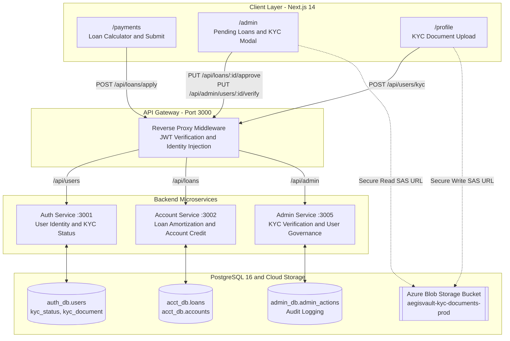
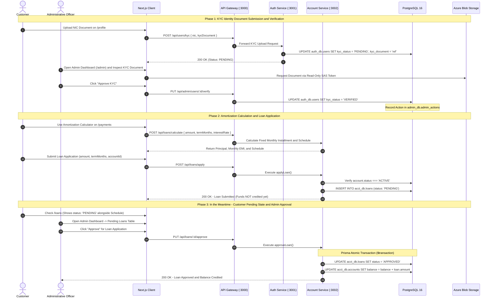
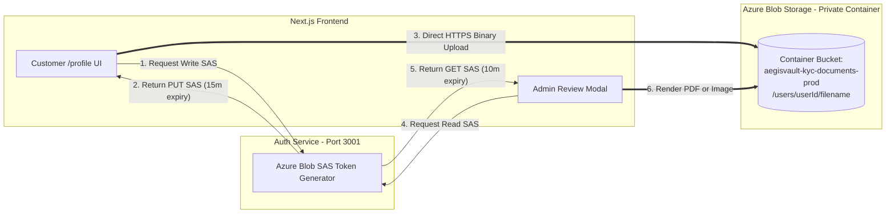
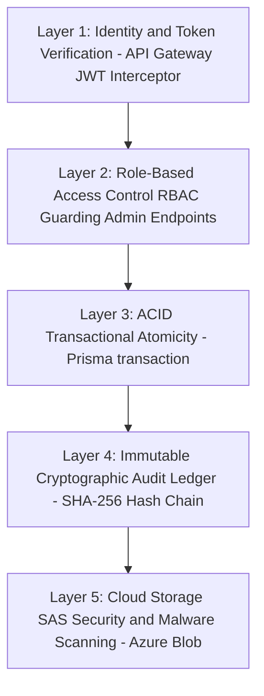

# 🏦 AegisVault Loans, Amortization & KYC Governance — Technical Blueprint & Architecture Guide

This comprehensive technical reference document details the architectural design, implementation workflows, database schemas, security layers, cloud storage integrations, and administrative governance for **Loan Applications, Amortization Calculation, Know Your Customer (KYC) Identity Verification, and Administrative Approvals** within the **AegisVault 5-Microservice Platform**.

---

## 🏗️ 1. Architecture & Microservice Responsibility Mapping

The AegisVault platform separates financial calculations, account balances, user identities, and administrative governance across decoupled microservices communicating through an **API Gateway** with isolated PostgreSQL schemas.



### Component Responsibility Table

| Component | Port / Layer | Primary Role in Loans & KYC |
| :--- | :--- | :--- |
| **Next.js Frontend** | Client UI | Provides the interactive Amortization Calculator, Loan Application Form (`client/src/app/payments/page.tsx`), KYC file upload dropzone (`client/src/app/profile/page.tsx`), and Admin KYC/Loan Review Dashboard (`client/src/app/admin/page.tsx`). |
| **API Gateway** | `3000` | Routes `/api/loans/*` to Account Service and `/api/admin/*` to Admin Service. Injects `x-user-id`, `x-user-role`, and `x-user-email` headers after verifying JWT access tokens. |
| **Account Service** | `3002` | Executes loan amortization math, stores loan applications in `acct_db.loans`, manages `PENDING` to `APPROVED` transitions, credits account balances atomically, and processes EMI repayments. |
| **Auth Service** | `3001` | Manages `auth_db.users` records, including national identity (`nic`), `kyc_status` (`PENDING`, `VERIFIED`, `REJECTED`), and `kyc_document` references. |
| **Admin Service** | `3005` | Provides administrative endpoints for user governance, KYC document approval (`PUT /api/admin/users/:id/verify`), and writes immutable logs to `admin_db.admin_actions`. |
| **Azure Blob Storage** | Cloud Storage | Recommended enterprise storage bucket container (`aegisvault-kyc-documents-prod`) for secure, immutable retention of customer KYC identity files using Shared Access Signature (SAS) tokens. |

---

## 🔄 2. Complete Loan & KYC End-to-End Orchestration Workflow

The following sequence diagram illustrates the lifecycle of a customer verifying their KYC identity, applying for a loan, waiting in `PENDING` status, and receiving funds upon Administrative approval.



---

## 🧮 3. Loan Amortization Calculator & Application Engine

### Mathematical Amortization Formula
AegisVault calculates fixed monthly installment payments (Equated Monthly Installment — **EMI**) using the standard compounding amortization formula:

$$M = P \times \frac{r(1+r)^n}{(1+r)^n - 1}$$

Where:
* **$M$**: Fixed Equated Monthly Installment (EMI).
* **$P$**: Principal Loan Amount (LKR).
* **$r$**: Monthly Interest Rate expressed as a decimal ($r = \frac{\text{Annual Rate}}{12 \times 100}$).
* **$n$**: Loan Tenor / Term in months (`termMonths`).

### Amortization Schedule Generation
In `services/account-service/src/controllers/loan.controller.js` (lines 17-54), the `generateAmortizationSchedule()` function computes the exact breakdown of principal versus interest for each installment period:

```javascript
const generateAmortizationSchedule = (amount, interestRate, termMonths, monthlyPayment, startDate = new Date()) => {
  const schedule = [];
  let remainingBalance = Number(amount);
  const monthlyRate = (Number(interestRate) / 100) / 12;
  const startDt = new Date(startDate);

  for (let month = 1; month <= termMonths; month++) {
    const beginningBalance = Number(remainingBalance.toFixed(2));
    let interestPayment = Number((beginningBalance * monthlyRate).toFixed(2));
    let principalPayment = Number((Number(monthlyPayment) - interestPayment).toFixed(2));

    if (month === termMonths || principalPayment > beginningBalance) {
      principalPayment = beginningBalance;
    }

    let endingBalance = Number((beginningBalance - principalPayment).toFixed(2));
    if (endingBalance < 0) endingBalance = 0;
    remainingBalance = endingBalance;

    const paymentDate = new Date(startDt);
    paymentDate.setMonth(startDt.getMonth() + month);

    schedule.push({
      installmentNumber: month,
      dueDate: paymentDate.toISOString().split('T')[0],
      beginningBalance,
      monthlyPayment: Number(monthlyPayment),
      principalPayment,
      interestPayment,
      endingBalance,
      status: 'PENDING'
    });

    if (remainingBalance <= 0) break;
  }
  return schedule;
};
```

### Loan Application Submission (`POST /api/loans/apply`)
When a customer submits a loan application from the client UI (`client/src/app/payments/page.tsx`, lines 167-188), the request is handled by `applyLoan` (`services/account-service/src/controllers/loan.controller.js`, lines 60-151):

1. **Input Validation**: Verifies `amount`, `termMonths`, and `interestRate` are positive numbers via `createLoanSchema` (`services/account-service/src/utils/validation.js`, lines 15-21).
2. **Account Status Prerequisite**: Confirms that the target bank account exists and is in `ACTIVE` status:
   ```javascript
   if (account.status !== 'ACTIVE') {
     return res.status(400).json({
       success: false,
       error: `Account is ${account.status}. Loan application rejected.`
     });
   }
   ```
3. **Default PENDING Status Assignment**: Notice how the loan status defaults to `'PENDING'`:
   ```javascript
   const loanStatus = status || 'PENDING';
   ```
4. **Withheld Fund Disbursement**: While the loan record is stored in `acct_db.loans`, the balance increment logic is strictly conditional:
   ```javascript
   if (loanStatus === 'APPROVED' || loanStatus === 'ACTIVE') {
     await tx.account.update({
       where: { id: account.id },
       data: { balance: { increment: P } }
     });
   }
   ```
   > [!IMPORTANT]
   > Because customer submissions always default to `PENDING`, **no funds are credited to the customer's account balance at the time of submission**. The loan remains queued until Administrative approval.

### Customer Experience "In the Meantime" (`PENDING` State)
While waiting for administrative review, customers can inspect their loan applications via `GET /api/loans` (`services/account-service/src/controllers/loan.controller.js`, lines 204-267). The backend response returns:
* `paymentStatus: "PENDING"`
* The complete month-by-month amortization schedule so the customer can review upcoming EMI obligations.
* In the frontend UI, `PENDING` loans display a yellow warning badge indicating that administrative clearance is in progress.

---

## 🪪 4. The Role of KYC (Know Your Customer) & Identity Governance

### KYC Lifecycle in AegisVault
Customer identity verification is managed in the **Auth Service** (`auth_db.users`). The `KycStatus` enum (`services/auth-service/prisma/schema.prisma`, lines 22-27) defines three legal compliance states:

```prisma
enum KycStatus {
  PENDING
  VERIFIED
  REJECTED
  @@schema("auth_db")
}
```

* **`PENDING`**: Assigned immediately upon registration or when a customer uploads new identity documentation via `POST /api/users/kyc` (`services/auth-service/src/controllers/user.controller.js`, lines 137-185).
* **`VERIFIED`**: Assigned exclusively by an Administrative Officer after auditing the customer's National Identity Card (NIC) and supporting documents via `PUT /api/admin/users/:id/verify`.
* **`REJECTED`**: Assigned if submitted identity files are illegible, fraudulent, or expired.

### Why KYC is Critical for Loan Approvals & Risk Management
In banking and financial technology, Know Your Customer (KYC) regulations are legally mandated to prevent **Money Laundering (AML)**, **Counter-Terrorism Financing (CTF)**, and **Credit Default Fraud**.

1. **Identity & Creditworthiness Binding**: A loan cannot be legally disbursed to an anonymous or unverified individual. KYC ties the digital bank account (`acct_db.accounts`) to a physical citizen identity (`nic`).
2. **Fraud Prevention**: Unverified accounts are high-risk vectors for synthetic identity fraud, where attackers request high-value loans and abandon the accounts.
3. **Regulatory Auditing**: Financial regulators require an immutable chain of custody proving that an authorized bank officer verified the borrower's identity prior to credit issuance.

### Current Architectural Gap vs. Required Enforcement
> [!WARNING]
> **Identified Codebase Gap**: Currently, the `applyLoan()` controller in Account Service (`services/account-service/src/controllers/loan.controller.js`, lines 83-105) only verifies whether `account.status === 'ACTIVE'`. It does **not** cross-reference the user's `kycStatus` in Auth Service.

#### Recommended Upgrade: Enforcing KYC Prerequisites
To harden the platform, loan applications and admin approvals must enforce KYC verification as a mandatory pre-condition:

```javascript
// RECOMMENDED UPGRADE in Account Service (applyLoan & approveLoan):
// Verify that the customer has passed KYC verification before loan processing
const userProfileRes = await axios.get(`${process.env.AUTH_SERVICE_URL}/api/users/profile`, {
  headers: { 'x-user-id': userId }
});

if (userProfileRes.data.profile.kycStatus !== 'VERIFIED') {
  return res.status(403).json({
    success: false,
    error: 'KYC Verification Required: You must complete identity verification before applying for a loan.',
    code: 'KYC_NOT_VERIFIED'
  });
}
```

---

## ☁️ 5. Azure Blob Storage (Container Buckets) for KYC Documents

### Current Implementation State (Gap Analysis)
In the current implementation of `uploadKyc()` (`services/auth-service/src/controllers/user.controller.js`, lines 151-160), the frontend submits a JSON payload containing only a filename string reference:

```javascript
const { nic, kycDocument } = req.body; // e.g., "passport_scan.pdf"
const updatedUser = await prisma.user.update({
  where: { id: String(userId) },
  data: { nic, kycDocument, kycStatus: 'PENDING' }
});
```

> [!CAUTION]
> **No actual binary files are uploaded to cloud storage in the current codebase.** Storing a filename string without persisting the underlying scanned identity document leaves the bank without audit evidence during regulatory examinations.

### Why Azure Blob Storage Container Buckets Are Essential
We **must** integrate **Azure Blob Storage (Azure Storage Container Buckets)** for KYC document management because:

1. **Database Decoupling & Performance**: Storing large binary files (PDFs, high-resolution JPEG scans) inside PostgreSQL tables (`BYTEA`) causes severe database bloat, degrades buffer cache efficiency, and expands backup restoration times.
2. **Immutable Retention (WORM)**: Azure Blob Storage supports **Write Once, Read Many (WORM)** immutability policies, preventing customer or attacker tampering after document submission.
3. **Granular Security & Expiring Access**: Cloud storage buckets allow the backend to issue **Shared Access Signature (SAS)** tokens, ensuring documents are never publicly accessible on the internet.

### Comprehensive Azure Blob Storage Architectural Blueprint
Below is the enterprise design specification for integrating Azure Blob Storage into AegisVault's KYC pipeline:



1. **Container Naming & Partitioning**:
   * Container Name: `aegisvault-kyc-documents-prod` (Private access level; no public anonymous read).
   * Blob Path Convention: `kyc/{userId}/{timestamp}_{documentType}.pdf` (e.g., `kyc/usr-1/1722421200_nic_front.pdf`).
2. **Secure SAS Token Upload Flow (Customer)**:
   * Instead of uploading heavy multipart binaries through the API Gateway, the client requests a temporary **Write-Only SAS URL** (`PUT` permission, valid for 15 minutes) from Auth Service.
   * The client browser uploads the encrypted PDF/image directly to Azure Blob Storage over TLS 1.3.
   * Upon upload completion, the client confirms the file URL with `POST /api/users/kyc`, storing the canonical blob URI in `auth_db.users.kyc_document`.
3. **Secure SAS Token Read Flow (Admin Review)**:
   * When an Administrative Officer opens the KYC Review Modal (`client/src/app/admin/page.tsx`, lines 837-898), the frontend calls `GET /api/admin/users/:id/kyc-url`.
   * Auth Service verifies Admin role credentials and generates a temporary **Read-Only SAS URL** (`GET` permission, valid for 10 minutes).
   * The Admin modal renders the document securely without exposing permanent storage credentials.

---

## 🏛️ 6. Admin Manual Approval Cycle (Loans & KYC)

### 1. Administrative KYC Verification Workflow
When an Admin inspects a customer's uploaded identity documentation in the dashboard modal (`client/src/app/admin/page.tsx`, lines 837-898), clicking **"Approve KYC"** invokes `PUT /api/admin/users/:id/verify`.

In `services/admin-service/src/controllers/admin.controller.js` (lines 216-270), the `verifyUserKyc()` controller performs two actions:
1. Updates `auth_db.users.kyc_status` to `'VERIFIED'`.
2. Records an immutable administrative audit trail entry in `admin_db.admin_actions`:
   ```javascript
   await prisma.adminAction.create({
     data: {
       adminUserId: String(adminId),
       action: 'VERIFY_USER_KYC',
       targetUserId: id,
       reason: 'KYC document verification approved by administrative officer'
     }
   });
   ```

### 2. Administrative Loan Disbursement Workflow
When an Admin reviews the **Pending Loan Applications** table (`client/src/app/admin/page.tsx`, lines 770-834) and clicks **"Approve"**, the client calls `PUT /api/loans/:id/approve`.

In `services/account-service/src/controllers/loan.controller.js` (lines 490-532), the `approveLoan()` controller executes an **ACID-compliant Database Transaction (`prisma.$transaction`)** to guarantee financial atomicity:

```javascript
const updatedLoan = await prisma.$transaction(async (tx) => {
  // 1. Transition loan status from PENDING to APPROVED
  const l = await tx.loan.update({
    where: { id },
    data: { status: 'APPROVED' }
  });

  // 2. Immediately credit the approved loan amount to the customer's account balance
  await tx.account.update({
    where: { id: loan.accountId },
    data: { balance: { increment: loan.amount } }
  });

  return l;
});
```

> [!NOTE]
> By enclosing status transition and balance increment inside `prisma.$transaction`, AegisVault eliminates partial update risks (e.g., loan marked approved but balance uncredited due to a network or process failure).

### 3. EMI Installment Repayment Workflow
Once a loan is `'APPROVED'` or `'ACTIVE'`, customers can execute monthly installment repayments via `POST /api/loans/:id/pay` (`services/account-service/src/controllers/loan.controller.js`, lines 392-485):

1. **Balance Pre-Check**: Verifies the customer account has sufficient liquid funds (`balance >= loan.monthlyPayment`).
2. **Balance Deduction**: Decrements the monthly installment amount from `acct_db.accounts.balance`.
3. **Ledger Recording**: Calls `recordLedgerTransaction()` (`services/account-service/src/utils/ledger.js`) to write an immutable `'PAYMENT'` record into `txn_db.transactions` and log an audit entry in `notif_db.audit_logs`:
   ```javascript
   recordLedgerTransaction({
     userId: String(userId),
     fromAccountId: account.accountNumber,
     toAccountId: 'AEGISVAULT-FINANCE',
     amount: paymentAmount,
     currency: account.currency || 'LKR',
     type: 'PAYMENT',
     status: 'SUCCESS',
     referenceNumber: `EMI-${Date.now().toString(36).toUpperCase()}`,
     description: `Loan EMI Deduction - Installment Cut for Loan #${loan.id.slice(0, 8)}`
   });
   ```

---

## 🔒 7. Comprehensive Security Layers for Loans & KYC Governance

AegisVault enforces a **Defense-in-Depth** security model across the entire Loan and KYC lifecycle:



### Security Layer Breakdown

| Layer | Implementation & Mechanism | Purpose & Protection Provided |
| :--- | :--- | :--- |
| **1. Identity & JWT Security** | API Gateway `jwtAuth.js` middleware & frontend Axios Interceptors (`client/src/app/lib/api.ts`, lines 54-146). | Verifies short-lived JWT access tokens (15m expiry) and automatically rotates HTTP-Only refresh cookies. Injects validated `x-user-id` and `x-user-role` headers into downstream requests. |
| **2. Role-Based Access Control (RBAC)** | Route guard middleware checking `req.headers['x-user-role'] === 'ADMIN'`. | Ensures only authenticated Administrative Officers can execute `PUT /api/loans/:id/approve` and `PUT /api/admin/users/:id/verify`. Prevents horizontal and vertical privilege escalation. |
| **3. Financial ACID Atomicity** | Prisma `$transaction` blocks in `services/account-service/src/controllers/loan.controller.js` (lines 507-519). | Ensures loan status updates and balance increments execute as a single indivisible database transaction, protecting against race conditions and double-disbursement bugs. |
| **4. Cryptographic Audit Ledger** | SHA-256 Hash Chaining in Notification Service (`notif_db.audit_logs`) and Admin Audit Logs (`admin_db.admin_actions`). | Every KYC verification, user suspension, and EMI deduction generates an immutable, tamper-evident audit record linked to the previous log hash (`previousHash`). |
| **5. Secure Document Storage** | Time-limited Azure Blob Shared Access Signature (SAS) URLs (15m write, 10m read). | Eliminates public internet access to customer NICs and passports. Ensures files are encrypted at rest (AES-256) and transmitted exclusively over TLS 1.3. |
| **6. Rate Limiting & Velocity Rules** | Redis 7 Sliding Window Rate Limiter (**100 req/min**) at API Gateway. | Prevents automated script flooding on `/api/loans/apply` and stops brute-force document enumerations on `/api/users/kyc`. |

---

## 🛠️ 8. Techniques Used vs. What Needs to be Upgraded

### Comprehensive Audit & Technical Upgrade Matrix

| Area | Current Codebase Implementation | Identified Technical Gap / Limitation | Recommended Enterprise Upgrade & Solution |
| :--- | :--- | :--- | :--- |
| **1. Loan Disbursement Ledger Audit** | `approveLoan()` (`services/account-service/src/controllers/loan.controller.js`, line 490) increments `account.balance` directly in PostgreSQL. | **No transaction ledger record is created when a loan is approved and funds are credited.** Balance appears without an audit trail entry in `txn_db.transactions`. | Inject a `recordLedgerTransaction()` call inside `approveLoan()` logging a `'LOAN_DISBURSEMENT'` transaction with reference number `LOAN-DISB-{id}`. |
| **2. KYC Prerequisite Enforcement** | `applyLoan()` only checks `if (account.status !== 'ACTIVE')`. | Unverified users (`kycStatus: 'PENDING'`) can submit loan applications and receive credit if an Admin accidentally clicks approve. | Add an inter-service check or verify JWT claims in `applyLoan()` and `approveLoan()` to reject requests unless `kycStatus === 'VERIFIED'`. |
| **3. KYC Document Storage** | Saves `{ kycDocument: file.name }` string reference in `auth_db.users`. | **No physical file is uploaded or stored.** Zero compliance audit trail for banking regulators. | Integrate **Azure Blob Storage** (`aegisvault-kyc-documents-prod`) with time-limited SAS tokens for real PDF/image uploads and virus scanning. |
| **4. Backend Admin RBAC Middleware** | API Gateway proxies `/api/admin/*` and `/api/loans/*`, but service-level checks rely on header existence. | If a microservice port is exposed internally, an attacker could bypass Gateway role checks. | Implement explicit RBAC Express middleware inside Account Service and Admin Service verifying `req.headers['x-user-role'] === 'ADMIN'`. |
| **5. Automated EMI Schedule Deduction** | EMI repayments are only triggered manually when a user calls `POST /api/loans/pay`. | Customers who forget to click pay do not get their monthly installment automatically deducted from their account. | Build a scheduled batch worker (or use `/schedule` cron task) in Account Service that queries `PENDING` installments on `dueDate` and executes auto-debits. |
| **6. Multi-Factor Auth (MFA) on High-Value Loans** | Any logged-in customer can apply for loans of any amount without step-up authentication. | A compromised customer session token allows attackers to request large loans instantly. | Require OTP verification (`/api/auth/verify-otp`) as an authorization header challenge for loan applications exceeding LKR 1,000,000. |

---

## 📂 9. Complete Codebase Reference Directory

The following table indexes all primary codebase files responsible for Loan Amortization, KYC Governance, and Admin Workflow across the repository:

### Frontend Client (`client/`)
* `client/src/app/payments/page.tsx` (lines 44-190) — Interactive Loan Amortization Calculator, EMI simulation, and Loan Application Form.
* `client/src/app/admin/page.tsx` (lines 770-898) — Administrative Dashboard containing Pending Loan Applications table, KYC Document Review Modal, and approval action handlers.
* `client/src/app/profile/page.tsx` (lines 30-115) — Customer KYC identity status display and NIC file upload dropzone.
* `client/src/app/lib/api.ts` (lines 160-193) — Axios API wrapper definitions for `accountApi.applyLoan()`, `adminApi.approveLoan()`, and `adminApi.verifyKyc()`.

### API Gateway (`services/api-gateway/`)
* `services/api-gateway/src/middleware/proxy.js` (lines 70-85) — Microservice reverse proxy routing `/api/loans` to Account Service (`:3002`) and `/api/admin` to Admin Service (`:3005`).

### Account Service (`services/account-service/`)
* `services/account-service/src/controllers/loan.controller.js` — Core loan controller implementing `applyLoan()`, `listLoans()`, `getLoan()`, `calculateLoan()`, `payInstallment()`, and `approveLoan()`.
* `services/account-service/src/routes/loan.routes.js` (lines 10-20) — Express router defining `/api/loans/apply`, `/api/loans/calculate`, `/api/loans/:id/pay`, and `/api/loans/:id/approve`.
* `services/account-service/src/utils/validation.js` (lines 15-21) — Joi/Zod validation schema (`createLoanSchema`) enforcing positive numbers for loan amount, tenor, and interest rate.
* `services/account-service/prisma/schema.prisma` (lines 56-73) — Database schema defining `Loan` model, `LoanStatus` enum (`PENDING`, `APPROVED`, `ACTIVE`, `PAID`), and relation to `Account`.

### Auth Service (`services/auth-service/`)
* `services/auth-service/src/controllers/user.controller.js` (lines 137-185) — Controller implementing `uploadKyc()` to receive customer NIC and document references.
* `services/auth-service/prisma/schema.prisma` (lines 22-48) — Database schema defining `User` model with `kycStatus` (`PENDING`, `VERIFIED`, `REJECTED`) and `kycDocument`.

### Admin Service (`services/admin-service/`)
* `services/admin-service/src/controllers/admin.controller.js` (lines 216-270) — Controller implementing `verifyUserKyc()` and recording immutable entries in `admin_db.admin_actions`.
* `services/admin-service/src/routes/admin.routes.js` (lines 10-15) — Express router defining `PUT /users/:id/verify`, `PUT /users/:id/suspend`, and dashboard aggregation.

---

## 🎯 10. Verification & Manual Testing Checklist

To verify that Loan Amortization, KYC Uploads, and Admin Approvals function as designed, execute the following end-to-end verification script:

```bash
# 1. Test Loan Amortization Calculation Endpoint (No Auth required for math check)
curl -X POST http://localhost:3000/api/loans/calculate \
  -H "Content-Type: application/json" \
  -d '{"amount": 500000, "termMonths": 24, "interestRate": 12.5}'

# 2. Upload Customer KYC Document Reference as Customer (Token required)
curl -X POST http://localhost:3000/api/users/kyc \
  -H "Content-Type: application/json" \
  -H "Authorization: Bearer <CUSTOMER_ACCESS_TOKEN>" \
  -d '{"nic": "981234567V", "kycDocument": "kyc/usr-1/passport_scan.pdf"}'

# 3. Apply for a Loan as Customer (Status should default to PENDING)
curl -X POST http://localhost:3000/api/loans/apply \
  -H "Content-Type: application/json" \
  -H "Authorization: Bearer <CUSTOMER_ACCESS_TOKEN>" \
  -d '{"accountId": "ACC-1001", "amount": 500000, "termMonths": 24, "interestRate": 12.5}'

# 4. Verify Customer Loan is in PENDING Status
curl -X GET http://localhost:3000/api/loans \
  -H "Authorization: Bearer <CUSTOMER_ACCESS_TOKEN>"

# 5. Admin Approves Customer KYC Verification
curl -X PUT http://localhost:3000/api/admin/users/usr-1/verify \
  -H "Content-Type: application/json" \
  -H "Authorization: Bearer <ADMIN_ACCESS_TOKEN>" \
  -d '{"reason": "NIC document verified by Admin"}'

# 6. Admin Approves Pending Loan (Disburses funds to Account Balance)
curl -X PUT http://localhost:3000/api/loans/<LOAN_ID>/approve \
  -H "Authorization: Bearer <ADMIN_ACCESS_TOKEN>"

# 7. Execute EMI Monthly Installment Deduction as Customer
curl -X POST http://localhost:3000/api/loans/<LOAN_ID>/pay \
  -H "Content-Type: application/json" \
  -H "Authorization: Bearer <CUSTOMER_ACCESS_TOKEN>" \
  -d '{"amount": 23648.50}'
```
