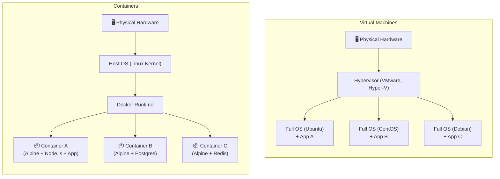
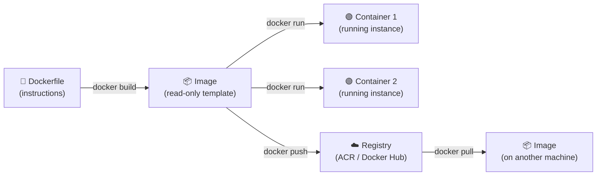
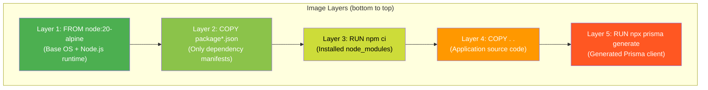
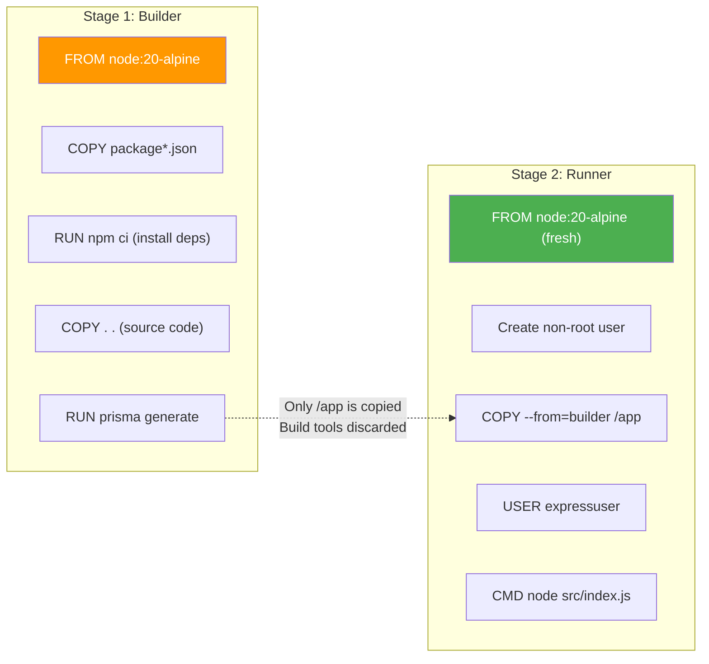
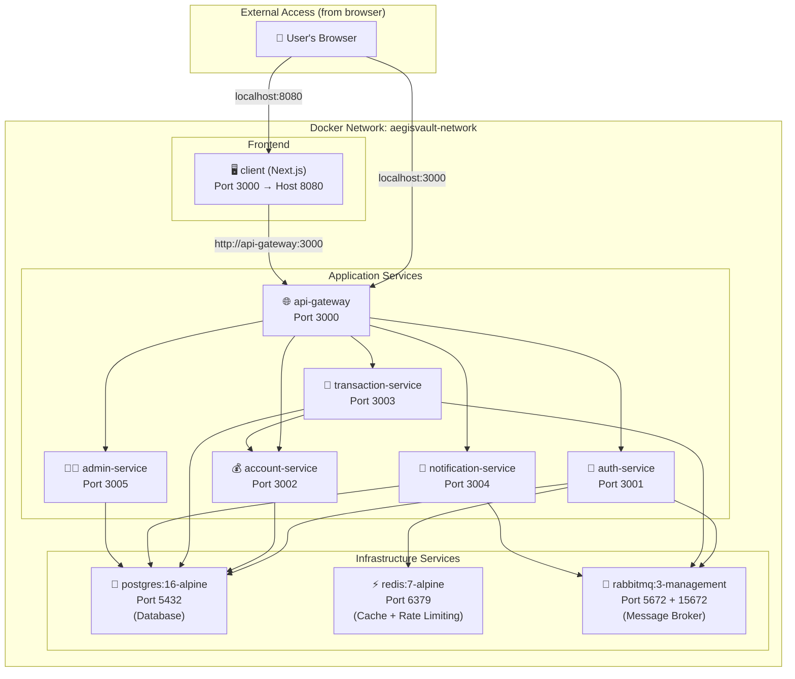
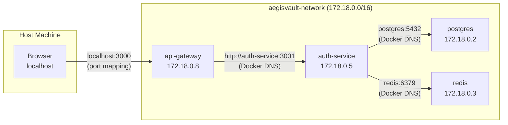
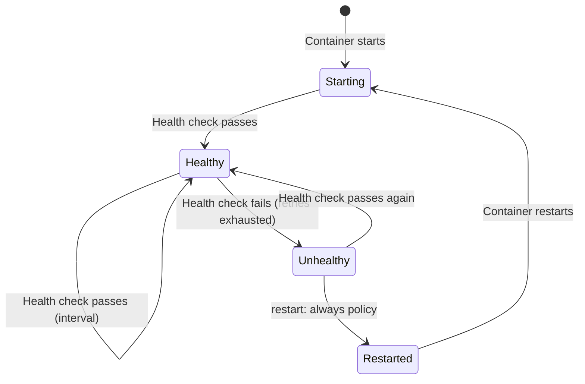

# 02 — Docker & Containerization Deep Dive

> Everything about how Docker works in AegisVault: containers vs VMs, Dockerfile instructions, multi-stage builds, Docker Compose orchestration, networking, and security.

---

## Table of Contents

1. [What Are Containers? (Containers vs VMs)](#1-what-are-containers-containers-vs-vms)
2. [Docker Core Concepts](#2-docker-core-concepts)
3. [Your Dockerfile.template — Line by Line](#3-your-dockerfiletemplate--line-by-line)
4. [Docker Compose — Orchestrating 10 Services](#4-docker-compose--orchestrating-10-services)
5. [Docker Networking in AegisVault](#5-docker-networking-in-aegisvault)
6. [Volumes & Data Persistence](#6-volumes--data-persistence)
7. [Health Checks — How Docker Monitors Services](#7-health-checks--how-docker-monitors-services)
8. [Docker Security Considerations](#8-docker-security-considerations)
9. [Your .dockerignore](#9-your-dockerignore)
10. [Limitations of Your Docker Setup](#10-limitations-of-your-docker-setup)
11. [Key Terms Glossary](#11-key-terms-glossary)

---

## 1. What Are Containers? (Containers vs VMs)

### The Problem Containers Solve

"It works on my machine." This is the classic developer excuse. Your app runs perfectly on your laptop but crashes on the server because of different Node.js versions, missing system libraries, or conflicting configurations.

Containers solve this by packaging your application **with its entire runtime environment** — OS libraries, dependencies, configuration — into a single, portable unit that runs identically everywhere.

### Containers vs Virtual Machines



| Aspect | Virtual Machine | Container |
|--------|----------------|-----------|
| **Size** | 1–10 GB (full OS) | 50–500 MB (shared kernel) |
| **Startup** | Minutes | Seconds |
| **Isolation** | Full hardware-level | Process-level (shared kernel) |
| **Overhead** | High (each VM runs its own kernel) | Minimal (containers share the host kernel) |
| **Use case** | Running different OSes, strong isolation | Running microservices, dev/prod parity |

**Key insight:** Containers don't include a full OS. They share the host machine's Linux kernel and only package the application layer. This is why your `node:20-alpine` image is ~180MB instead of ~2GB for a full Ubuntu VM.

### How Docker Works Under the Hood

Docker uses two Linux kernel features:
- **Namespaces** — Isolates what a container can **see** (its own process tree, network interfaces, filesystem). Each container thinks it's the only thing running.
- **cgroups (Control Groups)** — Limits what a container can **use** (CPU, memory, disk I/O). Prevents one container from consuming all host resources.

> [!NOTE]
> **On Windows/macOS**, Docker runs a lightweight Linux VM (WSL2 on Windows, HyperKit on macOS) because containers require a Linux kernel. The overhead is minimal — you won't notice it.

---

## 2. Docker Core Concepts

### Image vs Container

This is the most important distinction in Docker:

| Concept | Analogy | Description |
|---------|---------|-------------|
| **Image** | A recipe | A read-only template containing the application code, runtime, libraries, and configuration. Built from a Dockerfile. |
| **Container** | A dish made from the recipe | A running instance of an image. You can create multiple containers from the same image. |



### Layers — How Docker Images Are Built

Every instruction in a Dockerfile creates a **layer**. Layers are stacked on top of each other, and Docker caches them. If a layer hasn't changed, Docker reuses the cached version.



**Why layer order matters for caching:**

Layers are cached based on the instruction AND the files involved. If you change your source code (Layer 4), Docker invalidates Layer 4 and everything after it. But Layers 1-3 are reused from cache.

This is why the Dockerfile copies `package*.json` first and runs `npm install` BEFORE copying the source code. Dependency installation (slow) is cached unless `package.json` changes. Source code changes (frequent) only rebuild the final layer.

### Registry

A **registry** is a server that stores Docker images. Your project uses **Azure Container Registry (ACR)** — a private registry hosted on Azure. Public alternatives include Docker Hub and GitHub Container Registry (GHCR).

---

## 3. Your Dockerfile.template — Line by Line

> File: [Dockerfile.template](../../Dockerfile.template)

Your project uses a standardized multi-stage Dockerfile template for all microservices. Let's analyze every line.

### Stage 1: Builder

```dockerfile
FROM node:20-alpine AS builder
```

**What this does:**
- **`FROM`** — Specifies the base image. Every Dockerfile starts with `FROM`.
- **`node:20-alpine`** — Uses Node.js 20 on Alpine Linux.
  - **Alpine Linux** is a minimal Linux distribution (~5MB). Regular Ubuntu-based Node images are ~350MB; Alpine-based ones are ~180MB. Smaller images = faster pulls and smaller attack surface.
  - **`20`** — Node.js major version 20 (LTS — Long Term Support).
- **`AS builder`** — Names this stage "builder." This is the key to **multi-stage builds** — you can reference this stage from later stages.

```dockerfile
WORKDIR /app
```

**What this does:**
- **`WORKDIR`** — Sets the working directory inside the container. All subsequent commands (`COPY`, `RUN`, `CMD`) run from `/app`. If the directory doesn't exist, Docker creates it.

```dockerfile
# Copy package files first to leverage Docker layer caching
COPY package*.json ./
```

**What this does:**
- **`COPY`** — Copies files from the build context (your local machine) into the image.
- **`package*.json`** — The glob `*` matches both `package.json` and `package-lock.json`.
- **Why copy just these first?** This is the **layer caching optimization**. By copying only the dependency manifests before running `npm install`, Docker can cache the installed `node_modules` layer. When you change your source code but not your dependencies, the `npm ci` layer is reused from cache — saving 30-60 seconds per build.

```dockerfile
# Install production dependencies
RUN npm ci --only=production --no-audit --no-fund --loglevel=error
```

**What this does:**
- **`RUN`** — Executes a command during the build and saves the result as a new layer.
- **`npm ci`** — "Clean Install." Unlike `npm install`, `npm ci`:
  - Deletes existing `node_modules` first (clean slate)
  - Installs exact versions from `package-lock.json` (deterministic)
  - Fails if `package-lock.json` is out of sync with `package.json`
  - Is faster because it skips the dependency resolution step
- **`--only=production`** — Skips `devDependencies` (test frameworks, linting tools). Production images don't need Jest or ESLint.
- **`--no-audit`** — Skips vulnerability scanning during install (already done in CI).
- **`--no-fund`** — Suppresses "funding" messages.
- **`--loglevel=error`** — Only shows errors, keeping build logs clean.

```dockerfile
# Copy application source code
COPY . .
```

**What this does:**
- Copies everything else from the build context into the image. This includes your `src/` directory, `prisma/` schemas, and any other files.
- This comes AFTER `npm ci` to leverage layer caching (explained above).

```dockerfile
# Generate Prisma Client (UNCOMMENT for services using Prisma ORM)
# RUN npx prisma generate
```

**What this does:**
- This is a commented-out instruction. Services that use Prisma ORM need to generate the Prisma Client — a type-safe database query builder generated from the `schema.prisma` file. The actual service Dockerfiles uncomment this line.

### Stage 2: Runner (Production)

```dockerfile
FROM node:20-alpine AS runner
```

**What this does:**
- **Starts a completely new stage** from a fresh `node:20-alpine` image. This is the multi-stage build magic — the builder stage had all the build tools and intermediate files. This runner stage starts clean.

```dockerfile
WORKDIR /app

# Set production environment
ENV NODE_ENV=production
```

**What this does:**
- **`ENV`** — Sets an environment variable that persists in the running container.
- **`NODE_ENV=production`** — Tells Express.js and other libraries to optimize for production (e.g., disable verbose logging, enable caching, disable development-only features).

```dockerfile
# Create non-root user for security compliance
RUN addgroup --system --gid 1001 nodejs && \
    adduser --system --uid 1001 expressuser
```

**What this does:**
- Creates a system-level user and group for running the application.
- **`--system`** — Creates a system account (no home directory, no login shell).
- **`--gid 1001` / `--uid 1001`** — Assigns specific user/group IDs.
- **Why?** By default, containers run as `root`. If an attacker exploits a vulnerability in your app, they get root access inside the container — and potentially to the host. Running as a non-root user limits the damage. This is the **Principle of Least Privilege**.

> [!IMPORTANT]
> **This is a critical security feature.** The OWASP Docker Security Cheat Sheet mandates running containers as non-root. Your Dockerfile.template does this correctly. Always verify that individual service Dockerfiles also include the `USER` directive.

```dockerfile
# Copy built application from builder stage
COPY --from=builder --chown=expressuser:nodejs /app /app
```

**What this does:**
- **`COPY --from=builder`** — Copies files from the builder stage into this runner stage. Only the final application (code + `node_modules`) is copied — build tools and intermediate files are left behind.
- **`--chown=expressuser:nodejs`** — Sets the file ownership to the non-root user we just created.
- **Multi-stage build benefit:** The builder stage might have had `npm`, `gcc`, `python` (for native modules), and other build tools. None of that is in the final image. This means:
  - Smaller image size (fewer files)
  - Smaller attack surface (fewer tools for an attacker to exploit)

```dockerfile
USER expressuser
```

**What this does:**
- **`USER`** — Switches all subsequent commands and the running container to this user. From this point, the container runs as `expressuser`, not as `root`.

```dockerfile
# Default microservice port
EXPOSE 3001
```

**What this does:**
- **`EXPOSE`** — Documents which port the container listens on. This is purely informational — it doesn't actually open or publish the port. The port mapping happens in `docker-compose.yml` or at deployment time.

```dockerfile
# Run the Express microservice entry point
CMD ["node", "src/index.js"]
```

**What this does:**
- **`CMD`** — Specifies the default command to run when the container starts.
- **`["node", "src/index.js"]`** — JSON array syntax (exec form). Runs `node src/index.js` directly without a shell wrapper. This is important because:
  - Signals (SIGTERM for graceful shutdown) are sent directly to the Node.js process
  - No shell overhead (no `/bin/sh -c` wrapper)

### Multi-Stage Build Summary



**Before multi-stage:** One big image (~450MB) with build tools + source + node_modules.  
**After multi-stage:** A lean image (~180MB) with only the runtime and production dependencies.

---

## 4. Docker Compose — Orchestrating 10 Services

> File: [docker-compose.yml](../../docker-compose.yml)

Docker Compose lets you define and run **multiple containers** as a single application. Instead of running 10 separate `docker run` commands with complex networking, you define everything in one YAML file.

### What Docker Compose Does

```
docker compose up --build
```

This single command:
1. Builds Docker images for all 8 application services
2. Creates a Docker network for inter-service communication
3. Creates a persistent volume for PostgreSQL data
4. Starts all 10 containers in the correct order (respecting dependencies)
5. Monitors health checks and restarts failed containers

### Service Architecture

Your `docker-compose.yml` defines 10 services. Here's how they connect:



### Infrastructure Services — Explained

#### PostgreSQL

```yaml
services:
  postgres:
    image: postgres:16-alpine
    container_name: aegisvault-postgres
    restart: always
    environment:
      POSTGRES_DB: aegisvault
      POSTGRES_USER: aegis_admin
      POSTGRES_PASSWORD: ${DB_PASSWORD:-securep@ss123}
    ports:
      - "5433:5432"
    volumes:
      - pgdata:/var/lib/postgresql/data
      - ./scripts/init-schemas.sql:/docker-entrypoint-initdb.d/init-schemas.sql
    networks:
      - aegisvault-network
    healthcheck:
      test: ["CMD-SHELL", "pg_isready -U aegis_admin -d aegisvault"]
      interval: 5s
      timeout: 5s
      retries: 5
```

Line by line:
- **`image: postgres:16-alpine`** — Uses the official PostgreSQL 16 image (Alpine variant). Not built from a local Dockerfile — pulled from Docker Hub.
- **`container_name: aegisvault-postgres`** — Gives the container a fixed name instead of a randomly generated one. Useful for debugging with `docker logs aegisvault-postgres`.
- **`restart: always`** — If the container crashes, Docker automatically restarts it. Options: `no`, `on-failure`, `unless-stopped`, `always`.
- **`environment:`** — Injects environment variables into the container:
  - `POSTGRES_DB: aegisvault` — Creates a database named "aegisvault" on first startup.
  - `POSTGRES_USER` / `POSTGRES_PASSWORD` — Creates the admin user.
  - **`${DB_PASSWORD:-securep@ss123}`** — Shell variable substitution. Uses the `DB_PASSWORD` env var from your `.env` file. If not set, falls back to `securep@ss123`. The `:-` is the "default value" operator.
- **`ports: "5433:5432"`** — Maps host port 5433 to container port 5432. Format: `HOST:CONTAINER`. You access Postgres on `localhost:5433` from your machine, but other containers access it on `postgres:5432` via the Docker network.
- **`volumes:`** — Mount points:
  - `pgdata:/var/lib/postgresql/data` — Named volume. PostgreSQL stores all data in `/var/lib/postgresql/data` inside the container. The named volume `pgdata` persists this data across container restarts and recreations.
  - `./scripts/init-schemas.sql:/docker-entrypoint-initdb.d/init-schemas.sql` — Bind mount. The `init-schemas.sql` script is mounted into Postgres's init directory. On first startup, Postgres automatically executes all `.sql` files in `/docker-entrypoint-initdb.d/`.
- **`networks:`** — Connects to the `aegisvault-network`. All services on the same network can communicate by container name.
- **`healthcheck:`** — Defines how Docker checks if the service is healthy:
  - `pg_isready` — A PostgreSQL utility that checks if the database is accepting connections.
  - `interval: 5s` — Check every 5 seconds.
  - `timeout: 5s` — Wait max 5 seconds for a response.
  - `retries: 5` — Mark as unhealthy after 5 consecutive failures.

#### Redis

```yaml
  redis:
    image: redis:7-alpine
    container_name: aegisvault-redis
    restart: always
    ports:
      - "6379:6379"
    networks:
      - aegisvault-network
    healthcheck:
      test: ["CMD", "redis-cli", "ping"]
      interval: 5s
      timeout: 5s
      retries: 5
```

- **Redis** is used for two purposes in AegisVault:
  1. **Rate limiting** — Stores request counts per IP/user with automatic TTL expiry (see [rateLimiter.js](../../services/api-gateway/src/middleware/rateLimiter.js))
  2. **OTP caching** — Stores hashed OTP values with a 5-minute TTL for fast lookup
- **`redis-cli ping`** — The healthcheck sends a PING command to Redis. A healthy Redis responds with PONG.

#### RabbitMQ

```yaml
  rabbitmq:
    image: rabbitmq:3-management-alpine
    container_name: aegisvault-rabbitmq
    restart: always
    ports:
      - "5672:5672"
      - "15672:15672"
    networks:
      - aegisvault-network
    healthcheck:
      test: ["CMD", "rabbitmq-diagnostics", "-q", "ping"]
      interval: 5s
      timeout: 5s
      retries: 5
```

- **RabbitMQ** is a **message broker** — it enables **asynchronous communication** between microservices.
  - When the auth-service needs to send an OTP email, it doesn't call the notification-service directly (which could fail if the service is busy). Instead, it publishes a message to a RabbitMQ queue, and the notification-service consumes it when ready.
- **`rabbitmq:3-management-alpine`** — The `-management` variant includes a web-based admin UI on port 15672.
- **Two ports:**
  - `5672` — AMQP protocol port (application communication)
  - `15672` — Management UI (web dashboard for monitoring queues)

> [!NOTE]
> **AMQP (Advanced Message Queuing Protocol)** is an open standard for message brokers. The `amqp://rabbitmq:5672` connection string in your services connects to RabbitMQ over this protocol. Think of it like HTTP but for message queues.

### Application Services — Key Patterns

All application services follow the same structure. Let's use `auth-service` as the example:

```yaml
  auth-service:
    build:
      context: ./services/auth-service
      dockerfile: Dockerfile
    container_name: aegisvault-auth-service
    restart: always
    ports:
      - "3001:3001"
    environment:
      - PORT=3001
      - DATABASE_URL=postgresql://aegis_admin:${DB_PASSWORD:-securep@ss123}@postgres:5432/aegisvault?schema=auth_db
      - REDIS_URL=redis://redis:6379
      - RABBITMQ_URL=amqp://rabbitmq:5672
      - JWT_SECRET=${JWT_SECRET:-aegisvault-super-secret-jwt-key-2026}
      - JWT_ACCESS_EXPIRES_IN=15m
      - JWT_REFRESH_EXPIRES_IN=7d
      - NOTIFICATION_SERVICE_URL=http://notification-service:3004
    depends_on:
      rabbitmq:
        condition: service_healthy
      postgres:
        condition: service_healthy
      redis:
        condition: service_healthy
    networks:
      - aegisvault-network
```

- **`build:`** — Unlike infrastructure services (which use pre-built images), application services are built from local Dockerfiles.
  - `context: ./services/auth-service` — The build context is the service directory.
  - `dockerfile: Dockerfile` — Uses the Dockerfile in that directory.
- **`DATABASE_URL`** — The connection string includes `?schema=auth_db`. Each microservice uses a **separate PostgreSQL schema** within the same database. This provides data isolation without running multiple database servers.

| Service | Schema |
|---------|--------|
| auth-service | `auth_db` |
| account-service | `acct_db` |
| transaction-service | `txn_db` |
| notification-service | `notif_db` |
| admin-service | `admin_db` |

- **`depends_on:`** — Defines startup order with health conditions:
  - `condition: service_healthy` — Wait until the service's healthcheck reports "healthy" before starting.
  - `condition: service_started` — Just wait until the container starts (doesn't check health).
  - This prevents the auth-service from starting before PostgreSQL is ready to accept connections.

### The Client (Frontend)

```yaml
  client:
    build:
      context: ./client
      dockerfile: Dockerfile
    container_name: aegisvault-client
    restart: always
    ports:
      - "8080:3000"
    environment:
      - INTERNAL_API_URL=http://api-gateway:3000
      - NEXT_PUBLIC_API_URL=http://localhost:3000
    depends_on:
      api-gateway:
        condition: service_started
    networks:
      - aegisvault-network
```

- **`ports: "8080:3000"`** — The Next.js app inside the container listens on port 3000, but it's exposed on host port 8080. This avoids conflicting with the api-gateway which also uses port 3000.
- **`INTERNAL_API_URL`** — Used for **server-side rendering (SSR)** requests. When Next.js renders pages on the server, it calls the API gateway using the internal Docker network URL.
- **`NEXT_PUBLIC_API_URL`** — Used for **client-side** API calls from the browser. The `NEXT_PUBLIC_` prefix makes it available in browser JavaScript.

---

## 5. Docker Networking in AegisVault

### The Bridge Network

```yaml
networks:
  aegisvault-network:
    name: aegisvault-network
    driver: bridge
```

**What this does:**
- **Bridge network** — The default Docker network driver. Creates an isolated virtual network where containers can communicate by name.
- All 10 services are connected to `aegisvault-network`.
- **DNS resolution** — Docker's embedded DNS server resolves container names to IP addresses. When `auth-service` connects to `postgres:5432`, Docker's DNS resolves `postgres` to the PostgreSQL container's IP address (e.g., `172.18.0.2`).

### How Services Communicate



**Key networking concepts:**
- **Internal communication:** Services talk to each other using container names (e.g., `http://auth-service:3001`). No IP addresses needed.
- **External access:** Only ports explicitly mapped in `ports:` are accessible from the host machine. If a service has no port mapping, it's only accessible from within the Docker network.
- **Network isolation:** Containers on different networks can't communicate. Your services are all on one network, but in production you might separate frontend and backend networks for security.

---

## 6. Volumes & Data Persistence

### The Problem

Containers are **ephemeral** — when a container is destroyed, all data inside it is lost. This is fine for stateless services (your Node.js apps), but disastrous for databases.

### Named Volumes

```yaml
volumes:
  pgdata:
    name: aegisvault-pgdata
```

This creates a **named volume** called `aegisvault-pgdata`. Docker manages the volume's storage location (typically `/var/lib/docker/volumes/` on Linux).

```yaml
  postgres:
    volumes:
      - pgdata:/var/lib/postgresql/data
```

This mounts the `pgdata` volume at `/var/lib/postgresql/data` inside the PostgreSQL container. The data persists across:
- Container restarts (`docker restart`)
- Container recreation (`docker compose down && docker compose up`)

It does NOT persist across:
- `docker compose down -v` (the `-v` flag deletes volumes)
- Deleting the Docker volume manually

### Bind Mounts vs Named Volumes

```yaml
  postgres:
    volumes:
      - pgdata:/var/lib/postgresql/data                                         # Named volume
      - ./scripts/init-schemas.sql:/docker-entrypoint-initdb.d/init-schemas.sql # Bind mount
```

| Type | Syntax | Managed By | Use Case |
|------|--------|-----------|----------|
| Named Volume | `volumename:/container/path` | Docker | Persistent data (databases) |
| Bind Mount | `./host/path:/container/path` | You | Config files, development code, init scripts |

---

## 7. Health Checks — How Docker Monitors Services

Health checks tell Docker whether a container is actually working, not just running. A container can be "running" but have a crashed application inside it.

### Your Three Health Checks

```yaml
# PostgreSQL
healthcheck:
  test: ["CMD-SHELL", "pg_isready -U aegis_admin -d aegisvault"]
  interval: 5s
  timeout: 5s
  retries: 5

# Redis
healthcheck:
  test: ["CMD", "redis-cli", "ping"]
  interval: 5s
  timeout: 5s
  retries: 5

# RabbitMQ
healthcheck:
  test: ["CMD", "rabbitmq-diagnostics", "-q", "ping"]
  interval: 5s
  timeout: 5s
  retries: 5
```

### Health Check Lifecycle



**The three parameters:**
- **`interval: 5s`** — Run the health check every 5 seconds
- **`timeout: 5s`** — If the check doesn't respond within 5 seconds, count it as a failure
- **`retries: 5`** — After 5 consecutive failures (25 seconds), mark the container as "unhealthy"

**How `depends_on` uses health checks:**

```yaml
auth-service:
  depends_on:
    postgres:
      condition: service_healthy  # Wait for health check to pass
```

Without `condition: service_healthy`, Docker would start `auth-service` as soon as the Postgres container starts — but Postgres might still be initializing. The `service_healthy` condition ensures the auth-service only starts when Postgres is actually accepting connections.

---

## 8. Docker Security Considerations

### Non-Root Execution

Your [Dockerfile.template](../../Dockerfile.template) creates a non-root user:

```dockerfile
RUN addgroup --system --gid 1001 nodejs && \
    adduser --system --uid 1001 expressuser
USER expressuser
```

This follows the **Principle of Least Privilege**. If an attacker exploits a vulnerability in your Node.js app, they get access as `expressuser` (limited permissions) instead of `root` (full access to the container and potentially the host).

### Alpine Linux (Minimal Attack Surface)

All images use Alpine Linux (`node:20-alpine`, `postgres:16-alpine`, `redis:7-alpine`). Alpine has:
- No `bash` (uses `ash` shell) — attackers can't use bash-specific exploits
- No `curl`, `wget` — harder for attackers to download malicious payloads
- Fewer pre-installed packages — fewer potential vulnerability entry points

### Security Issues in Your Current Setup

| Issue | Risk | Location |
|-------|------|----------|
| Exposed database ports | External access to Postgres | `ports: "5433:5432"` in [docker-compose.yml L10-11](../../docker-compose.yml#L10) |
| Exposed Redis port | External access to cache | `ports: "6379:6379"` in [docker-compose.yml L28](../../docker-compose.yml#L28) |
| Exposed RabbitMQ management UI | External access to broker admin | `ports: "15672:15672"` in [docker-compose.yml L43](../../docker-compose.yml#L43) |
| No resource limits | One container can exhaust host | No `mem_limit` or `cpus` in any service |
| Default RabbitMQ credentials | `guest:guest` in production | [docker-compose.yml L64](../../docker-compose.yml#L64) |
| Redis without password | Unauthenticated cache access | `redis://redis:6379` with no `requirepass` |

> [!WARNING]
> **Exposed infrastructure ports are a significant security risk.** In production, PostgreSQL, Redis, and RabbitMQ should NEVER have port mappings. They should only be accessible within the Docker network. The port mappings in your `docker-compose.yml` are useful for local development (so you can connect with a DB client) but dangerous in production.

---

## 9. Your .dockerignore

> File: [.dockerignore](../../.dockerignore)

The `.dockerignore` file works like `.gitignore` but for Docker builds. It tells Docker which files to exclude from the build context. This:
- **Reduces build context size** — Faster upload to the Docker daemon
- **Improves security** — Prevents sensitive files (`.env`, `node_modules`) from being included in the image
- **Speeds up builds** — Fewer files to process

---

## 10. Limitations of Your Docker Setup

| Limitation | Impact | How to Fix |
|-----------|--------|------------|
| **No resource limits** | One service can consume all CPU/RAM on the host | Add `deploy: resources: limits: cpus: '0.5' memory: 512M` to each service |
| **Exposed infrastructure ports** | Postgres/Redis/RabbitMQ accessible from host network | Remove `ports:` from infrastructure services in production |
| **No image scanning** | Vulnerable base images reach production | Add Trivy scanning in CI/CD pipeline |
| **No Docker Compose profiles** | Can't easily switch between dev/prod configurations | Use `profiles:` to separate dev-only services (port mappings, debug tools) |
| **No container logging driver** | Logs are only in stdout, not forwarded to a central system | Add `logging: driver: json-file` with `max-size` and `max-file` options |
| **Single-host architecture** | All containers run on one machine — single point of failure | Use Docker Swarm or Kubernetes for multi-host deployment |

---

## 11. Key Terms Glossary

| Term | Full Name | Explanation |
|------|-----------|-------------|
| **Docker** | Docker Engine | Platform for building, shipping, and running containers |
| **Container** | Linux Container | A lightweight, isolated process running an application with its dependencies |
| **Image** | Container Image | A read-only template used to create containers. Built from a Dockerfile |
| **Dockerfile** | Docker Build File | A text file with instructions for building a Docker image |
| **Layer** | Image Layer | Each Dockerfile instruction creates a layer. Layers are cached and reusable |
| **Multi-stage Build** | Multi-stage Dockerfile | Using multiple `FROM` statements to create lean production images by discarding build tools |
| **Alpine** | Alpine Linux | A minimal Linux distribution (~5MB) used as a base for Docker images |
| **Docker Compose** | Docker Compose | Tool for defining and running multi-container applications with YAML configuration |
| **Bridge Network** | Docker Bridge | Default network driver that creates an isolated virtual network for containers |
| **Named Volume** | Docker Named Volume | Docker-managed storage that persists data across container lifecycle |
| **Bind Mount** | Docker Bind Mount | Mounts a host directory directly into a container |
| **Build Context** | Docker Build Context | The directory sent to the Docker daemon for building an image |
| **Registry** | Container Registry | A server that stores and distributes container images (ACR, Docker Hub, GHCR) |
| **ACR** | Azure Container Registry | Microsoft's managed Docker image registry service |
| **OCI** | Open Container Initiative | Industry standard for container image and runtime formats |
| **AMQP** | Advanced Message Queuing Protocol | Standard protocol for message brokers like RabbitMQ |
| **TTL** | Time To Live | How long a value (OTP, cache entry) persists before automatic expiry |
| **ENTRYPOINT** | Container Entrypoint | The main executable of a container. `CMD` provides default arguments to it |
| **`EXPOSE`** | Dockerfile Expose | Documents which port a container listens on (informational only) |
| **`WORKDIR`** | Working Directory | Sets the directory for subsequent Dockerfile instructions |
| **`CMD`** | Default Command | The command run when a container starts (can be overridden) |
| **`ENV`** | Environment Variable | Sets a persistent environment variable in the container |
| **cgroups** | Control Groups | Linux kernel feature that limits container resource usage (CPU, memory) |
| **Namespaces** | Linux Namespaces | Linux kernel feature that isolates container processes, networks, and filesystems |
| **Ephemeral** | Temporary | Containers are ephemeral — data inside is lost when the container is destroyed |

---

> **Next:** [03 — Azure Cloud & Deployment Deep Dive](./03_azure_cloud_and_deployment.md) — How your project lives in Azure, what each resource does, and how to monitor it.
