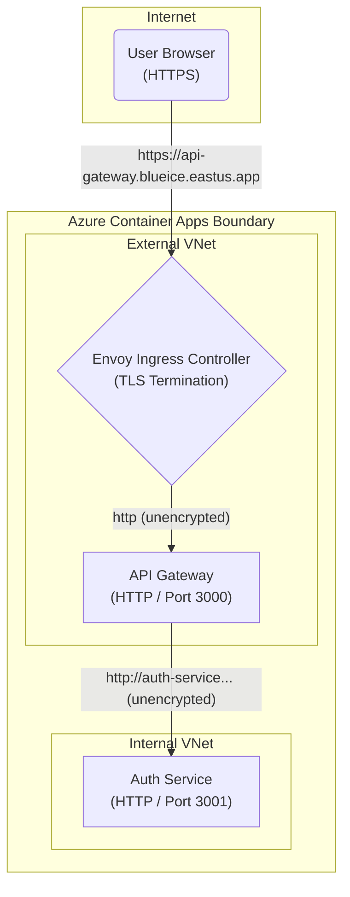

# 03 — Azure Cloud & Deployment Deep Dive

> A comprehensive guide to how AegisVault lives in the Microsoft Azure cloud, covering infrastructure provisioning, Azure Container Apps (ACA), ingress networking, and production observability.

---

## Table of Contents

1. [Azure Fundamentals in AegisVault](#1-azure-fundamentals-in-aegisvault)
2. [Provisioning Script (`provision.azcli`) — Line by Line](#2-provisioning-script-provisionazcli--line-by-line)
3. [Database Provisioning (`provision-dbs.azcli`)](#3-database-provisioning-provision-dbsazcli)
4. [Ingress & TLS Termination](#4-ingress--tls-termination)
5. [Monitoring, Logs, & Dashboards](#5-monitoring-logs--dashboards)
6. [Limitations of Your Cloud Setup](#6-limitations-of-your-cloud-setup)
7. [Key Terms Glossary](#7-key-terms-glossary)

---

## 1. Azure Fundamentals in AegisVault

Your application uses **Azure Container Apps (ACA)** as its primary hosting platform. ACA is a fully managed serverless container service built on top of Kubernetes, but it hides the complexity of Kubernetes from you.

### The Resource Hierarchy

```mermaid
graph TB
    subgraph "Azure Subscription"
        subgraph "Resource Group: aegisvault-rg"
            ACR["📦 Azure Container Registry (ACR)\n(Stores Docker Images)"]
            
            subgraph "Container Apps Environment: aegisvault-env"
                direction TB
                VNET["Virtual Network (Managed)"]
                
                subgraph "External Apps"
                    GW["🌐 api-gateway"]
                    CL["🖥️ client"]
                end
                
                subgraph "Internal Apps"
                    AU["🔐 auth-service"]
                    DB["🐘 postgres"]
                    RD["⚡ redis"]
                end
                
                VNET --> External Apps
                VNET --> Internal Apps
            end
        end
    end
```

- **Resource Group (`aegisvault-rg`)**: A logical folder that holds related resources. If you delete the resource group, everything inside it is destroyed simultaneously.
- **Azure Container Registry (ACR)**: A private repository for your Docker images. Your CD pipeline pushes here; Container Apps pulls from here.
- **Container Apps Environment (`aegisvault-env`)**: A secure boundary around a group of container apps. Apps in the same environment share the same virtual network and write logs to the same Log Analytics workspace.

---

## 2. Provisioning Script (`provision.azcli`) — Line by Line

> File: [infrastructure/provision.azcli](../../infrastructure/provision.azcli)

This script defines your **Infrastructure as Code (IaC)**. Instead of clicking through the Azure Portal, you run this script to create your entire environment in minutes.

### 2.1 — Creating the Foundations

```bash
RESOURCE_GROUP="aegisvault-rg"
LOCATION="eastus"
ACR_NAME="aegisvaultacrrw5v9v"
ENVIRONMENT="aegisvault-env"

# 1. Create Resource Group
az group create --name $RESOURCE_GROUP --location $LOCATION
```

- **`az group create`**: Creates the resource group in the `eastus` data center region. All subsequent resources will be placed here.

```bash
# 2. Create Azure Container Registry (Basic tier for cost savings)
az acr create --resource-group $RESOURCE_GROUP --name $ACR_NAME --sku Basic --admin-enabled true
```

- **`az acr create`**: Creates the Container Registry.
- **`--sku Basic`**: Pricing tier. Basic is the cheapest (perfect for demos/startups).
- **`--admin-enabled true`**: Generates a username/password for this registry. This is what your CD pipeline uses (`REGISTRY_USERNAME` and `REGISTRY_PASSWORD`) to authenticate and push images.

```bash
# 3. Create Container Apps Environment
az containerapp env create --name $ENVIRONMENT --resource-group $RESOURCE_GROUP --location $LOCATION
```

- **`az containerapp env create`**: Sets up the underlying Kubernetes cluster, virtual network, and Log Analytics workspace implicitly.

### 2.2 — The App Creation Helper Function

Instead of repeating a massive command 8 times, the script uses a bash function:

```bash
create_app() {
  APP_NAME=$1
  INGRESS_TYPE=$2
  TARGET_PORT=$3
  MIN_REPLICAS=${4:-0}
  
  az containerapp create \
    --name $APP_NAME \
    --resource-group $RESOURCE_GROUP \
    --environment $ENVIRONMENT \
    --image mcr.microsoft.com/azuredocs/containerapps-helloworld:latest \
    --ingress $INGRESS_TYPE \
    --target-port $TARGET_PORT \
    --min-replicas $MIN_REPLICAS \
    --max-replicas 1
}
```

**Why this is clever:**
- It creates "placeholder" apps using a tiny Microsoft hello-world image. 
- Why? Because to configure GitHub Actions secrets (like `AUTH_SERVICE_URL`), the apps need to exist so Azure generates their FQDNs (URLs). But the apps can't be built until GitHub Actions runs. 
- **Chicken-and-egg solved:** Provision placeholders first -> get their URLs -> give URLs to GitHub Actions -> GitHub builds your real code and overwrites the placeholders.

**Key Parameters:**
- **`--ingress $INGRESS_TYPE`**: Can be `internal` or `external`. (Deep dive on this below).
- **`--target-port $TARGET_PORT`**: The port your Node.js app listens on (e.g., 3001).
- **`--min-replicas 0`**: **Scale to Zero**. If a service receives no traffic, Azure spins it down to 0 instances. You pay absolutely nothing when it's idle. It takes ~2 seconds to wake up (cold start) when a new request arrives.

### 2.3 — Provisioning the Apps

```bash
# Internal Microservices (No public access from internet)
create_app "auth-service" "internal" 3001
create_app "account-service" "internal" 3002
create_app "transaction-service" "internal" 3003
create_app "notification-service" "internal" 3004 1  # Note the 1 for min-replicas
create_app "admin-service" "internal" 3005

# Public Services (Internet accessible)
create_app "api-gateway" "external" 3000
create_app "client" "external" 3000
```

Notice that `notification-service` has `--min-replicas 1`. Why? 
Because it listens to RabbitMQ for events (like OTP emails). If it scaled to 0, it wouldn't be listening to the queue, and emails would pile up unread. Background workers must always have at least 1 replica running.

---

## 3. Database Provisioning (`provision-dbs.azcli`)

> File: [infrastructure/provision-dbs.azcli](../../infrastructure/provision-dbs.azcli)

This script spins up your stateful services (Postgres, Redis, RabbitMQ) directly inside Container Apps.

```bash
az containerapp create --name postgres \
  --resource-group $RESOURCE_GROUP \
  --environment $ENVIRONMENT \
  --image postgres:16-alpine \
  --ingress internal \
  --target-port 5432 \
  --transport tcp \
  --env-vars POSTGRES_DB=aegisvault POSTGRES_USER=aegis_admin POSTGRES_PASSWORD=securep@ss123 \
  --min-replicas 1 \
  --max-replicas 1
```

- **`--transport tcp`**: Unlike your web APIs which use HTTP transport, databases use raw TCP sockets.
- **`--min-replicas 1 --max-replicas 1`**: Databases cannot easily be scaled in and out without complex clustering logic. They are pinned to exactly 1 replica.

> [!WARNING]
> **This is an anti-pattern for production databases.** Running stateful databases inside ephemeral containers on Azure Container Apps means you have no persistent volume attached. If the container restarts, all data is permanently wiped. In a real production environment, you should use **Azure Database for PostgreSQL (Flexible Server)** and **Azure Cache for Redis**, which provide persistence, backups, and high availability.

---

## 4. Ingress & TLS Termination

In your provisioning script, you specify `--ingress internal` or `--ingress external`. This leverages Envoy proxy, which runs invisibly in Azure Container Apps.



### 1. External Ingress (`api-gateway`, `client`)
- Azure assigns a public FQDN (e.g., `https://client.blueice-abc123.eastus.azurecontainerapps.io`).
- **TLS Termination**: Azure provides a free SSL certificate automatically. It decrypts the HTTPS traffic at the Envoy proxy edge.
- The traffic is then forwarded as plain HTTP to your Node.js app on port 3000. Your Node app never has to deal with SSL certificates.

### 2. Internal Ingress (All microservices)
- Azure assigns an internal FQDN (e.g., `https://auth-service.internal.blueice-abc123.eastus.azurecontainerapps.io`).
- This URL is strictly unreachable from the public internet. It can only be resolved and accessed by other apps inside the same `aegisvault-env` environment.
- This creates a massive security boundary: an attacker cannot directly probe your `auth-service` or `transaction-service`. They must go through your `api-gateway`.

---

## 5. Monitoring, Logs, & Dashboards

AegisVault includes several observability mechanics combining Winston loggers and Grafana.

### Structured JSON Logging (Winston)

In [logger.js](../../services/api-gateway/src/config/logger.js), you implemented a Winston logger:

```javascript
    const logData = {
      method,
      path: originalUrl,
      statusCode,
      durationMs,
      ip,
      userId: req.user ? req.user.sub : 'anonymous',
    };
    logger.info('HTTP Request Completed', logData);
```

**Why JSON?** When this outputs to the console (`stdout`), Azure Container Apps automatically captures it and sends it to **Azure Log Analytics**. Because it's formatted as JSON, Log Analytics parses the fields automatically. You can query:
`AppLogs | where statusCode >= 500` instead of writing complex Regex to parse plain text logs.

### Dashboards and Visualizations

Based on the screenshots in your repository, you've configured advanced dashboards:

#### Azure Portal Container Apps Metrics

Azure provides out-of-the-box CPU, Memory, and Network usage metrics per replica. This helps you identify if a microservice is experiencing a memory leak or CPU exhaustion.

#### API Gateway Grafana Dashboard

Grafana visualizes Prometheus metrics. In the API gateway screenshot, we see:
- **Total Requests & Error Rates**: Crucial for SLI (Service Level Indicators). A spike in 5xx errors indicates a service outage.
- **Latency Percentiles (P95, P99)**: It's not enough to know the *average* response time. P99 latency tells you that "99% of requests completed faster than X milliseconds." If P99 spikes, your system is degrading under load.

#### GitHub Actions Workflow Monitoring

Monitoring your CI/CD execution times and failure rates is also part of DevOps. The GitHub Actions history shows how often deployments fail and how long they take.

---

## 6. Limitations of Your Cloud Setup

While impressive, the current Azure setup has limitations a production system must address:

| Limitation | Impact | How to Fix |
|-----------|--------|------------|
| **Databases in stateless containers** | Database restarts result in complete data loss | Migrate to managed services: Azure Database for PostgreSQL Flexible Server |
| **No secrets vault** | Connection strings are injected as plain environment variables | Integrate **Azure Key Vault** to store DB passwords and JWT secrets securely |
| **No auto-scaling rules** | Services are hardcoded to `--max-replicas 1` | Add KEDA scaling rules (e.g., scale based on concurrent HTTP requests or RabbitMQ queue length) |
| **No Virtual Network (VNet) Integration** | The environment uses a managed VNet | Deploy into a custom Azure VNet to control outbound traffic via NAT Gateway and firewalls |
| **Imperative provisioning script** | `.azcli` scripts are hard to maintain and update | Migrate to **Terraform** or **Bicep** for declarative Infrastructure as Code (Phase 2) |

---

## 7. Key Terms Glossary

| Term | Full Name | Explanation |
|------|-----------|-------------|
| **ACA** | Azure Container Apps | Serverless container service (abstracted Kubernetes) used to host AegisVault |
| **Envoy** | Envoy Proxy | A high-performance proxy used by ACA to route traffic and terminate TLS |
| **TLS Termination** | Transport Layer Security Termination | The process of decrypting HTTPS traffic at the network edge before forwarding as plain HTTP to the app |
| **Scale to Zero** | Scale to Zero | Serverless feature where idle apps spin down to 0 replicas, costing nothing |
| **Cold Start** | Cold Start | The latency introduced (usually 2-5s) when a request hits a service scaled to zero, forcing it to spin up |
| **IaC** | Infrastructure as Code | Managing cloud resources through machine-readable definition files (scripts/Terraform) |
| **FQDN** | Fully Qualified Domain Name | The complete domain name for a specific computer, or host, on the internet |
| **SKU** | Stock Keeping Unit | Microsoft's terminology for pricing/feature tiers (e.g., Basic, Standard, Premium) |
| **Log Analytics** | Azure Log Analytics | Azure's centralized logging database where you query logs using KQL (Kusto Query Language) |
| **P99 Latency** | 99th Percentile Latency | The maximum time it takes the fastest 99% of requests to complete. Used to measure tail latency |
| **Stateful vs Stateless** | - | Stateless apps (Node APIs) save nothing locally. Stateful apps (Postgres) require persistent disk storage |

---

> **Next:** [04 — Kubernetes & Terraform](./04_kubernetes_and_terraform.md) — Where K8s and Terraform would fit, and why your app still runs perfectly without them.
