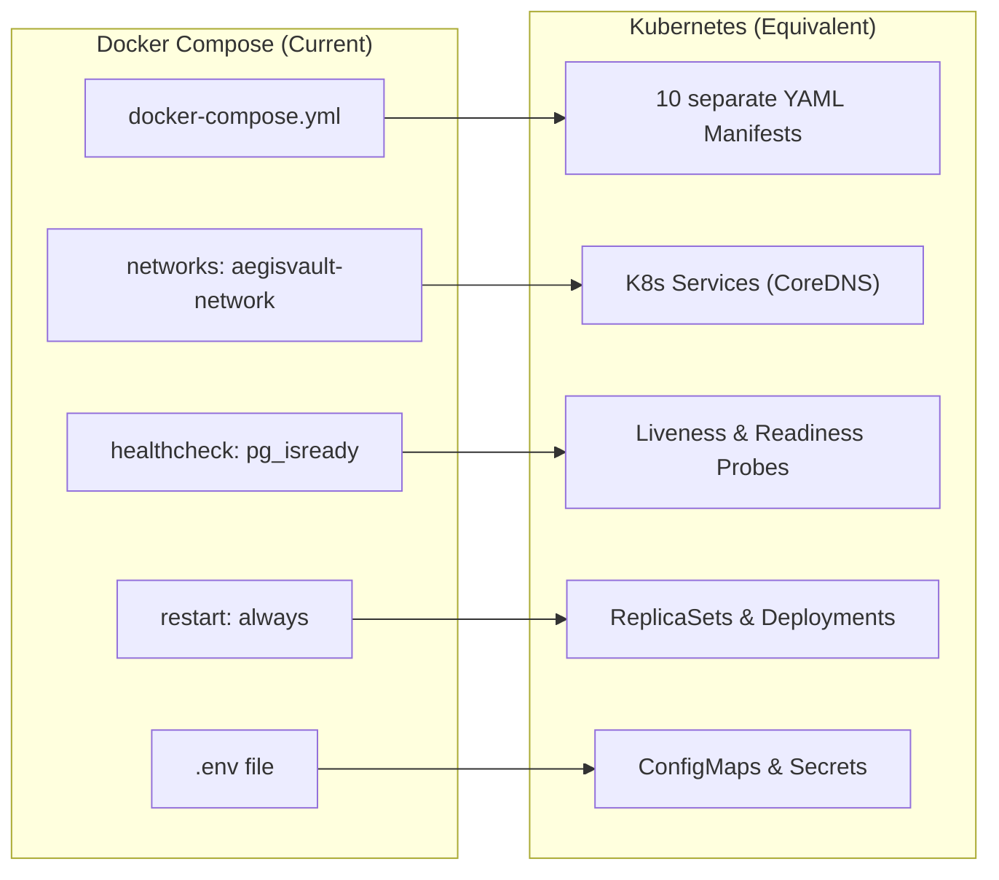
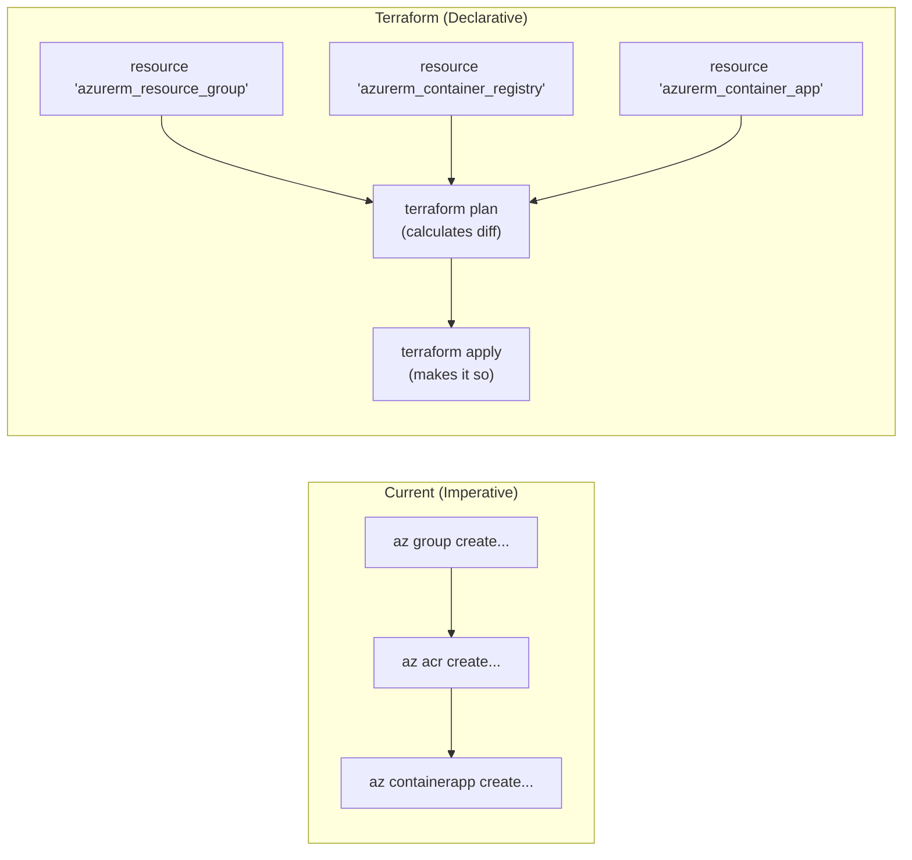

# 04 — Kubernetes & Terraform (Cloud-Native Infrastructure)

> Where Kubernetes and Terraform would fit in AegisVault, what they do, how they differ from your current setup, and why your application already benefits from them invisibly.

---

## Table of Contents

1. [Kubernetes Theory: The Orchestrator](#1-kubernetes-theory-the-orchestrator)
2. [How Kubernetes Maps to AegisVault](#2-how-kubernetes-maps-to-aegisvault)
3. [Sample Kubernetes Manifest (`auth-service.yaml`)](#3-sample-kubernetes-manifest-auth-serviceyaml)
4. [Terraform Theory: Infrastructure as Code (IaC)](#4-terraform-theory-infrastructure-as-code-iac)
5. [How Terraform Maps to AegisVault](#5-how-terraform-maps-to-aegisvault)
6. [Sample Terraform Config (`main.tf`)](#6-sample-terraform-config-maintf)
7. [Why Your App Works Without Them (The "Serverless" Secret)](#7-why-your-app-works-without-them-the-serverless-secret)
8. [Impact Analysis: Should You Switch?](#8-impact-analysis-should-you-switch)
9. [Key Terms Glossary](#9-key-terms-glossary)

---

## 1. Kubernetes Theory: The Orchestrator

Docker is great for running one container. Docker Compose is great for running 10 containers on **one machine**. But what happens when you need to run 1,000 containers across 50 machines? 

**Kubernetes (K8s)** is a container orchestration platform. It decides where to place containers, how to scale them, how they communicate, and how to recover if a machine dies.

### Core Kubernetes Resources

| Concept | Explanation | Analogy |
|---------|-------------|---------|
| **Pod** | The smallest unit in K8s. Usually contains one container (like your Node.js app). | A single worker |
| **Deployment** | Manages identical Pods. Ensures X replicas are running and handles rolling updates. | The manager of workers |
| **Service** | A stable IP address and DNS name that load-balances traffic across Pods. | The reception desk |
| **Ingress** | The gateway exposing internal Services to the outside internet (HTTPS/routing). | The building's front door |
| **ConfigMap** | Stores non-sensitive configuration data (e.g., `PORT=3000`) injected as env vars. | An instruction manual |
| **Secret** | Stores sensitive data (passwords, JWT keys) encoded in Base64. | A safe |
| **Namespace** | A virtual cluster inside K8s (e.g., `dev`, `staging`, `prod`). | Office floors |

---

## 2. How Kubernetes Maps to AegisVault

If you were to rewrite your `docker-compose.yml` into Kubernetes, here is how the concepts map:



### Self-Healing & Scaling
If your `auth-service` container crashes in Docker Compose, Docker restarts it on that exact same machine. If the *machine* dies, your app goes offline.
In Kubernetes, if the machine (Node) dies, K8s detects the failure and instantly spins up the `auth-service` Pod on a different, healthy Node.

---

## 3. Sample Kubernetes Manifest (`auth-service.yaml`)

This is what you would write instead of your `docker-compose.yml` block to deploy the `auth-service` in Kubernetes.

```yaml
---
# 1. The Deployment (Manages the Containers)
apiVersion: apps/v1
kind: Deployment
metadata:
  name: auth-service
spec:
  replicas: 2                     # Run 2 copies for high availability
  selector:
    matchLabels:
      app: auth-service
  template:
    metadata:
      labels:
        app: auth-service
    spec:
      containers:
        - name: auth-service
          image: aegisvaultacrrw5v9v.azurecr.io/auth-service:latest
          ports:
            - containerPort: 3001
          envFrom:
            - secretRef:
                name: auth-secrets # Pulls JWT_SECRET from K8s Secrets
            - configMapRef:
                name: auth-config  # Pulls non-sensitive env vars
          livenessProbe:           # Equivalent to Docker healthcheck
            httpGet:
              path: /health
              port: 3001
            initialDelaySeconds: 10
            periodSeconds: 5

---
# 2. The Service (Internal Networking & Load Balancing)
apiVersion: v1
kind: Service
metadata:
  name: auth-service               # Other pods use http://auth-service:3001
spec:
  selector:
    app: auth-service              # Routes traffic to pods with this label
  ports:
    - protocol: TCP
      port: 3001
      targetPort: 3001
```

---

## 4. Terraform Theory: Infrastructure as Code (IaC)

In AegisVault, you create cloud resources using Azure CLI bash scripts (`provision.azcli`).
**Terraform** solves the flaws of imperative scripting through **declarative** configuration.

### Imperative (Bash/CLI) vs Declarative (Terraform)

- **Imperative (`azcli`)**: "Create a resource group. Then create a registry. Then create an environment." 
  - *The problem*: If you run the script twice, it fails ("Resource already exists"). You have to write complex `if` statements to check if things exist first.
- **Declarative (Terraform)**: "The cloud should look exactly like this file." 
  - *The magic*: Terraform reads your current Azure state, compares it to your file, and calculates the exact diff (the **Plan**). If you run it twice, it says "No changes needed." If you delete a resource from the file, Terraform deletes it from Azure.

### Core Terraform Concepts
- **Provider**: The plugin that talks to the cloud (e.g., `azurerm` for Azure, `aws` for AWS).
- **Resource**: A specific cloud component (e.g., a database, a container registry).
- **State File (`terraform.tfstate`)**: A JSON file where Terraform remembers what it has deployed.
- **Drift Detection**: If someone manually changes a setting in the Azure Portal, Terraform detects it on the next run and reverts it to match the code.

---

## 5. How Terraform Maps to AegisVault



---

## 6. Sample Terraform Config (`main.tf`)

If you rewrote your `provision.azcli`, it would look like this in HashiCorp Configuration Language (HCL):

```hcl
# Configure the Azure Provider
provider "azurerm" {
  features {}
}

# 1. Resource Group (Replaces `az group create`)
resource "azurerm_resource_group" "aegis" {
  name     = "aegisvault-rg"
  location = "eastus"
}

# 2. Azure Container Registry (Replaces `az acr create`)
resource "azurerm_container_registry" "acr" {
  name                = "aegisvaultacrrw5v9v"
  resource_group_name = azurerm_resource_group.aegis.name
  location            = azurerm_resource_group.aegis.location
  sku                 = "Basic"
  admin_enabled       = true
}

# 3. Container Apps Environment (Replaces `az containerapp env create`)
resource "azurerm_container_app_environment" "env" {
  name                = "aegisvault-env"
  location            = azurerm_resource_group.aegis.location
  resource_group_name = azurerm_resource_group.aegis.name
}
```

Notice how `azurerm_container_registry` references `azurerm_resource_group.aegis.name`. Terraform automatically understands that the Resource Group must be created *before* the Registry. No manual ordering required.

---

## 7. Why Your App Works Without Them (The "Serverless" Secret)

If Kubernetes and Terraform are the industry standards, why is AegisVault running perfectly in production without them?

### The Kubernetes Secret
You **are** using Kubernetes. 
**Azure Container Apps (ACA)** is a managed layer built directly on top of Microsoft's Azure Kubernetes Service (AKS). Microsoft runs the control plane, manages the nodes, and abstracts the YAML files away from you. 

Under the hood, ACA uses massive open-source K8s technologies:
- **KEDA (Kubernetes Event-driven Autoscaling)**: Powers your `--min-replicas 0`. It scales your containers based on HTTP traffic or RabbitMQ queue length without you writing HPA (Horizontal Pod Autoscaler) metrics.
- **Envoy Proxy**: Powers your `--ingress internal/external`. It handles the TLS termination and routing.
- **Dapr (Distributed Application Runtime)**: Available in ACA for microservice state management (though AegisVault doesn't explicitly enable it).

### The Terraform Secret
Your `.azcli` scripts act as "Poor Man's Terraform." Because you only run `provision.azcli` once to set up the environment, and rely on GitHub Actions (`cd.yml`) to do the continuous `az containerapp update` commands, you avoid the biggest pain points of imperative scripts. 

---

## 8. Impact Analysis: Should You Switch?

### Implementing Kubernetes (AKS) instead of Container Apps
- **Pros**: Total control over networking, persistent volumes (fixing your stateful database issue), ability to run multi-cloud (AWS/GCP), custom sidecars, rich ecosystem.
- **Cons**: Extremely steep learning curve. You must manage node upgrades, write thousands of lines of YAML, manage your own Ingress controllers, and pay for the K8s control plane overhead.
- **Verdict**: For AegisVault's current scale, Azure Container Apps is superior. The abstraction saves DevOps overhead.

### Implementing Terraform instead of `.azcli`
- **Pros**: **GitOps**. Your infrastructure is version-controlled. If someone deletes the `auth-service` via the Azure Portal, `terraform apply` will instantly detect the drift and recreate it. It makes Disaster Recovery trivial.
- **Cons**: You have to learn HCL and manage state files securely (e.g., inside Azure Storage).
- **Verdict**: **You should definitely implement Terraform.** Imperative bash scripts are fragile in real-world enterprise environments.

---

## 9. Key Terms Glossary

| Term | Full Name | Explanation |
|------|-----------|-------------|
| **K8s** | Kubernetes | Open-source container orchestration platform originally built by Google. |
| **IaC** | Infrastructure as Code | Managing cloud resources through declarative definition files rather than clicking in a UI. |
| **GitOps** | Git Operations | The practice of using Git repositories as the single source of truth to deliver infrastructure as code. |
| **State File** | Terraform State | A JSON file (`terraform.tfstate`) where Terraform maps your real-world cloud resources to your configuration files. |
| **Drift** | Configuration Drift | When the actual cloud infrastructure changes (manually) and differs from what is defined in code. |
| **HPA** | Horizontal Pod Autoscaler | A K8s feature that automatically increases/decreases the number of Pods based on CPU/RAM usage. |
| **KEDA** | Kubernetes Event-driven Autoscaling | A tool that scales K8s pods based on external events (e.g., "scale up when RabbitMQ has 100 messages"). |
| **Envoy** | Envoy Proxy | A high-performance proxy built by Lyft, heavily used in cloud-native systems for routing and metrics. |
| **Dapr** | Distributed Application Runtime | Portable APIs that simplify microservice connectivity (pub/sub, state management). |
| **Manifest** | K8s Manifest | A YAML file that describes exactly how a resource should look in Kubernetes. |
| **Liveness Probe** | K8s Liveness Probe | A health check that tells K8s if a container is dead and needs to be restarted. |
| **Readiness Probe** | K8s Readiness Probe | A health check that tells K8s if a container is ready to receive network traffic. |

---

> **Next:** [05 — Cybersecurity Features Implemented](./05_cybersecurity_features_implemented.md) — Diving into the code behind AegisVault's security, from JWTs and OTPs to fraud detection algorithms.
