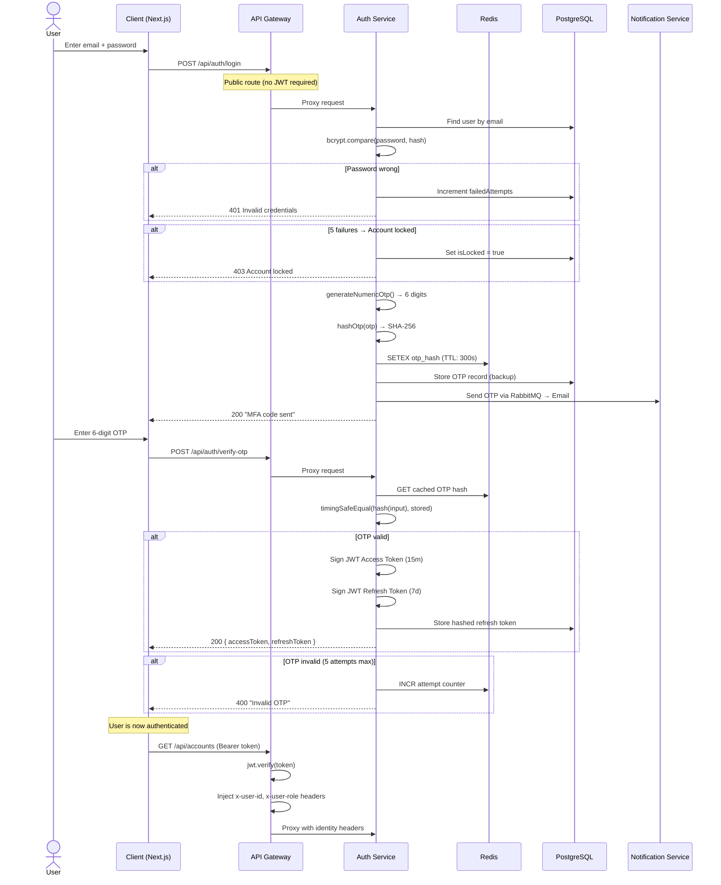
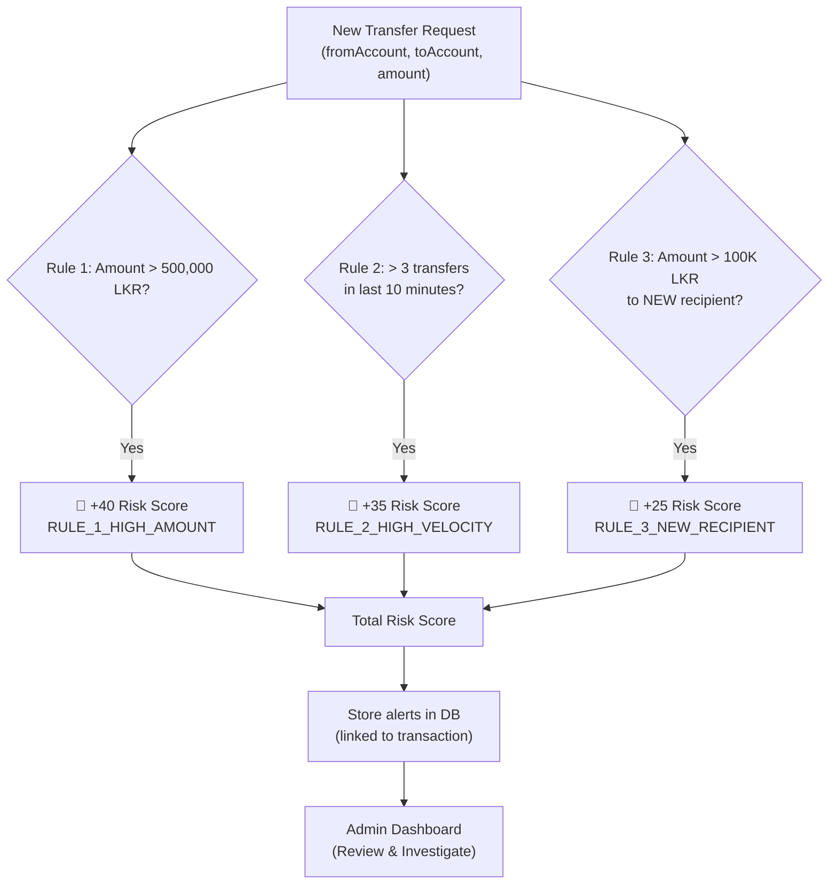
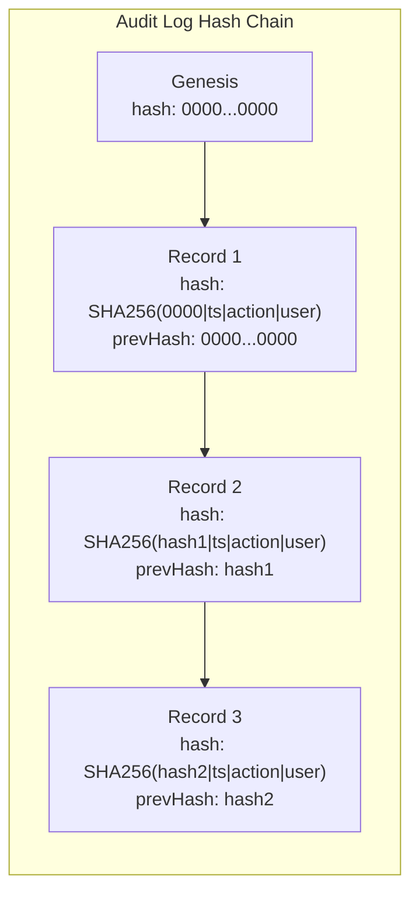
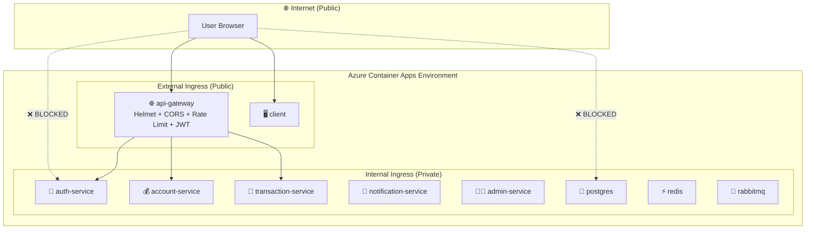

# 05 — Cybersecurity Features Implemented in AegisVault

> A deep dive into every security mechanism built into your banking platform — what it defends against, how the code works, and the theory behind each technique.

---

## Table of Contents

1. [The Authentication Chain (Login Flow)](#1-the-authentication-chain-login-flow)
2. [Password Security (Bcrypt)](#2-password-security-bcrypt)
3. [Multi-Factor Authentication (MFA/OTP)](#3-multi-factor-authentication-mfaotp)
4. [JSON Web Tokens (JWT)](#4-json-web-tokens-jwt)
5. [Account Lockout & Brute-Force Protection](#5-account-lockout--brute-force-protection)
6. [API Gateway Security Layer](#6-api-gateway-security-layer)
7. [Rate Limiting (DDoS Mitigation)](#7-rate-limiting-ddos-mitigation)
8. [Input Validation (Injection Prevention)](#8-input-validation-injection-prevention)
9. [ACID Transactions (Financial Integrity)](#9-acid-transactions-financial-integrity)
10. [Fraud Detection Engine](#10-fraud-detection-engine)
11. [Cryptographic Audit Trail (Hash Chain)](#11-cryptographic-audit-trail-hash-chain)
12. [Infrastructure Security (Network Segmentation)](#12-infrastructure-security-network-segmentation)
13. [RBAC & IDOR Protection](#13-rbac--idor-protection)

---

## 1. The Authentication Chain (Login Flow)

Before diving into individual features, let's see the **full authentication flow** a user goes through to access AegisVault:



Every box in this diagram corresponds to a security feature explained below.

---

## 2. Password Security (Bcrypt)

### The Theory: Why Not Just Store Passwords?

If you store passwords in plaintext (`password123` in the database), a single database breach exposes every user's credentials. Even storing them with simple hashing (like MD5 or SHA-256) is dangerous because attackers use **rainbow tables** — precomputed lookup tables that map common passwords to their hashes.

**Bcrypt** solves this with three mechanisms:
1. **Salting** — Appends a random string (salt) to each password before hashing. Two users with the same password get different hashes.
2. **Cost Factor** — Controls how slow the hashing is. Cost 12 means 2^12 = 4,096 iterations. At ~250ms per hash, brute-forcing a single password at 4 attempts/second would take years.
3. **Adaptive** — As hardware gets faster, you increase the cost factor.

### Your Implementation

> File: [auth.controller.js L54](../../services/auth-service/src/controllers/auth.controller.js#L54)

```javascript
// Registration: Hash with cost factor 12
const passwordHash = await bcrypt.hash(password, 12);

// Login: Constant-time comparison
const isPasswordValid = await bcrypt.compare(password, user.passwordHash);
```

**Why `bcrypt.compare()` is special:** It performs a constant-time comparison. Even if the first character of the hash doesn't match, it still takes the same amount of time as a full match. This prevents **timing attacks** — where an attacker measures response times to determine how many characters of a hash match.

### Hash vs Encryption: A Critical Distinction

| Concept | Reversible? | Use Case |
|---------|-------------|----------|
| **Hashing** (bcrypt, SHA-256) | ❌ One-way | Passwords, OTPs — you never need the original value |
| **Encryption** (AES-256) | ✅ Two-way (with key) | PII data (NIC numbers) — you need to read the original value |

---

## 3. Multi-Factor Authentication (MFA/OTP)

### The Theory: Something You Know + Something You Have

**MFA (Multi-Factor Authentication)** requires two or more factors to prove identity:
1. **Something you know** → Password
2. **Something you have** → Your email inbox (where the OTP is sent)
3. **Something you are** → Biometrics (not implemented in AegisVault)

Even if an attacker steals your password (phishing, data breach), they can't log in without access to your email.

### OTP Generation: Cryptographically Secure Randomness

> File: [otp.js L12-L17](../../services/auth-service/src/utils/otp.js#L12-L17)

```javascript
const generateNumericOtp = (length = 6) => {
  const min = Math.pow(10, length - 1);    // 100000
  const max = Math.pow(10, length) - 1;    // 999999
  const num = crypto.randomInt(min, max + 1);
  return String(num);
};
```

**Why `crypto.randomInt()` and NOT `Math.random()`?**

`Math.random()` uses a **PRNG (Pseudo-Random Number Generator)**. It produces numbers based on a predictable algorithm seeded by a timestamp. An attacker who knows when the OTP was generated can potentially predict the value.

`crypto.randomInt()` uses a **CSPRNG (Cryptographically Secure PRNG)**. It pulls entropy from the operating system's random device (`/dev/urandom` on Linux), which aggregates hardware noise (mouse movements, disk I/O timing, network interrupts). The output is computationally indistinguishable from true randomness.

> [!IMPORTANT]
> **CSPRNG** stands for **Cryptographically Secure Pseudo-Random Number Generator**. Always use `crypto.randomInt()` or `crypto.randomBytes()` for security-critical randomness. Never use `Math.random()` for tokens, OTPs, or session IDs.

### OTP Hashing & Constant-Time Verification

> File: [otp.js L22-L35](../../services/auth-service/src/utils/otp.js#L22-L35)

```javascript
// Hash OTP with SHA-256 before storage
const hashOtp = (otp) => {
  return crypto.createHash('sha256').update(String(otp).trim()).digest('hex');
};

// Verify with constant-time comparison
const verifyOtpHash = (otp, hash) => {
  const generatedHash = hashOtp(otp);
  if (generatedHash.length !== hash.length) return false;
  return crypto.timingSafeEqual(Buffer.from(generatedHash), Buffer.from(hash));
};
```

**Why SHA-256 and not bcrypt for OTPs?** OTPs are short-lived (5 minutes) and single-use. The brute-force window is tiny. SHA-256 is fast (microseconds), which is fine for a 6-digit code that expires quickly. Bcrypt's deliberate slowness (250ms) is overkill here.

**What is `timingSafeEqual()`?**

A **timing attack** exploits the fact that normal string comparison (`===`) stops at the first mismatched character. If the attacker sends OTP `100000` and the server responds in 1ms, they know the first digit isn't `1`. If they send `200000` and it takes 2ms, the first digit might be `2`. By measuring microsecond differences across thousands of requests, an attacker can reconstruct the OTP one digit at a time.

`crypto.timingSafeEqual()` always compares every byte, regardless of where the mismatch is. The response time is constant, leaking zero information.

### OTP Attempt Limiting

> File: [auth.controller.js L273-L280](../../services/auth-service/src/controllers/auth.controller.js#L273-L280)

```javascript
const attemptsKey = `mfa_attempts:${user.id}`;
const attempts = await redisClient.incr(attemptsKey);
if (attempts === 1) await redisClient.expire(attemptsKey, 300); // 5 min TTL

if (attempts >= 5) {
  await redisClient.del(redisKey); // Invalidate the OTP entirely
  return res.status(429).json({ error: 'Maximum MFA attempts exceeded.' });
}
```

After 5 wrong OTP guesses, the OTP is deleted from Redis, forcing the user to restart the login flow. This prevents brute-forcing the 6-digit OTP space (1,000,000 possibilities).

---

## 4. JSON Web Tokens (JWT)

### The Theory: Stateless Authentication

Traditional session-based auth stores session data on the server (in memory or Redis). Every request requires the server to look up the session.

**JWT (JSON Web Token)** is a self-contained token. The server doesn't need to look anything up — the token itself contains the user's identity, signed with a secret key.

### JWT Structure

A JWT has three parts separated by dots: `header.payload.signature`

```
eyJhbGciOiJIUzI1NiIsInR5cCI6IkpXVCJ9.
eyJzdWIiOiJ1c2VyLTEyMyIsInJvbGUiOiJDVVNUT01FUiJ9.
SflKxwRJSMeKKF2QT4fwpMeJf36POk6yJV_adQssw5c
```

| Part | Content | Purpose |
|------|---------|---------|
| **Header** | `{"alg": "HS256", "typ": "JWT"}` | Specifies the signing algorithm |
| **Payload** | `{"sub": "user-123", "role": "CUSTOMER", "exp": 1735689600}` | Contains claims (user data) |
| **Signature** | HMAC-SHA256(header + payload, secret) | Proves the token wasn't tampered with |

### Your Implementation: Access + Refresh Tokens

> File: [auth.controller.js L297-L319](../../services/auth-service/src/controllers/auth.controller.js#L297-L319)

```javascript
// Access Token (15 minutes) — Used for API requests
const accessTokenPayload = {
  sub: user.id,        // Subject (user ID)
  id: user.id,
  email: user.email,
  role: user.role,     // CUSTOMER or ADMIN
  kycStatus: user.kycStatus
};
const accessToken = jwt.sign(accessTokenPayload, JWT_SECRET, {
  expiresIn: ACCESS_TOKEN_EXPIRES_IN  // '15m'
});

// Refresh Token (7 days) — Used to get new access tokens
const refreshTokenPayload = {
  sub: user.id,
  id: user.id,
  type: 'refresh'      // Distinguishes from access tokens
};
const refreshToken = jwt.sign(refreshTokenPayload, JWT_SECRET, {
  expiresIn: REFRESH_TOKEN_EXPIRES_IN  // '7d'
});
```

**Why two tokens?**
- **Access Token (15m)**: Short-lived. Used in every API request. If stolen, the attacker has at most 15 minutes of access.
- **Refresh Token (7d)**: Long-lived. Stored securely. Only used to request new access tokens. Hashed with SHA-256 before database storage for revocation support.

### Token Type Validation

> File: [auth.controller.js L451-L456](../../services/auth-service/src/controllers/auth.controller.js#L451-L456)

```javascript
if (decoded.type !== 'refresh') {
  return res.status(401).json({
    error: 'Invalid token type provided.'
  });
}
```

This prevents an attacker from using a stolen access token as a refresh token. The `type: 'refresh'` claim is checked during the refresh flow.

### Gateway JWT Verification

> File: [jwtAuth.js L34-L102](../../services/api-gateway/src/middleware/jwtAuth.js#L34-L102)

```javascript
const jwtAuthMiddleware = (req, res, next) => {
  // 1. Skip public routes (login, register, OTP)
  if (isPublicRoute(originalUrl)) return next();

  // 2. Extract token from Authorization header or cookie
  const authHeader = req.headers.authorization;
  let token = null;
  if (authHeader && authHeader.startsWith('Bearer ')) {
    token = authHeader.split(' ')[1];
  }

  // 3. Verify token signature and expiry
  const decoded = jwt.verify(token, JWT_SECRET);

  // 4. Inject identity headers for downstream services
  req.headers['x-user-id'] = String(decoded.sub);
  req.headers['x-user-role'] = String(decoded.role);
  req.headers['x-user-email'] = String(decoded.email);
  next();
};
```

The API Gateway validates every token once. Downstream services (auth-service, account-service, etc.) trust the `x-user-id` and `x-user-role` headers without re-verifying the JWT. This is the **gateway pattern** — centralized authentication with header-based identity propagation.

---

## 5. Account Lockout & Brute-Force Protection

### The Theory

**Credential stuffing** is when attackers use lists of breached username/password pairs (bought on the dark web) and try them against your login endpoint at scale using botnets. Account lockout limits how many attempts an attacker gets.

### Your Implementation

> File: [auth.controller.js L124-L150](../../services/auth-service/src/controllers/auth.controller.js#L124-L150)

```javascript
if (!isPasswordValid) {
  const newFailedCount = user.failedAttempts + 1;
  const shouldLock = newFailedCount >= 5;

  await prisma.user.update({
    where: { id: user.id },
    data: {
      failedAttempts: newFailedCount,
      isLocked: shouldLock
    }
  });

  if (shouldLock) {
    logger.warn('🚨 Account locked due to 5 consecutive failed login attempts');
    return res.status(403).json({
      error: 'Your account has been locked. Please contact customer support.'
    });
  }

  return res.status(401).json({
    error: 'Invalid email or password.',
    attemptsRemaining: 5 - newFailedCount
  });
}

// Reset counter on successful login
if (user.failedAttempts > 0) {
  await prisma.user.update({
    where: { id: user.id },
    data: { failedAttempts: 0 }
  });
}
```

**Security properties:**
- After 5 wrong passwords, the account is permanently locked (`isLocked: true`).
- Only an admin can unlock it via `PUT /api/admin/users/:id/unlock`.
- The counter resets to 0 on a successful login (preventing accidental lockout from typos).
- The response says "Invalid email or password" — never reveals whether the email exists. This prevents **username enumeration**.

---

## 6. API Gateway Security Layer

### The Theory: Defense in Depth

**Defense in Depth** means applying multiple layers of security so that if one fails, others still protect the system. Your API Gateway is the outermost layer — the single entry point for all external traffic.

### Helmet.js Security Headers

> File: [api-gateway/index.js L27](../../services/api-gateway/src/index.js#L27)

```javascript
app.use(helmet());
```

One line of code, but Helmet sets **11 HTTP security headers**:

| Header | Value | What It Prevents |
|--------|-------|-----------------|
| `X-Content-Type-Options` | `nosniff` | Browser MIME-type sniffing → XSS |
| `X-Frame-Options` | `SAMEORIGIN` | Clickjacking (embedding your site in an iframe) |
| `Strict-Transport-Security` | `max-age=15552000` | Forces HTTPS for 180 days (**HSTS**) |
| `Content-Security-Policy` | Default policy | Controls which scripts/styles can load (**CSP**) |
| `X-XSS-Protection` | `0` | Disables buggy browser XSS filter (modern CSP is better) |
| `Referrer-Policy` | `no-referrer` | Prevents leaking the full URL to third parties |
| `X-DNS-Prefetch-Control` | `off` | Prevents browser DNS prefetch leaking |
| `X-Permitted-Cross-Domain-Policies` | `none` | Blocks Flash/PDF cross-domain access |
| `X-Download-Options` | `noopen` | Prevents IE from executing downloads in site context |

### CORS (Cross-Origin Resource Sharing)

> File: [api-gateway/index.js L20-L25](../../services/api-gateway/src/index.js#L20-L25)

```javascript
app.use(cors({
  origin: process.env.CORS_ORIGIN || '*',
  methods: ['GET', 'POST', 'PUT', 'DELETE', 'PATCH', 'OPTIONS'],
  allowedHeaders: ['Content-Type', 'Authorization', 'X-Requested-With'],
  credentials: true
}));
```

**What is CORS?** Browsers enforce the **Same-Origin Policy** — JavaScript on `evil.com` cannot make API calls to `aegisvault.com` by default. CORS is the server-side mechanism that explicitly allows specific origins.

- `origin: process.env.CORS_ORIGIN` — In production, this is set to the deployed client URL (e.g., `https://client.blueice.eastus.azurecontainerapps.io`). Only that origin can call the API.
- `credentials: true` — Allows cookies (like `refreshToken`) to be sent cross-origin.

### Internal Endpoint Protection

> File: [api-gateway/index.js L66-L71](../../services/api-gateway/src/index.js#L66-L71)

```javascript
app.use((req, res, next) => {
  if (req.path.includes('/internal')) {
    return res.status(403).json({ error: 'Direct access to internal endpoints via gateway is forbidden.' });
  }
  next();
});
```

Your microservices expose `/internal/*` routes for service-to-service communication (e.g., notification-service's `/internal/notify`). This middleware blocks external users from reaching those routes through the API Gateway.

### Reverse Proxy Pattern

> File: [proxy.js](../../services/api-gateway/src/middleware/proxy.js)

```javascript
const setupProxies = (app) => {
  app.use('/api/auth', createServiceProxy(SERVICES.AUTH, 'auth-service'));
  app.use('/api/accounts', createServiceProxy(SERVICES.ACCOUNT, 'account-service'));
  app.use('/api/transactions', createServiceProxy(SERVICES.TRANSACTION, 'transaction-service'));
  // ...
};
```

**Why is this secure?** The individual microservices are never directly exposed to the internet. They have `internal` ingress on Azure and no host port mappings in production. All external traffic must pass through the API Gateway, which enforces JWT auth, rate limiting, and security headers before forwarding requests.

---

## 7. Rate Limiting (DDoS Mitigation)

### The Theory

**Rate limiting** restricts how many requests a client can make in a time window. Without it, an attacker can:
- **DDoS** — Overwhelm your servers with millions of requests
- **Credential stuff** — Try thousands of password combinations per minute
- **Scrape data** — Download your entire user database through the API

### Your Implementation: Dual-Tier Rate Limiter

> File: [rateLimiter.js](../../services/api-gateway/src/middleware/rateLimiter.js)

```javascript
// Tier 1: Public endpoints (login, register) — 20 req/min per IP
const publicRateLimiter = rateLimit({
  windowMs: 60 * 1000,
  max: 20,
  store: getStore('public'),       // Redis-backed
  keyGenerator: (req) => req.ip    // Rate limit by IP address
});

// Tier 2: Authenticated endpoints — 100 req/min per user
const authenticatedRateLimiter = rateLimit({
  windowMs: 60 * 1000,
  max: 100,
  store: getStore('auth'),          // Redis-backed
  keyGenerator: (req) => {
    if (req.user) return `user:${req.user.sub}`;  // Rate limit by user ID
    return req.ip;
  }
});
```

**Why Redis-backed?** If the rate limiter stores counts in-memory, each server instance has its own counter. An attacker could rotate between servers. With Redis, all instances share a centralized counter. The `getStore()` function also includes a **graceful fallback** — if Redis is down, it falls back to in-memory limiting rather than disabling rate limiting entirely.

---

## 8. Input Validation (Injection Prevention)

### The Theory: Never Trust User Input

The **OWASP Top 10** (the industry-standard list of critical web application vulnerabilities) lists **Injection** as the #1 threat. Injection attacks occur when untrusted user input is treated as executable code.

### SQL Injection Prevention: Prisma ORM

Your application uses **Prisma ORM**, which generates **parameterized queries**. User input is never concatenated into SQL strings:

```javascript
// SAFE: Prisma parameterized query
const user = await prisma.user.findUnique({
  where: { email: email.toLowerCase() }
});
// Generated SQL: SELECT * FROM users WHERE email = $1
// $1 is bound as a parameter, never concatenated

// DANGEROUS: Raw SQL concatenation (NOT in your code)
// const user = await db.query(`SELECT * FROM users WHERE email = '${email}'`);
// Attacker input: admin@test.com' OR '1'='1
// Resulting SQL: SELECT * FROM users WHERE email = 'admin@test.com' OR '1'='1'
// → Returns ALL users
```

### Zod Schema Validation

> File: [validation.js](../../services/auth-service/src/utils/validation.js)

```javascript
const passwordRegex = /^(?=.*[a-z])(?=.*[A-Z])(?=.*\d)(?=.*[^a-zA-Z\d]).{8,}$/;

const registerSchema = z.object({
  email: z.string().email('Please provide a valid email address'),
  phone: z.string().min(9, 'Phone number must be at least 9 digits'),
  nic: z.string().min(8, 'NIC must be at least 8 characters long'),
  password: z.string()
    .min(8, 'Password must be at least 8 characters long')
    .regex(passwordRegex, 'Password must contain uppercase, lowercase, number, and special char'),
  role: z.enum(['CUSTOMER', 'ADMIN', 'OFFICER']).optional().default('CUSTOMER')
});
```

**Zod** is a TypeScript-first schema validation library. It validates request bodies **before** they reach your controllers. If validation fails, the middleware returns a 400 error with specific field errors, and the controller never sees the bad data.

The `validate` middleware factory:

```javascript
const validate = (schema) => (req, res, next) => {
  try {
    req.body = schema.parse(req.body);  // Parse & validate
    next();
  } catch (err) {
    return res.status(400).json({ error: 'Validation failed', details: err.errors });
  }
};
```

---

## 9. ACID Transactions (Financial Integrity)

### The Theory

**ACID** is a set of four properties that guarantee database transactions are processed reliably:

| Property | Meaning | In Your Code |
|----------|---------|--------------|
| **A**tomicity | All operations succeed or all fail. No partial transfers. | `prisma.$transaction()` rolls back on any error |
| **C**onsistency | Data always moves from one valid state to another. | Balance checks prevent negative balances |
| **I**solation | Concurrent transactions don't interfere with each other. | Prisma interactive transactions provide isolation |
| **D**urability | Once committed, data survives crashes. | PostgreSQL WAL (Write-Ahead Log) |

### Your Transfer Logic

> File: [account.controller.js L182-L268](../../services/account-service/src/controllers/account.controller.js#L182-L268)

```javascript
const result = await prisma.$transaction(async (tx) => {
  // 1. Fetch sender account
  const sender = await tx.account.findFirst({ where: { id: fromAccountId } });

  // 2. Ownership check (IDOR protection)
  if (sender.userId !== userId) throw new Error('Access denied.');

  // 3. Status check
  if (sender.status !== 'ACTIVE') throw new Error('Account is frozen.');

  // 4. Balance check
  if (Number(sender.balance) < transferAmount) throw new Error('Insufficient funds.');

  // 5. Self-transfer prevention
  if (sender.id === receiver.id) throw new Error('Cannot transfer to same account.');

  // 6. Atomic debit with conditional balance check
  const senderUpdateResult = await tx.account.updateMany({
    where: { id: sender.id, balance: { gte: transferAmount } },
    data: { balance: { decrement: transferAmount } }
  });
  if (senderUpdateResult.count === 0) throw new Error('Insufficient funds (race condition).');

  // 7. Atomic credit
  await tx.account.update({
    where: { id: receiver.id },
    data: { balance: { increment: transferAmount } }
  });
});
// If ANY step throws, the entire transaction rolls back automatically
```

**Why the double balance check (steps 4 and 6)?** Step 4 is a fast check. Step 6 is the **real** protection — using `updateMany` with a `WHERE balance >= amount` clause. If another concurrent transaction already debited the balance between steps 4 and 6, `updateMany` returns `count: 0` (no rows matched), and the transaction rolls back. This is a **conditional write** pattern that prevents the **double-spend problem**.

---

## 10. Fraud Detection Engine

### The Theory

A **fraud engine** evaluates financial transactions against predefined rules in real-time. It doesn't block transactions (in your implementation) but **flags** them for manual review by administrators.

### Your 3-Rule Engine

> File: [fraudEngine.js](../../services/transaction-service/src/utils/fraudEngine.js)



**Rule 1 — High Amount Detection:**
```javascript
if (numericAmount > 500000) {
  triggeredRules.push({
    rule: 'RULE_1_HIGH_AMOUNT',
    riskScore: 40,
    description: `High transfer amount: LKR ${numericAmount.toLocaleString()}`
  });
}
```

**Rule 2 — Velocity Detection (sliding window):**
```javascript
const tenMinutesAgo = new Date(Date.now() - 10 * 60 * 1000);
const recentTransfersCount = await prisma.transaction.count({
  where: {
    fromAccountId,
    createdAt: { gte: tenMinutesAgo }
  }
});
if (recentTransfersCount >= 3) {
  triggeredRules.push({ rule: 'RULE_2_HIGH_VELOCITY', riskScore: 35 });
}
```

**Rule 3 — New Recipient + Large Amount:**
```javascript
if (numericAmount > 100000) {
  const priorTransfer = await prisma.transaction.findFirst({
    where: { fromAccountId, toAccountId, status: 'SUCCESS' }
  });
  if (!priorTransfer) {
    triggeredRules.push({ rule: 'RULE_3_NEW_RECIPIENT_LARGE_AMOUNT', riskScore: 25 });
  }
}
```

### Fail-Safe Design

```javascript
} catch (err) {
  // Fail safe: return unflagged if engine errors
  return { isFlagged: false, totalRiskScore: 0, triggeredRules: [] };
}
```

If the fraud engine crashes (database timeout, query error), it returns `isFlagged: false` — transactions are **never blocked** by a fraud engine failure. This is a deliberate **availability over security** tradeoff for a banking system. Blocking legitimate transactions is worse than missing a fraud flag.

---

## 11. Cryptographic Audit Trail (Hash Chain)

### The Theory: Blockchain-Inspired Tamper Detection

A **hash chain** (also called a hash-linked list) is the fundamental data structure behind blockchains. Each record contains the hash of the previous record. If anyone modifies a historical record, the chain breaks and the tampering is mathematically detectable.



### Your Implementation

> File: [auditEngine.js](../../services/notification-service/src/utils/auditEngine.js)

```javascript
const GENESIS_HASH = '0000000000000000000000000000000000000000000000000000000000000000';

const recordAuditEvent = async ({ userId, action, resource, resourceId, details }) => {
  // 1. Get the hash of the last audit record
  const lastLog = await prisma.auditLog.findFirst({
    orderBy: { createdAt: 'desc' }
  });
  const prevHash = lastLog ? lastLog.hash : GENESIS_HASH;

  // 2. Calculate this record's hash
  const hashInput = `${prevHash}|${timestamp}|${action}|${userId || 'SYSTEM'}|${detailsStr}`;
  const hash = crypto.createHash('sha256').update(hashInput).digest('hex');

  // 3. Store with both hashes
  await prisma.auditLog.create({
    data: { hash, previousHash: prevHash, action, userId, details }
  });
};
```

### Chain Verification

> File: [auditEngine.js L72-L118](../../services/notification-service/src/utils/auditEngine.js#L72-L118)

```javascript
const verifyAuditChain = async () => {
  const logs = await prisma.auditLog.findMany({ orderBy: { createdAt: 'asc' } });
  let expectedPrevHash = GENESIS_HASH;

  for (const log of logs) {
    // 1. Check chain linkage
    if (log.previousHash !== expectedPrevHash) {
      return { valid: false, reason: 'Previous hash mismatch' };
    }

    // 2. Recalculate and verify hash
    const recalculated = crypto.createHash('sha256')
      .update(`${log.previousHash}|${log.createdAt.toISOString()}|${log.action}|...`)
      .digest('hex');
    
    if (log.hash !== recalculated) {
      return { valid: false, reason: 'Hash signature verification failed' };
    }

    expectedPrevHash = log.hash;
  }
  return { valid: true, message: 'All signatures verified.' };
};
```

**What this catches:** If someone directly edits a database row (e.g., changing a transaction amount in the audit log), the stored hash won't match the recalculated hash. If someone deletes a record, the chain breaks because the next record's `previousHash` won't match any existing record's `hash`.

---

## 12. Infrastructure Security (Network Segmentation)

### Your Network Architecture



**Security properties:**
- **Only 2 services are internet-accessible**: api-gateway and client. All others have internal-only ingress.
- **Database is never exposed**: Postgres, Redis, and RabbitMQ are only reachable from within the Container Apps Environment.
- **Non-root containers**: The [Dockerfile.template](../../Dockerfile.template) runs as `expressuser` (UID 1001), not root. If an attacker exploits a vulnerability, they have limited permissions.

---

## 13. RBAC & IDOR Protection

### The Theory

- **RBAC (Role-Based Access Control)**: Users have roles (CUSTOMER, ADMIN, OFFICER). Different roles can access different endpoints.
- **IDOR (Insecure Direct Object Reference)**: An attacker changes a URL parameter (e.g., `/accounts/123` to `/accounts/456`) to access another user's data.
- **BOLA (Broken Object-Level Authorization)**: The OWASP API Security Top 10 term for IDOR.

### Your Implementation

**Role hardcoding on registration:**
> File: [auth.controller.js L62](../../services/auth-service/src/controllers/auth.controller.js#L62)

```javascript
const newUser = await prisma.user.create({
  data: {
    role: 'CUSTOMER',  // HARDCODED — ignores req.body.role
  }
});
```

Even if an attacker sends `{"role": "ADMIN"}` in the registration request body, the code always assigns `CUSTOMER`.

**Account ownership check (IDOR protection):**
> File: [account.controller.js L199-L203](../../services/account-service/src/controllers/account.controller.js#L199-L203)

```javascript
if (userRole !== 'ADMIN' && sender.userId !== userId) {
  throw new Error('Access denied. You do not own the source account.');
}
```

Before transferring money, the code verifies that the `x-user-id` (from the JWT) matches the account's `userId`. A CUSTOMER can only transfer from their own accounts. ADMINs can act on any account.

---

> **Next:** [06 — Security Vulnerabilities & Fixes](./06_security_vulnerabilities_and_fixes.md) — Everything that's still broken, and exactly how to fix it.
