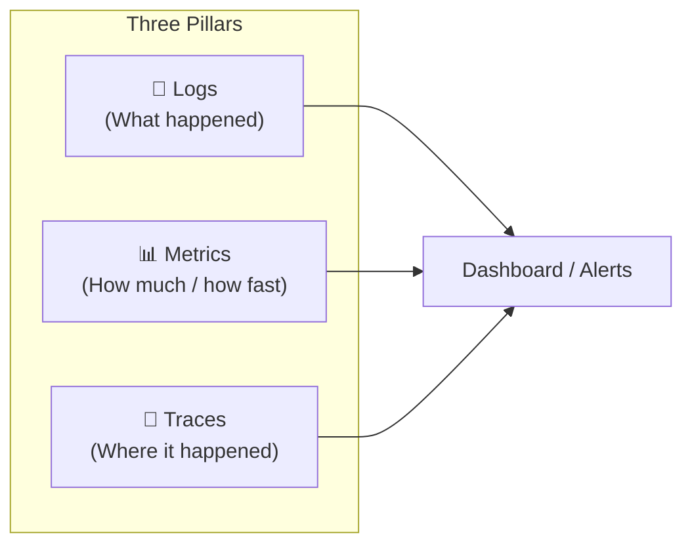
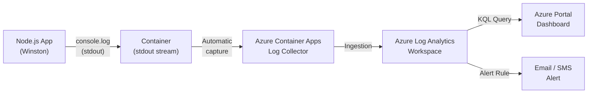
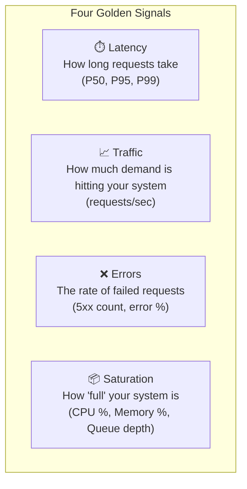
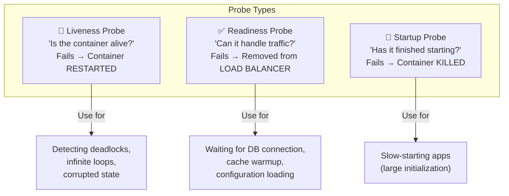
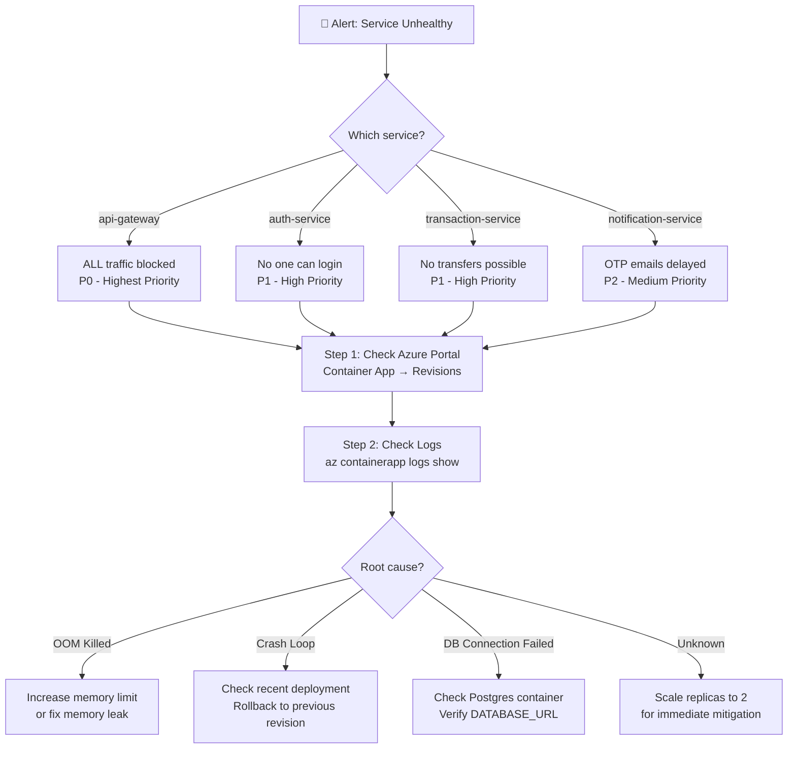
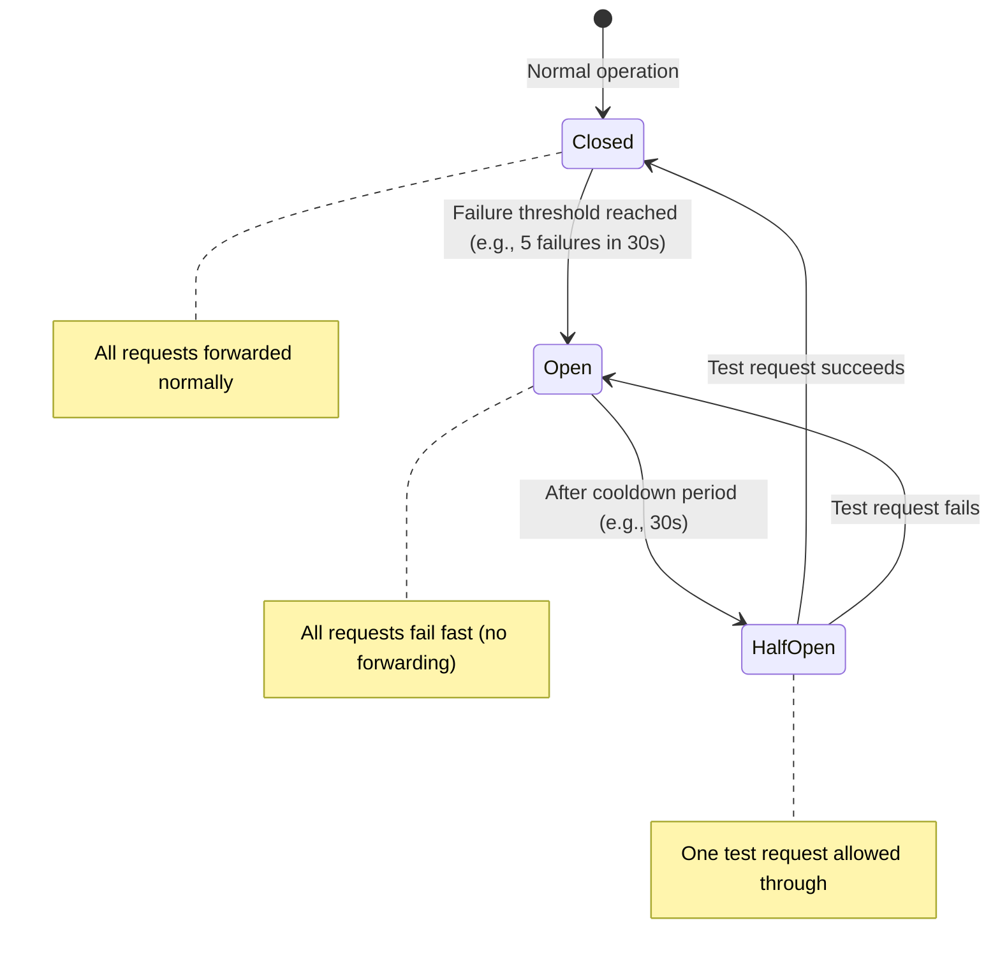

# 08 — Monitoring & Production Operations

> How to monitor, debug, and operate AegisVault in production — covering observability theory, your Winston logging setup, Azure monitoring, Grafana dashboards, health checks, and incident response.

---

## Table of Contents

1. [The Three Pillars of Observability](#1-the-three-pillars-of-observability)
2. [Your Logging Setup (Winston)](#2-your-logging-setup-winston)
3. [Azure Monitoring & Log Analytics](#3-azure-monitoring--log-analytics)
4. [Grafana Dashboards — Reading Your Metrics](#4-grafana-dashboards--reading-your-metrics)
5. [Health Check Endpoints](#5-health-check-endpoints)
6. [Incident Response Playbook](#6-incident-response-playbook)
7. [What's Missing & How to Improve](#7-whats-missing--how-to-improve)
8. [Key Terms Glossary](#8-key-terms-glossary)

---

## 1. The Three Pillars of Observability

**Observability** is the ability to understand the internal state of a system by examining its external outputs. In production, you can't attach a debugger or read `console.log()` — you need structured outputs.



| Pillar | What It Tells You | Example | In AegisVault |
|--------|-------------------|---------|---------------|
| **Logs** | Discrete events with context | "User usr-123 failed login at 14:05:32" | ✅ Winston structured JSON logs |
| **Metrics** | Aggregated numerical measurements over time | "95th percentile latency is 230ms" | ✅ Grafana + Prometheus |
| **Traces** | End-to-end request journey across services | "Request X went: gateway → auth → redis → postgres" | ❌ Not implemented |

---

## 2. Your Logging Setup (Winston)

### Structured JSON Logging

> File: [api-gateway/config/logger.js](../../services/api-gateway/src/config/logger.js)

```javascript
const logger = winston.createLogger({
  level: process.env.LOG_LEVEL || 'info',
  format: winston.format.combine(
    winston.format.timestamp({ format: 'YYYY-MM-DDTHH:mm:ss.SSSZ' }),
    winston.format.errors({ stack: true }),
    winston.format.json()
  ),
  defaultMeta: { service: 'api-gateway' },
  transports: [
    new winston.transports.Console({
      format: winston.format.combine(
        winston.format.timestamp(),
        winston.format.json()
      )
    })
  ]
});
```

**Why JSON and not plain text?**

Plain text log:
```
[2026-08-07 14:05:32] INFO: User logged in - user123
```
To search for all logins by `user123`, you'd write complex Regex. Fragile and error-prone.

Structured JSON log:
```json
{
  "timestamp": "2026-08-07T14:05:32.123Z",
  "level": "info",
  "message": "HTTP Request Completed",
  "service": "api-gateway",
  "method": "POST",
  "path": "/api/auth/login",
  "statusCode": 200,
  "durationMs": 142,
  "userId": "usr-123",
  "ip": "192.168.1.50"
}
```
Now you can query: `WHERE userId = 'usr-123' AND statusCode >= 500`. Every log management system (Azure Log Analytics, Elasticsearch, Datadog) parses JSON automatically.

### Request Logging Middleware

> File: [logger.js L28-L57](../../services/api-gateway/src/config/logger.js#L28-L57)

```javascript
const requestLogger = (req, res, next) => {
  const start = Date.now();

  res.on('finish', () => {
    const durationMs = Date.now() - start;
    const logData = {
      method: req.method,
      path: req.originalUrl,
      statusCode: res.statusCode,
      durationMs,
      ip: req.ip,
      userId: req.user ? req.user.sub : 'anonymous',
      userRole: req.user ? req.user.role : 'unauthenticated'
    };

    if (res.statusCode >= 500) {
      logger.error('HTTP Server Error', logData);
    } else if (res.statusCode >= 400) {
      logger.warn('HTTP Client Error', logData);
    } else {
      logger.info('HTTP Request Completed', logData);
    }
  });

  next();
};
```

**How it works:**
1. When a request arrives, it records the start time (`Date.now()`).
2. It calls `next()` — the request continues through the middleware chain to the controller.
3. When the response finishes (`res.on('finish')`), it calculates duration and logs with the appropriate level.
4. Log level is based on status code: `5xx → error`, `4xx → warn`, `2xx/3xx → info`.

### Log Levels Explained

| Level | When to Use | Example |
|-------|-------------|---------|
| `error` | System failures, unrecoverable errors | Database connection lost, unhandled exception |
| `warn` | Suspicious activity, degraded performance | Invalid login attempt, Redis fallback triggered |
| `info` | Normal operations, audit trail | User registered, transfer completed |
| `debug` | Verbose development-time data | Audit hash calculated, OTP stored in Redis |

> [!TIP]
> **`LOG_LEVEL` environment variable** controls verbosity. In production, use `info` (default). Set to `debug` only when investigating issues — debug logs can be extremely verbose and expensive to store.

---

## 3. Azure Monitoring & Log Analytics

### How Logs Flow from Your Containers to Azure



Azure Container Apps **automatically** captures everything your container writes to `stdout` and `stderr`. No logging agent needed. The logs are sent to the **Log Analytics Workspace** created when you provisioned the Container Apps Environment.

### Basic KQL (Kusto Query Language) Queries

KQL is Microsoft's query language for Log Analytics. It reads left-to-right, using pipes (`|`) to chain operations — similar to Unix shell pipes.

```kusto
// 1. Find all 5xx errors in the last hour
ContainerAppConsoleLogs_CL
| where TimeGenerated > ago(1h)
| where Log_s contains "HTTP Server Error"
| project TimeGenerated, Log_s

// 2. Find all login failures for a specific user
ContainerAppConsoleLogs_CL
| where Log_s contains "Invalid password attempt"
| where Log_s contains "user@example.com"
| sort by TimeGenerated desc

// 3. Calculate average response time per endpoint
ContainerAppConsoleLogs_CL
| where Log_s contains "durationMs"
| extend parsed = parse_json(Log_s)
| summarize avg(toreal(parsed.durationMs)) by tostring(parsed.path)
| sort by avg_durationMs desc
```

### Azure Portal: Container Apps Metrics


The Azure Portal provides built-in metrics for each Container App:
- **CPU Usage (%)**: If a service consistently uses >80% CPU, it needs more replicas or code optimization.
- **Memory Usage (MB)**: A steadily increasing memory graph suggests a **memory leak**.
- **Replica Count**: How many instances are running. If it's 0, the service is scaled to zero (idle).
- **Request Count**: Total inbound requests over time.

---

## 4. Grafana Dashboards — Reading Your Metrics

### What Grafana Shows

Grafana is an open-source visualization platform that connects to data sources like Prometheus to render real-time dashboards.


**Key metrics on the API Gateway dashboard:**

| Panel | What It Shows | What to Look For |
|-------|--------------|-----------------|
| **Total Requests** | Cumulative request count | Sudden drops = service outage; sudden spikes = DDoS or viral traffic |
| **Error Rate (%)** | Percentage of 4xx and 5xx responses | Should be < 1%. Above 5% = investigate immediately |
| **Response Time (P95/P99)** | 95th and 99th percentile latency | P99 > 2s means 1 in 100 users waits over 2 seconds |
| **Active Connections** | Current open TCP connections | If this hits max, new users get connection refused |


**Auth Service dashboard specifics:**
- **Login Success vs Failure rate**: A sudden spike in failures may indicate a credential stuffing attack.
- **OTP Verification latency**: If Redis is down and the system falls back to DB, latency spikes are visible here.

### The Four Golden Signals (Google SRE)

Google's Site Reliability Engineering book defines four critical metrics. Your dashboards should track all of these:



---

## 5. Health Check Endpoints

### Your `/health` Endpoints

Every service in AegisVault exposes a `/health` endpoint. Here's the API Gateway's:

> File: [api-gateway/index.js L44-L54](../../services/api-gateway/src/index.js#L44-L54)

```javascript
app.get('/health', (req, res) => {
  res.status(200).json({
    status: 'healthy',
    service: 'api-gateway',
    timestamp: new Date().toISOString(),
    uptime: process.uptime()
  });
});
```

### Three Types of Kubernetes Health Probes

While your current ACA setup doesn't explicitly configure these, understanding them is critical for production operations:



| Probe | Checks | Failure Action | Your Equivalent |
|-------|--------|---------------|-----------------|
| **Liveness** | Is the process alive? | Restart container | `restart: always` in docker-compose |
| **Readiness** | Can it serve requests? | Remove from load balancer | Docker `healthcheck` in compose |
| **Startup** | Has it finished booting? | Kill and reschedule | `depends_on: condition: service_healthy` |

---

## 6. Incident Response Playbook

### When a Service Goes Down



### Useful Azure CLI Commands for Debugging

```bash
# 1. View live logs from a container
az containerapp logs show --name auth-service --resource-group aegisvault-rg --follow

# 2. List all revisions (deployment history)
az containerapp revision list --name auth-service --resource-group aegisvault-rg -o table

# 3. Rollback to a previous revision
az containerapp revision activate --name auth-service --resource-group aegisvault-rg --revision auth-service--abc123

# 4. Scale up replicas immediately
az containerapp update --name auth-service --resource-group aegisvault-rg --min-replicas 2 --max-replicas 4

# 5. Check environment variables (redacted)
az containerapp show --name auth-service --resource-group aegisvault-rg --query properties.template.containers[0].env
```

### Circuit Breaker Pattern (Not Yet Implemented)

A **circuit breaker** prevents cascading failures. If `auth-service` is down, the API Gateway should stop forwarding requests to it (instead of timing out on every request) and return a fast error response.



**States:**
- **Closed (Normal)**: Requests flow to the downstream service. Failures are counted.
- **Open (Tripped)**: After N failures, the circuit "opens." All requests immediately return an error without contacting the down service. This prevents overwhelming a struggling service.
- **Half-Open (Testing)**: After a cooldown period, one request is allowed through. If it succeeds, the circuit closes. If it fails, it stays open.

---

## 7. What's Missing & How to Improve

| Missing Piece | Impact | Solution |
|--------------|--------|----------|
| **Distributed Tracing** | Can't trace a request across services. If a transfer fails, you must manually correlate logs by timestamp | Implement OpenTelemetry with a trace ID header (`x-correlation-id`) propagated through all services |
| **Centralized Log Aggregation** | Logs are in Azure Log Analytics but not easily correlated | Consider ELK Stack (Elasticsearch, Logstash, Kibana) or Azure Application Insights |
| **APM (Application Performance Monitoring)** | No automatic detection of slow queries, memory leaks, or CPU hotspots | Integrate Azure Application Insights SDK or Datadog APM agent |
| **Alerting** | No automated alerts when error rates spike or services go down | Configure Azure Monitor Alerts: "If 5xx error rate > 5% for 5 minutes, send email/Slack" |
| **SLOs/SLAs** | No formal definition of acceptable performance | Define SLOs: "99.9% of requests complete in < 500ms", "99.95% uptime per month" |
| **Runbooks** | No documented procedures for common incidents | Create step-by-step guides for each failure scenario |

---

## 8. Key Terms Glossary

| Term | Full Name | Explanation |
|------|-----------|-------------|
| **APM** | Application Performance Monitoring | Tools that automatically detect performance issues (slow queries, memory leaks). |
| **KQL** | Kusto Query Language | Microsoft's query language for Log Analytics. Reads left-to-right with pipe operators. |
| **SLI** | Service Level Indicator | A measurable metric of service quality (e.g., request latency, error rate). |
| **SLO** | Service Level Objective | A target value for an SLI (e.g., "P99 latency < 500ms"). |
| **SLA** | Service Level Agreement | A contractual guarantee around SLOs, with penalties for violations. |
| **MTTR** | Mean Time To Recover | Average time from incident detection to service restoration. |
| **MTTF** | Mean Time To Failure | Average time between system failures. |
| **P50/P95/P99** | Percentile Latency | The latency below which X% of requests complete. P99 = tail latency. |
| **Golden Signals** | Four Golden Signals | Google SRE's four key metrics: Latency, Traffic, Errors, Saturation. |
| **RED Method** | Rate, Errors, Duration | A simplified monitoring approach: track request Rate, Error count, and Duration. |
| **USE Method** | Utilization, Saturation, Errors | For infrastructure monitoring: CPU Utilization, Memory Saturation, Disk Errors. |
| **Circuit Breaker** | Circuit Breaker Pattern | Prevents cascading failures by fast-failing requests to unhealthy services. |
| **OpenTelemetry** | OpenTelemetry (OTel) | Open-source observability framework for generating traces, metrics, and logs. |
| **Correlation ID** | Request Correlation ID | A unique ID attached to a request, propagated across all services for tracing. |
| **Runbook** | Operations Runbook | A documented step-by-step guide for handling specific operational incidents. |

---

> **Next:** [09 — Integration Testing Deep Dive](./09_integration_testing_deep_dive.md) — How your microservices are tested with Jest, Supertest, and mock-driven integration strategies.
