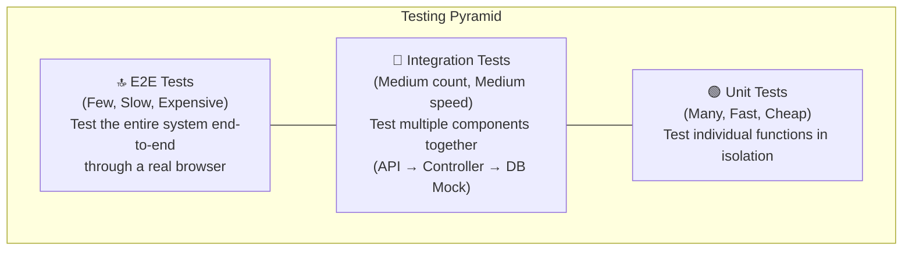
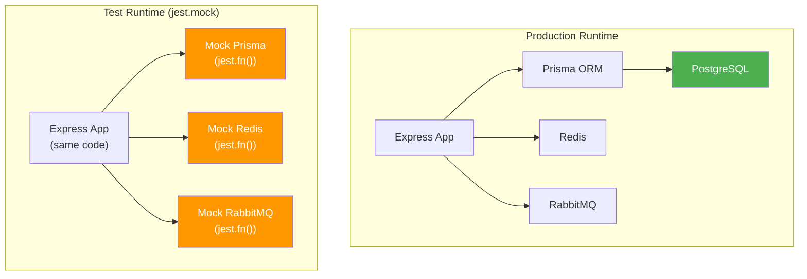
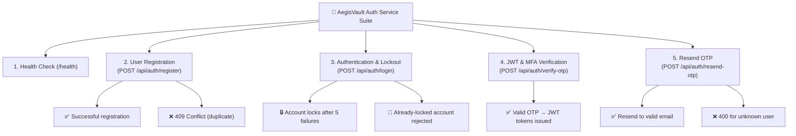
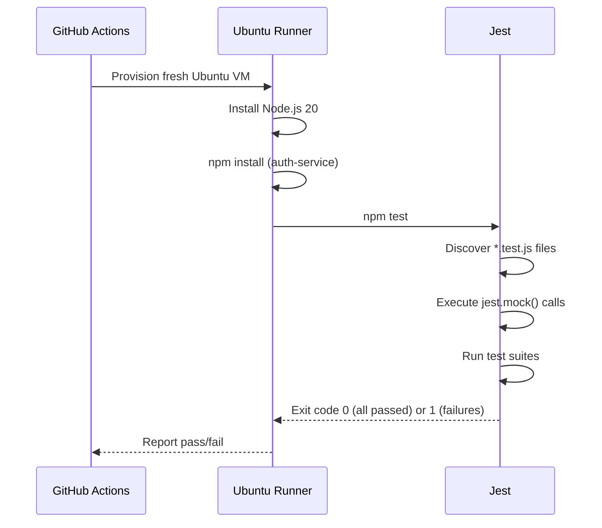

# 09 — Integration Testing Deep Dive

> How AegisVault's microservices are tested using Jest and Supertest — understanding test doubles, mock-driven integration strategies, and what each test suite actually verifies.

---

## Table of Contents

1. [Testing Theory: Unit vs Integration vs E2E](#1-testing-theory-unit-vs-integration-vs-e2e)
2. [Your Testing Stack: Jest + Supertest](#2-your-testing-stack-jest--supertest)
3. [The Mock Architecture (How Tests Bypass Real Infrastructure)](#3-the-mock-architecture-how-tests-bypass-real-infrastructure)
4. [Auth Service Tests — Line by Line](#4-auth-service-tests--line-by-line)
5. [Transaction Service Tests — Line by Line](#5-transaction-service-tests--line-by-line)
6. [Account Service Tests — Integration with Real DB](#6-account-service-tests--integration-with-real-db)
7. [Notification & Admin Service Tests](#7-notification--admin-service-tests)
8. [How Tests Run in CI](#8-how-tests-run-in-ci)
9. [Limitations & Improvements](#9-limitations--improvements)
10. [Key Terms Glossary](#10-key-terms-glossary)

---

## 1. Testing Theory: Unit vs Integration vs E2E

### The Testing Pyramid



| Level | What It Tests | Speed | In AegisVault |
|-------|--------------|-------|---------------|
| **Unit** | A single function/class in isolation | Milliseconds | `bcrypt.hash()`, `evaluateFraudRules()` |
| **Integration** | Multiple components interacting | Seconds | HTTP request → Express route → Controller → Mocked DB |
| **E2E (End-to-End)** | The entire system through the UI | Minutes | ❌ Not implemented (would use Playwright/Cypress) |

### Your tests are primarily **narrow integration tests** — they send real HTTP requests to your Express app using Supertest, but the database (Prisma), cache (Redis), and message broker (RabbitMQ) are all replaced with mocks.

---

## 2. Your Testing Stack: Jest + Supertest

### Jest

**Jest** is a JavaScript testing framework created by Meta (Facebook). It provides:
- **Test Runner**: Discovers and executes test files (`*.test.js`)
- **Assertion Library**: `expect(value).toBe(expected)` syntax
- **Mocking**: `jest.fn()`, `jest.mock()`, `jest.spyOn()` for replacing dependencies
- **Code Coverage**: Reports which lines of code are exercised by tests

### Supertest

**Supertest** is a library for testing HTTP servers. It creates a real HTTP request to your Express `app` object **without starting a server on a port**. This means tests are fast and don't have port conflicts.

```javascript
const request = require('supertest');
const app = require('../src/index');  // Your Express app

// Send a real HTTP POST request
const res = await request(app)
  .post('/api/auth/register')
  .send({ email: 'test@test.com', password: 'SecurePass1!' });

// Assert on the HTTP response
expect(res.status).toBe(201);
expect(res.body.success).toBe(true);
```

**What happens under the hood:**
1. Supertest imports your Express `app` (not the `app.listen()` call — just the router configuration)
2. It creates an in-memory HTTP server bound to a random port
3. It sends the request, waits for the response, and returns it
4. The server is destroyed after the test

---

## 3. The Mock Architecture (How Tests Bypass Real Infrastructure)

In production, your auth-service talks to PostgreSQL (via Prisma), Redis, and RabbitMQ. In tests, all three are replaced with **mock objects** — fake implementations that simulate the real things but don't require actual running services.



### How `jest.mock()` Works

```javascript
// This replaces the REAL '../src/config/db' module with a fake one
jest.mock('../src/config/db', () => {
  const mockPrisma = {
    user: {
      findUnique: jest.fn(),   // Returns undefined by default
      findFirst: jest.fn(),
      create: jest.fn(),
      update: jest.fn(),
    },
    $transaction: jest.fn((callback) => callback()),
    $on: jest.fn(),
  };
  return { prisma: mockPrisma };
});
```

**What this does:**
- When any file in the auth-service does `require('../config/db')`, instead of getting the real Prisma client (which needs a running PostgreSQL), it gets this mock object.
- `jest.fn()` creates a "spy function" that:
  - Records every call (arguments, call count)
  - Returns `undefined` by default
  - Can be configured to return specific values with `.mockResolvedValue()`

### Test Doubles Terminology

| Type | Definition | In Your Code |
|------|-----------|-------------|
| **Mock** | A fake that records calls and can be verified | `jest.fn()` — most of your test doubles |
| **Stub** | A fake that returns canned responses | `prisma.user.findUnique.mockResolvedValue({...})` |
| **Spy** | Wraps a real function, recording calls without replacing behavior | `jest.spyOn(bcrypt, 'compare')` |
| **Fake** | A simplified but working implementation (e.g., in-memory DB) | Not used in AegisVault |
| **Dummy** | A placeholder passed but never used | `testAccountId = 'dummy-account-id'` |

---

## 4. Auth Service Tests — Line by Line

> File: [auth.test.js](../../services/auth-service/tests/auth.test.js) (249 lines)

### Test Suite Structure



### Test 1: Health Check

```javascript
describe('1. Health Check Endpoint (/health)', () => {
  it('should return 200 OK and healthy status', async () => {
    const res = await request(app).get('/health');
    expect(res.status).toBe(200);
    expect(res.body.status).toBe('healthy');
    expect(res.body.service).toBe('auth-service');
  });
});
```

**What this verifies:** The most basic integration test — can the Express app start and respond? If this fails, the entire service is broken (syntax errors, missing dependencies, port conflicts).

### Test 2: User Registration

```javascript
it('should successfully register a new user with valid Sri Lankan NIC', async () => {
  // ARRANGE: Configure mocks to simulate "no existing user"
  prisma.user.findFirst.mockResolvedValue(null);  // No duplicate found
  prisma.user.create.mockResolvedValue({          // Return created user
    id: 'usr-new-100',
    email: 'newuser@aegisvault.com',
    role: 'CUSTOMER',
  });

  // ACT: Send registration request
  const res = await request(app)
    .post('/api/auth/register')
    .send({
      email: 'newuser@aegisvault.com',
      phone: '+94770001111',
      nic: '200412345678',
      password: 'SecurePassword123!',
    });

  // ASSERT: Verify HTTP response
  expect(res.status).toBe(201);
  expect(res.body.success).toBe(true);
  expect(res.body.user.email).toBe('newuser@aegisvault.com');
});
```

**The AAA Pattern (Arrange-Act-Assert):**
1. **Arrange**: Set up mock return values and test data
2. **Act**: Execute the code under test (send HTTP request)
3. **Assert**: Verify the outcome (status code, response body)

**What this verifies:**
- Zod validation accepts valid input
- The controller calls `prisma.user.findFirst()` to check duplicates
- The controller calls `prisma.user.create()` with the hashed password
- The response is properly formatted with 201 status

### Test 3: Account Lockout After 5 Failures

```javascript
it('should lock out account after 5 failed login attempts', async () => {
  const lockedUser = {
    id: 'usr-test-locked',
    email: 'locked@aegisvault.com',
    passwordHash: '$2b$12$eXAMPLehAsHeDPaSsWoRDhAsH',
    failedAttempts: 4,   // Already at 4 — next failure will trigger lockout
    isLocked: false,
  };

  prisma.user.findUnique.mockResolvedValue(lockedUser);
  prisma.user.update.mockResolvedValue({ ...lockedUser, failedAttempts: 5, isLocked: true });

  // Spy on bcrypt.compare to force "wrong password"
  jest.spyOn(bcrypt, 'compare').mockImplementation(() => Promise.resolve(false));

  const res = await request(app)
    .post('/api/auth/login')
    .send({ email: 'locked@aegisvault.com', password: 'WrongPassword!' });

  expect(res.status).toBe(403);
  expect(res.body.error).toContain('5 consecutive failed login attempts');

  // Verify the database was updated correctly
  expect(prisma.user.update).toHaveBeenCalledWith({
    where: { id: 'usr-test-locked' },
    data: { failedAttempts: 5, isLocked: true },
  });
});
```

**Key techniques here:**
- **`jest.spyOn(bcrypt, 'compare')`** — Instead of mocking the entire bcrypt module, it wraps just the `compare` function. This lets the test control whether the password check passes or fails.
- **`.toHaveBeenCalledWith()`** — Verifies not just that the function was called, but that it was called with exactly the right arguments. This ensures the lockout logic sends the correct data to the database.

### Test 4: JWT Token Issuance after OTP Verification

```javascript
it('should issue valid JWT access and refresh tokens upon successful OTP verification', async () => {
  prisma.user.findUnique.mockResolvedValue({
    id: 'usr-test-1', email: 'test@aegisvault.com', role: 'CUSTOMER', kycStatus: 'VERIFIED'
  });

  // Pre-compute the SHA-256 hash of '123456' — same algorithm as production
  const sha256OtpHash = crypto.createHash('sha256').update('123456').digest('hex');
  prisma.otpRecord.findFirst.mockResolvedValue({
    otpHash: sha256OtpHash,
    expiresAt: new Date(Date.now() + 300000),  // Not expired
  });

  const res = await request(app)
    .post('/api/auth/verify-otp')
    .send({ email: 'test@aegisvault.com', otp: '123456' });

  expect(res.status).toBe(200);
  expect(res.body.accessToken).toBeDefined();
  expect(res.body.refreshToken).toBeDefined();

  // Verify the JWT is actually valid and contains correct claims
  const decoded = jwt.verify(res.body.accessToken, process.env.JWT_SECRET);
  expect(decoded.sub).toBe('usr-test-1');
  expect(decoded.role).toBe('CUSTOMER');
});
```

**What makes this test thorough:**
- It doesn't just check that a token is returned — it **decodes and verifies** the token's contents using `jwt.verify()`.
- It uses the real SHA-256 hashing algorithm to create the mock OTP hash, ensuring the hash comparison logic in production works correctly with the `timingSafeEqual` function.

---

## 5. Transaction Service Tests — Line by Line

> File: [transaction.test.js](../../services/transaction-service/tests/transaction.test.js) (191 lines)

### Additional Mock: Axios (HTTP Client)

The transaction-service calls the account-service over HTTP (via Axios) to check balances and execute transfers. In tests, Axios is mocked:

```javascript
jest.mock('axios');
const axios = require('axios');

beforeEach(() => {
  jest.clearAllMocks();
  axios.post.mockResolvedValue({ data: { success: true } });
});
```

**Why mock Axios?** The transaction-service doesn't own the account-service. Running the tests shouldn't require another microservice to be running. By mocking Axios, you simulate the account-service's responses.

### Test: Successful ACID Transfer

```javascript
it('should successfully execute atomic interbank transfer and log receipt', async () => {
  // Mock: Account service returns sender balance
  axios.get.mockResolvedValueOnce({
    data: { success: true, balance: 500000.00, account: { status: 'ACTIVE' } }
  });

  // Mock: Account service confirms atomic transfer
  axios.post.mockResolvedValueOnce({
    data: { success: true, message: 'ACID transfer executed successfully' }
  });

  // Mock: Transaction DB record created
  prisma.transaction.create.mockResolvedValue({
    id: 'txn-test-001',
    amount: 25000.00,
    status: 'SUCCESS',
    fraudFlag: false,
  });

  const res = await request(app)
    .post('/api/transactions/transfer')
    .send({
      fromAccountId: '810023459812',
      toAccountId: '810087654321',
      amount: 25000.00,
      currency: 'LKR',
    });

  expect(res.status).toBe(201);
  expect(res.body.transaction.status).toBe('SUCCESS');
  expect(res.body.transaction.fraudFlag).toBe(false);
});
```

**What this verifies:**
- The transfer flow: balance check → execute transfer → create transaction record
- The fraud engine doesn't flag a normal amount (25,000 LKR < 500,000 threshold)
- The response includes the transaction with correct status

### Test: Fraud Detection Engine (Rule 1)

```javascript
it('should flag transaction when amount exceeds high-value threshold', async () => {
  // Balance is sufficient (2M LKR)
  axios.get.mockResolvedValueOnce({
    data: { success: true, balance: 2000000.00, account: { status: 'ACTIVE' } }
  });
  axios.post.mockResolvedValueOnce({ data: { success: true } });

  prisma.transaction.create.mockResolvedValue({
    amount: 650000.00,   // > 500,000 threshold
    fraudFlag: true,     // Should be flagged
  });

  prisma.fraudAlert.create.mockResolvedValue({
    ruleTriggered: 'HIGH_AMOUNT_THRESHOLD',
    riskScore: 85,
    status: 'FLAGGED',
  });

  const res = await request(app)
    .post('/api/transactions/transfer')
    .send({ fromAccountId: '810023459812', toAccountId: '990011223344', amount: 650000.00 });

  expect(res.status).toBe(201);
  expect(res.body.transaction.fraudFlag).toBe(true);
  expect(res.body.fraudAlerts).toBeDefined();
});
```

---

## 6. Account Service Tests — Integration with Real DB

> File: [account.integration.test.js](../../services/account-service/tests/account.integration.test.js) (42 lines)

The account-service tests are different. They do **NOT** mock Prisma — they attempt to connect to a real database. This makes them true integration tests, but they require a running PostgreSQL instance.

```javascript
const request = require('supertest');
const app = require('../src/index');  // No jest.mock() — uses real Prisma

it('should successfully hit the GET /api/accounts endpoint', async () => {
  const response = await request(app)
    .get('/api/accounts')
    .set('x-user-id', testUserId);  // Simulate gateway header injection
  
  expect(response.status).toBe(200);
  expect(Array.isArray(response.body)).toBe(true);
});

it('should block requests without x-user-id header', async () => {
  const response = await request(app).get('/api/accounts');
  expect([400, 401, 403]).toContain(response.status);
});
```

**Why `expect([200, 400, 404]).toContain(response.status)`?**

These tests use dummy IDs (`'dummy-account-id'`). They don't know what's in the database. The test verifies that:
- The Express route exists and responds (not a 500)
- The middleware chain works (`x-user-id` header is required)
- The response format is correct (array for list endpoints)

A 200 means the query succeeded. A 404 means the account doesn't exist (expected with a dummy ID). Both are valid responses — only a 500 indicates a broken integration.

---

## 7. Notification & Admin Service Tests

### Notification Service: RBAC Enforcement

> File: [notification.integration.test.js](../../services/notification-service/tests/notification.integration.test.js)

```javascript
it('should successfully hit the GET /api/audit endpoint (Admin only)', async () => {
  const response = await request(app)
    .get('/api/audit')
    .set('x-user-id', testUserId)
    .set('x-user-role', 'ADMIN');    // Admin role → should work
  
  expect(response.status).toBe(200);
});

it('should block non-admins from hitting the GET /api/audit endpoint', async () => {
  const response = await request(app)
    .get('/api/audit')
    .set('x-user-role', 'CUSTOMER'); // Customer role → should be denied
  
  expect(response.status).toBe(403);
});
```

**What this verifies:** The RBAC middleware correctly reads the `x-user-role` header and blocks non-admin users from sensitive endpoints. This is a critical security test.

### Admin Service: Cross-Service Proxy Testing

> File: [loans.integration.test.js](../../services/admin-service/tests/loans.integration.test.js)

```javascript
it('should reject requests without ADMIN or OFFICER role (403 Forbidden)', async () => {
  const response = await request(app)
    .put(`/api/admin/loans/${testLoanId}/approve`)
    .set('x-user-role', 'CUSTOMER');
  
  expect(response.status).toBe(403);
});
```

The admin service tests verify that loan approval/rejection endpoints:
1. Only accept ADMIN or OFFICER roles
2. Proxy correctly to the account-service (even if the loan doesn't exist — the proxy should work)

---

## 8. How Tests Run in CI

Your CI pipeline (`ci.yml`) runs tests as part of the `unit-tests` job:

```yaml
- name: Install Dependencies & Run Tests - Auth Service
  working-directory: ./services/auth-service
  env:
    JWT_SECRET: aegisvault-super-secret-jwt-key-2026
    NODE_ENV: test
  run: |
    npm install --no-fund
    npm audit --audit-level=high || true
    npm test
```



**Key point:** Because all infrastructure is mocked, these tests run on a bare Ubuntu VM with no PostgreSQL, Redis, or RabbitMQ installed. They execute in ~5 seconds.

---

## 9. Limitations & Improvements

| Limitation | Impact | Improvement |
|-----------|--------|-------------|
| **Heavy mocking** | Mocks can become stale — if the real DB schema changes, mocks still pass | Use **Testcontainers** to spin up real Postgres/Redis in Docker during tests |
| **No code coverage enforcement** | Unknown percentage of code is tested | Add `jest --coverage` and `coverageThreshold` in `jest.config.js` |
| **No E2E tests** | No verification of the full user flow through the browser | Add Playwright or Cypress for login → transfer → verify flow |
| **Account/Notification tests need real DB** | These tests fail without a running database | Either add mocks or use Testcontainers |
| **No load/performance testing** | No idea how the system performs under 1000 concurrent users | Add k6 or Artillery load tests in CI |
| **No contract testing** | If the account-service changes its API response shape, the transaction-service tests still pass (because Axios is mocked) | Use **Pact** for consumer-driven contract testing |

### What are Testcontainers?

**Testcontainers** is a library that programmatically starts real Docker containers (PostgreSQL, Redis) during tests and tears them down after. This gives you the speed of unit tests with the confidence of real infrastructure:

```javascript
// Example: Using Testcontainers for real Postgres in tests
const { PostgreSqlContainer } = require('testcontainers');

let container;

beforeAll(async () => {
  container = await new PostgreSqlContainer('postgres:16-alpine')
    .withDatabase('aegisvault')
    .start();
  process.env.DATABASE_URL = container.getConnectionUri();
}, 30000);

afterAll(async () => {
  await container.stop();
});
```

---

## 10. Key Terms Glossary

| Term | Full Name | Explanation |
|------|-----------|-------------|
| **Jest** | Jest Testing Framework | JavaScript testing framework by Meta with built-in assertions, mocking, and coverage |
| **Supertest** | SuperTest HTTP Testing | Library for testing HTTP endpoints by sending requests to an Express app in-memory |
| **Mock** | Mock Object | A fake implementation that records calls for later verification |
| **Stub** | Test Stub | A mock configured to return specific values for specific inputs |
| **Spy** | Test Spy | Wraps a real function, recording calls without changing behavior (unless overridden) |
| **AAA** | Arrange-Act-Assert | Testing pattern: set up data (Arrange), execute code (Act), verify results (Assert) |
| **Test Double** | Test Double | Generic term for any fake object used in tests (mock, stub, spy, fake, dummy) |
| **Code Coverage** | Test Code Coverage | Percentage of source code lines executed during tests |
| **Testcontainers** | Testcontainers | Library for running real Docker containers (databases, caches) during automated tests |
| **Contract Testing** | Consumer-Driven Contract Testing | Verifying that service API interfaces match between producer and consumer |
| **`jest.fn()`** | Jest Mock Function | Creates a new mock function that records all calls and arguments |
| **`jest.mock()`** | Jest Module Mock | Replaces an entire module import with a mock implementation |
| **`jest.spyOn()`** | Jest Spy | Creates a spy on an existing object method |
| **`mockResolvedValue()`** | Mock Resolved Value | Configures a mock to return a resolved Promise with the given value |
| **`toHaveBeenCalledWith()`** | Jest Matcher | Asserts that a mock was called with specific arguments |
| **`beforeEach()`** | Jest Lifecycle Hook | Runs a function before each test case (used for resetting mocks) |
| **E2E** | End-to-End Testing | Testing the complete application flow through a real browser/client |

---

> **Congratulations!** 🎉 You've completed the entire AegisVault Learning Documentation Suite. These 9 documents cover CI/CD, Docker, Azure, Kubernetes, Terraform, Cybersecurity, Vulnerabilities, Monitoring, and Testing — all grounded in your actual codebase.
