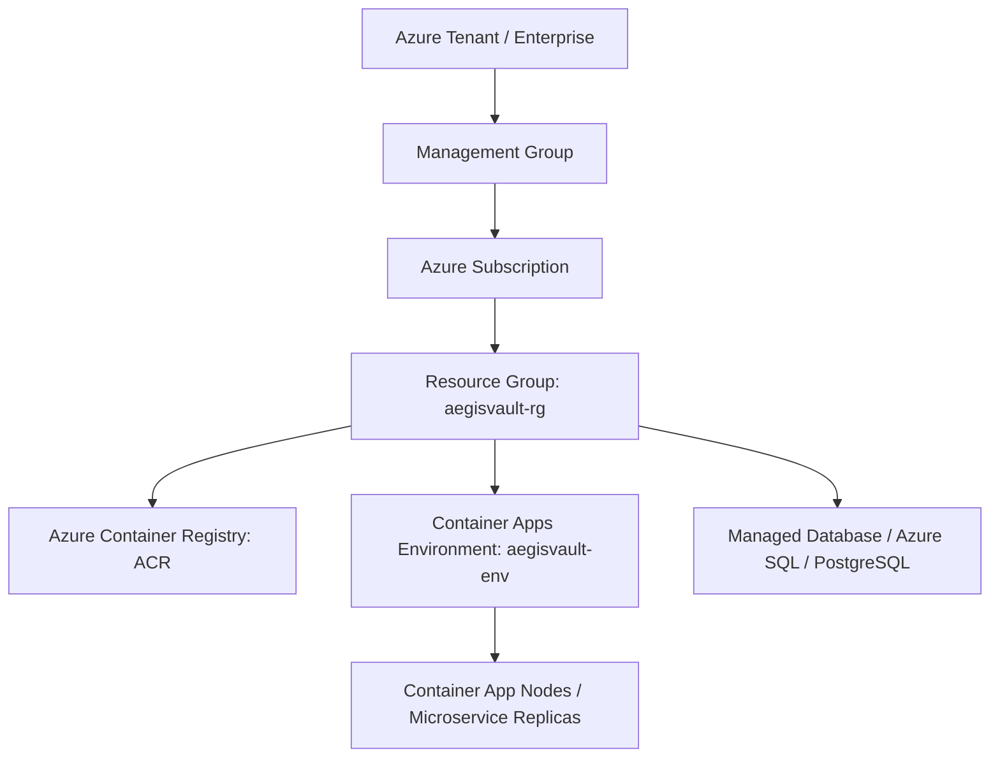
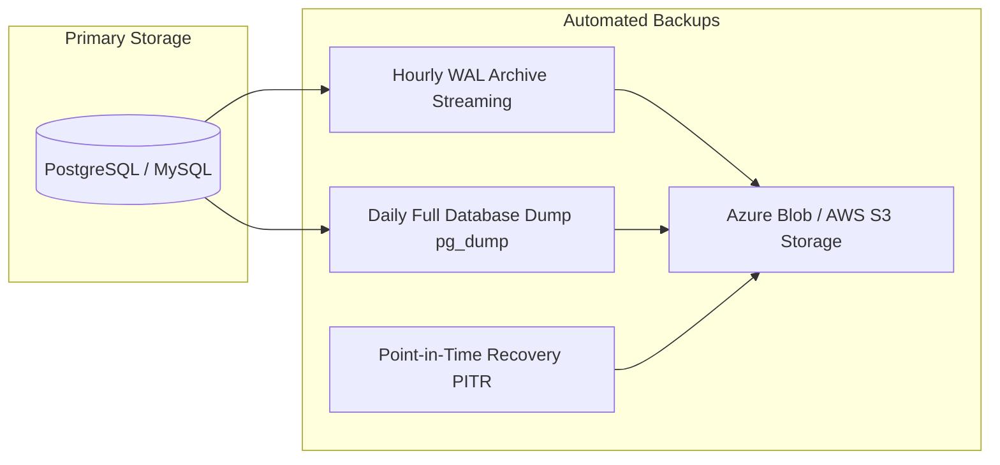
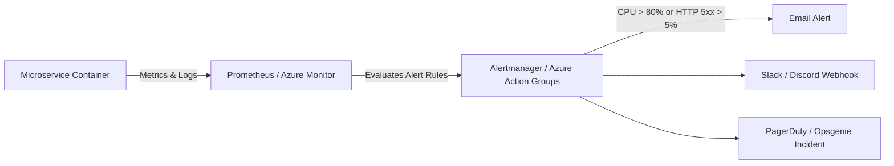
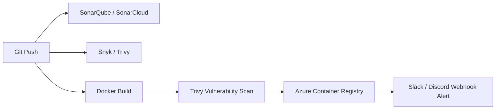
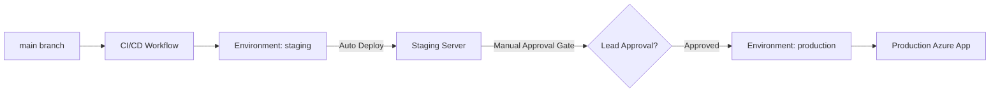

# AegisVault DevOps Post-Competition Interview Guide & Lessons Learned

This guide breaks down each of the 5 interview topics raised by the judges during the final evaluation of the **AegisVault Digital Banking Platform**. It explains the core concepts, why judges ask these questions, the production industry standard, and concrete examples of how to implement them in future DevOps competitions and real-world infrastructure.

---

## 1. Azure Cloud Architecture & IAM Roles (RBAC vs Root User)

### A. Core Concepts & Cloud Structure Hierarchy
In cloud platforms like Azure or AWS, infrastructure is organized in a hierarchical tree:



* **Tenant**: The top-level Azure Active Directory (Entra ID) organization context.
* **Subscription**: The billing container.
* **Resource Group (`aegisvault-rg`)**: A logical container for grouping related cloud resources.
* **Nodes / Workers**: The underlying compute instances (VMs / K8s nodes) executing container instances.
* **Modules**: Infrastructure as Code (IaC) units that bundle related cloud resources together for reusability.

---

### B. Root User vs. Least Privilege IAM Roles
* **The Mistake**: Deploying using Azure Root / Subscription Owner credentials or ACR Admin Password. If these keys leak, an attacker gains full control of the entire cloud account.
* **Industry Standard**: Use **Azure Role-Based Access Control (RBAC)** and **Managed Identity**.

#### 1. GitHub Actions CI/CD via Azure Service Principal (RBAC)
Instead of root credentials, create a scoped Service Principal with *only* `Contributor` access to the specific Resource Group:

```bash
# Create a Service Principal scoped ONLY to aegisvault-rg
az ad sp create-for-rbac \
  --name "github-actions-aegisvault" \
  --role "Contributor" \
  --scopes /subscriptions/{SUBSCRIPTION_ID}/resourceGroups/aegisvault-rg \
  --sdk-auth
```
*(Even better: Use **Azure Workload Identity Federation (OIDC)** to connect GitHub Actions without using long-lived secret keys at all!)*

#### 2. Passwordless Inter-Service Access via Managed Identity
Instead of storing database passwords or ACR registry secrets in code or `.env`:
* Enable **System-Assigned Managed Identity** on Azure Container Apps.
* Grant `AcrPull` role to the Container App's Managed Identity.

```bash
# Assign Managed Identity to auth-service
az containerapp identity assign \
  --name auth-service \
  --resource-group aegisvault-rg \
  --system-assigned

# Grant AcrPull role to auth-service identity
az role assignment create \
  --assignee <identity-principal-id> \
  --role "AcrPull" \
  --scope /subscriptions/{SUBSCRIPTION_ID}/resourceGroups/aegisvault-rg/providers/Microsoft.ContainerRegistry/registries/aegisvaultacr
```

---

## 2. Database Backup, Monitoring, Alerting & Resilience

### A. Database Backup Mechanisms
When judges ask *"What is your database backup mechanism?"*, they want to know how data loss is prevented.



1. **Managed Cloud Databases (Azure Database for PostgreSQL / Flexible Server)**:
   * Automated **Point-In-Time Recovery (PITR)** up to 35 days.
   * Daily full snapshots and continuous Write-Ahead Log (WAL) archiving.
   * Read Replicas across multiple availability zones.
2. **Containerized / Self-Hosted DBs**:
   * Automated cron container executing `pg_dumpall` or `mysqldump`.
   * Encrypting backups with GPG and pushing to an encrypted **Azure Blob Storage container** or **AWS S3 bucket** with Lifecycle Rules (e.g. retention for 30 days).

---

### B. What Happens When a Service Crashes? (Resilience & Self-Healing)
Judges look for automated fault handling:

1. **Health Probes**:
   * **Liveness Probe**: Asks *"Is the container running?"* If it returns 500 or times out, the container runtime kills and restarts the container.
   * **Readiness Probe**: Asks *"Is the app ready to receive traffic?"* (e.g., connected to DB). If false, traffic is temporarily stopped from routing to it.
2. **Automatic Restart Policies**:
   * Setting `restartPolicy: Always` in Kubernetes or Azure Container Apps ensures crashed containers restart immediately.
3. **High Availability (HA)**:
   * Setting `--min-replicas 2` so if container instance #1 crashes, container instance #2 handles incoming HTTP traffic while instance #1 restarts.
4. **Message Queue Failover (RabbitMQ)**:
   * Using **Dead Letter Queues (DLQ)** in `notification-service` so failed messages are saved and retried later rather than lost.

---

### C. Monitoring & Emergency Alerting System
Judges ask *"How do you monitor it? Do admins get emergency alerts?"*



1. **Log & Metric Aggregation**:
   * **Prometheus + Grafana** or **Azure Application Insights**.
   * Microservices expose standard metrics endpoint (`/metrics`).
2. **Automated Alert Rules**:
   * **Condition**: If HTTP 5xx error rate > 5% for 2 minutes, OR container crashes > 3 times in 5 minutes, OR CPU usage > 85%.
3. **Emergency Alert Channels**:
   * **Azure Monitor Action Groups**: Send instant SMS/Email notifications to DevOps Engineers.
   * **PagerDuty / Opsgenie Integration**: Triggers automated phone call / incident ticket.
   * **Slack / Discord Webhooks**: Real-time ops alert channel messages.

---

## 3. Infrastructure as Code (Terraform) & Kubernetes

### A. Terraform vs. Bash Scripts (`provision.azcli`)
Why judges favor Terraform over CLI scripts:

| Feature | Bash Script (`azcli`) | Terraform (IaC) |
| :--- | :--- | :--- |
| **Paradigm** | Imperative (step-by-step commands) | Declarative (defines desired state) |
| **State Management** | None (can create duplicate resources) | Tracks state in `terraform.tfstate` |
| **Drift Detection** | Cannot detect manual cloud changes | `terraform plan` flags any manual drift |
| **Modularity** | Hard to maintain bash functions | Reusable `.tf` modules |
| **Rollbacks & Deletion**| Hard to tear down cleanly | Single command: `terraform destroy` |

#### Simple Terraform Example for AegisVault (`main.tf`):
```hcl
resource "azurerm_resource_group" "rg" {
  name     = "aegisvault-rg"
  location = "East US"
}

resource "azurerm_container_registry" "acr" {
  name                = "aegisvaultacr"
  resource_group_name = azurerm_resource_group.rg.name
  location            = azurerm_resource_group.rg.location
  sku                 = "Standard"
  admin_enabled       = false # Uses RBAC!
}
```

---

### B. Kubernetes (K8s / AKS) vs Azure Container Apps
* **Azure Container Apps (ACA)**: Managed serverless container platform built on Kubernetes + KEDA + Envoy. Good for quick setups.
* **Kubernetes (AKS)**: Full container orchestration engine. Gives full control over Pods, Services, Deployments, Ingress Controllers (Nginx/Traefik), ConfigMaps, Secrets, and Helm Charts.

---

## 4. 3rd-Party Services & Tools in CI/CD Pipelines

Judges ask: *"Did you use 3rd-party services in the CI/CD pipeline?"*

Here are the standard 3rd-party security, quality, and notification tools integrated into modern pipelines:



1. **SonarQube / SonarCloud**: Static Application Security Testing (SAST) & Code Quality analysis (detects code smells, security hotspots, duplication).
2. **Snyk / Aqua Trivy**:
   * **Snyk**: Scans `package.json` for known CVE security vulnerabilities in third-party libraries.
   * **Trivy**: Scans Docker container base images for OS vulnerabilities before pushing to ACR.
3. **Codecov / Coveralls**: Code test coverage reports uploaded automatically from Jest/Supertest.
4. **Slack / Discord Notifications**: Sends build status (success/failure) notifications to team channels using webhooks (`rtCamp/action-slack-notify`).

---

## 5. GitHub Environments & Versioning Strategy

### A. GitHub Environments (Staging vs. Production)
GitHub Environments allow you to configure protection rules and separate environment-specific secrets.



1. **GitHub Environment Setup**:
   * Create two environments in repo settings: `staging` and `production`.
2. **Required Approvers (Manual Gate)**:
   * Require explicit manual review/approval from team leads before code is released to `production`.
3. **Environment Secrets**:
   * `staging` environment uses `STAGING_DATABASE_URL`.
   * `production` environment uses `PROD_DATABASE_URL`.

---

### B. GitHub Versioning & Release Strategy
1. **Semantic Versioning (SemVer)**: `vMAJOR.MINOR.PATCH`
   * `v1.0.0`: Initial stable release.
   * `v1.1.0`: New backward-compatible feature (e.g. added new API endpoint).
   * `v1.0.1`: Patch / Bug fix.
2. **Docker Image Tagging Strategy**:
   * Never rely on `:latest` in production!
   * Best practice tag format: `${{ github.sha }}` and `${{ github.ref_name }}` (e.g. `aegisvault-auth:v1.2.0` and `aegisvault-auth:sha-a1b2c3d`).
3. **Git Tagging & Releases**:
   ```bash
   git tag -a v1.0.0 -m "Release v1.0.0 - Duothon Finals"
   git push origin v1.0.0
   ```
