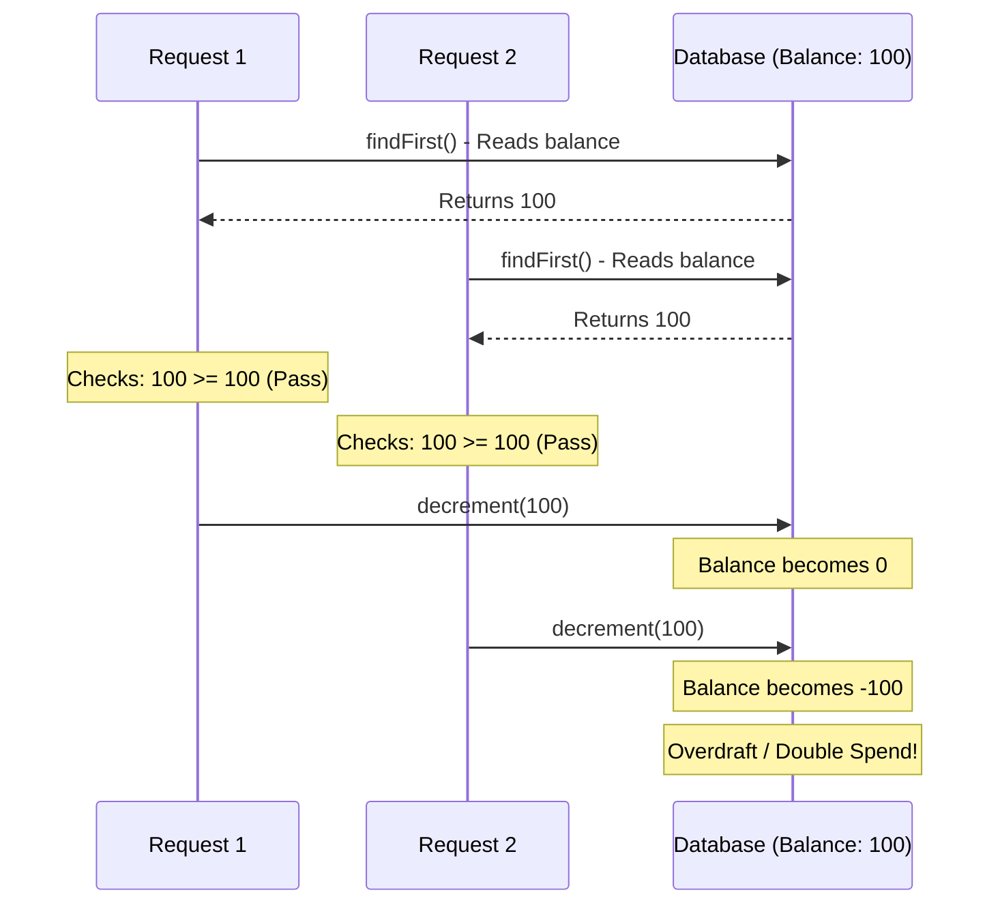
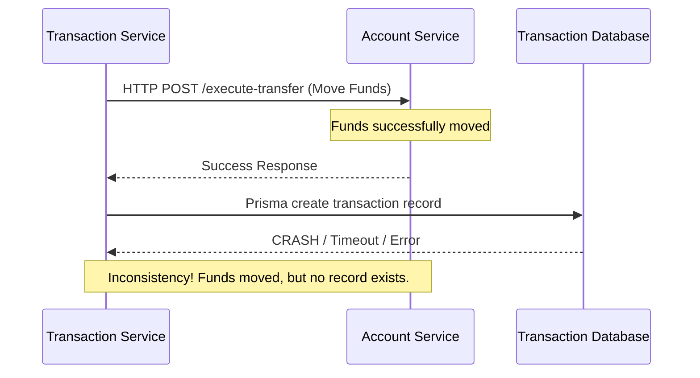

# Architectural Vulnerabilities & Code Analysis Report

This report outlines critical architectural flaws, race conditions, and deviations from industry standards discovered during an in-depth code review of the AegisVault microservices platform. 

---

## 1. Rate Limiting Middleware Order (API Gateway)

**File:** [services/api-gateway/src/index.js](file:///c:/Users/USER/Desktop/Duothon_6.0_BigBug/services/api-gateway/src/index.js)

**The Problem:**
In the API Gateway, the `authenticatedRateLimiter` is designed to limit requests per user (100 req/min) to prevent abuse. However, it is mounted *before* the `jwtAuthMiddleware`.
Because the JWT middleware is what actually parses the token and extracts the `user-id`, the rate limiter has no idea who the user is when it runs. This renders the per-user rate limiting completely ineffective, likely forcing it to fall back to IP-based rate limiting or failing silently.

**Industry Standard Solution:**
Authentication middleware must always precede authorization or authenticated rate-limiting middleware.

---

## 2. "Time-of-Check to Time-of-Use" (TOCTOU) Race Condition (Account Service)

**Files:** [services/account-service/src/controllers/account.controller.js](file:///c:/Users/USER/Desktop/Duothon_6.0_BigBug/services/account-service/src/controllers/account.controller.js)

**The Problem:**
When processing a fund transfer (`executeTransfer`) or a bill payment (`payBill`), the code checks if the sender has enough money by doing a standard database read:
`const sender = await tx.account.findFirst(...)`
It then checks in Node.js memory:
`if (senderBalance < transferAmount) { throw Error; }`
Finally, it updates the balance. 

In a high-concurrency environment, if a user submits two transfer requests at the exact same millisecond, *both* requests will read the initial balance, *both* will pass the `if` check, and *both* will decrement the balance. This is a classic "double spending" bug that violates ACID compliance.



**Industry Standard Solution:**
Databases must handle concurrency atomically. The update query itself must enforce the condition (e.g., updating with a `WHERE id = X AND balance >= amount`), or the initial read must use a row-level lock (`SELECT ... FOR UPDATE`) to block concurrent reads until the transaction finishes.

---

## 3. Distributed Transaction Consistency Failure (Transaction Service)

**File:** [services/transaction-service/src/controllers/transaction.controller.js](file:///c:/Users/USER/Desktop/Duothon_6.0_BigBug/services/transaction-service/src/controllers/transaction.controller.js)

**The Problem:**
In a microservices architecture, a single business action often spans multiple services. In the `transfer` controller:
1. It calls the Account Service via HTTP to move the funds.
2. It saves a transaction receipt/record in its own local database (`txn_db`).

If step 2 fails (e.g., the Transaction Service crashes, or its database is temporarily down), the funds have already been moved in Step 1, but there is no record of it in the transaction ledger. The system is now in an inconsistent state.



**Industry Standard Solution:**
This requires the **Saga Pattern**. If the local database write fails, the Transaction Service must have a compensation mechanism—it must send an automatic API request back to the Account Service to "refund" or reverse the transfer it just initiated.

---

## 4. Hardcoded MFA Security Backdoor (Auth Service)

**File:** [services/auth-service/src/controllers/auth.controller.js](file:///c:/Users/USER/Desktop/Duothon_6.0_BigBug/services/auth-service/src/controllers/auth.controller.js)

**The Problem:**
In the `verifyOtp` function, there is a block of code designed for testing/demos:
```javascript
const allowedDemoAccounts = ['admin@aegisvault.com', 'customer1@aegisvault.com', ...];
const isDemoBypass = allowedDemoAccounts.includes(user.email) && otp === '123456';
```
While convenient for hackathons, leaving hardcoded credentials or bypasses in authentication controllers is a severe security vulnerability (CWE-798). If this code is deployed to production, anyone who discovers these email addresses can bypass Multi-Factor Authentication.

**Industry Standard Solution:**
Remove hardcoded bypasses. Test environments should handle OTP overrides via secure, injected environment variables, or testing suites should intercept the email sending mechanism to read the actual OTP.

---

## 5. Cryptographic Hash Chain Forking (Notification Service)

**File:** [services/notification-service/src/utils/auditEngine.js](file:///c:/Users/USER/Desktop/Duothon_6.0_BigBug/services/notification-service/src/utils/auditEngine.js)

**The Problem:**
The `auditEngine.js` creates a blockchain-like sequence of audit logs by hashing each new log with the `previousHash`. To find the `previousHash`, it queries the database for the most recent log.

If RabbitMQ pushes two audit events to the Notification Service simultaneously, both parallel executions will query the database at the same time, grab the exact same `previousHash`, and insert two new records that both point to the same parent. This creates a "fork" in the chain, completely breaking the mathematical integrity required by the `verifyAuditChain` function.

```mermaid
graph TD
    A[Audit Log 1<br/>Hash: 0x1A] --> B[Audit Log 2<br/>Hash: 0x2B]
    
    B --> C[Audit Log 3 (Event A)<br/>PrevHash: 0x2B]
    B --> D[Audit Log 4 (Event B)<br/>PrevHash: 0x2B]
    
    style C stroke:#f66,stroke-width:2px
    style D stroke:#f66,stroke-width:2px
    Note right of D: Fork created due to<br/>concurrent read of 0x2B
```

**Industry Standard Solution:**
Event consumers handling strictly sequential data must run sequentially. The RabbitMQ consumer for the `audit_queue` must be configured with a `prefetch(1)` limit (which restricts it to processing one message at a time), or the database insertion must use a strict queuing mechanism to prevent parallel writes.
