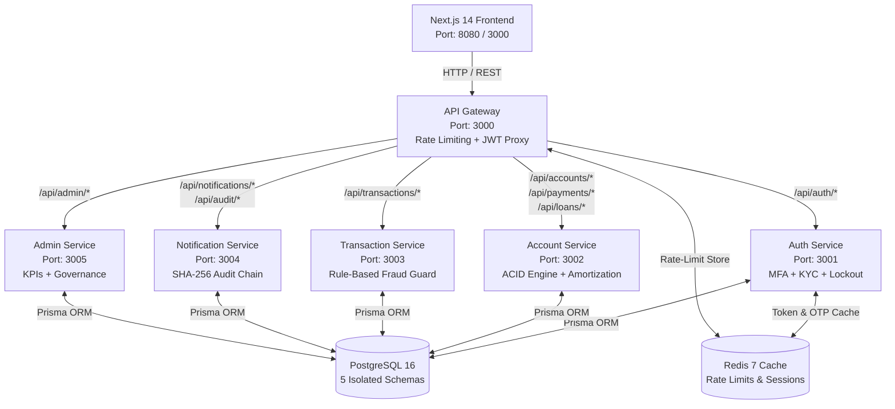

# AegisVault Project & Architecture Overview

This document provides a comprehensive overview of the AegisVault project, detailing its architecture, microservices, infrastructure, and directory structure. 

AegisVault is a highly resilient, 5-microservice digital banking platform designed for the Duothon 6.0 competition. It offers a secure environment with zero-trust authentication, immutable cryptographic audit trails, real-time fraud detection, and ACID-compliant financial transactions.

---

## 🏗️ 1. High-Level System Architecture

The application adopts a modern microservices architecture, heavily relying on an API Gateway pattern to mediate communication between the frontend client and the backend services.

### Architecture Diagram



---

## 🧩 2. Microservices Breakdown

The backend is split into 5 distinct Node.js/Express microservices, plus an API gateway:

### 1. API Gateway (Port 3000)
- **Role:** Single public entry point and traffic cop.
- **Responsibilities:** JWT authentication, rate limiting (Redis-backed), CORS, security headers (Helmet), and reverse proxying requests to internal microservices. It automatically attaches user identity headers (`x-user-id`, etc.) to internal requests.

### 2. Auth Service (Port 3001)
- **Role:** Manages identity and access.
- **Responsibilities:** User registration, multi-factor authentication (MFA) via OTP, token issuance/refresh (JWT), account lockout mechanisms, and KYC status tracking.

### 3. Account Service (Port 3002)
- **Role:** The core banking engine.
- **Responsibilities:** Bank account creation, balance checks, ACID-compliant inter-account fund transfers using Prisma `$transaction()`, utility bill payments, and loan amortization.

### 4. Transaction Service (Port 3003)
- **Role:** Transfer orchestration and risk management.
- **Responsibilities:** Coordinates transfers with the Account service, runs real-time rule-based fraud detection, and acts as an ISO 8583 clearing simulator for external interbank payments. It triggers asynchronous events for audit and notifications.

### 5. Notification Service (Port 3004)
- **Role:** Event consumer and audit tracker.
- **Responsibilities:** Listens to RabbitMQ queues (`email_queue`, `notify_queue`, `audit_queue`). Sends emails via Nodemailer/SMTP, records in-app notifications, and maintains the immutable SHA-256 cryptographic audit chain.

### 6. Admin Service (Port 3005)
- **Role:** Back-office governance.
- **Responsibilities:** Aggregates dashboard metrics, handles KYC verification workflows, reviews fraud alerts, and allows admins to suspend or unlock user accounts.

---

## 🛠️ 3. Infrastructure & Shared Services

All services run cohesively via Docker Compose and share critical infrastructure components:

*   **PostgreSQL 16:** A single database server containing **5 isolated schemas** (`auth_db`, `acct_db`, `txn_db`, `notif_db`, `admin_db`), providing data isolation for each microservice while minimizing resource overhead.
*   **Redis 7:** Used heavily by the API Gateway for rate limiting and by the Auth Service to store temporary OTPs with TTLs.
*   **RabbitMQ 3:** A message broker enabling asynchronous, non-blocking communication (e.g., dispatching emails and writing audit logs without slowing down the HTTP responses).
*   **Next.js 14 Client:** The frontend application (Port 8080) built with React and Tailwind CSS. It communicates exclusively with the API Gateway.

---

## 📁 4. Project Structure (Directory Map)

```text
Duothon_6.0_BigBug/
├── .github/workflows/          # CI/CD Pipeline (GitHub Actions)
├── client/                     # Next.js 14 Frontend Application
│   ├── src/app/                # Next.js App Router pages (login, dashboard, transfer, etc.)
│   ├── src/components/         # Reusable React components (e.g., Navbar)
│   ├── src/lib/api.ts          # Axios client with JWT auto-refresh interceptors
│   ├── tailwind.config.ts      # Tailwind CSS design system configuration
│   └── Dockerfile              # Multi-stage Docker build for frontend
├── services/                   # Backend Microservices (Node.js/Express)
│   ├── api-gateway/            # Reverse Proxy & Security Gateway
│   ├── auth-service/           # Auth, MFA, JWT Tokens, Users
│   ├── account-service/        # Bank Accounts, ACID Transfers, Loans
│   ├── transaction-service/    # Orchestration, Fraud Rules, ISO 8583
│   ├── notification-service/   # Email, Push Alerts, Hash Chain Audit Engine
│   └── admin-service/          # Dashboard, Governance, User Management
├── databases/
│   └── postgres/               # Custom PostgreSQL container configs
├── infrastructure/             # Cloud provisioning scripts (Azure Container Apps)
├── scripts/                    
│   ├── init-schemas.sql        # Initializes the 5 PostgreSQL schemas on boot
│   ├── seed-demo.js            # Seeds demo accounts and data
│   └── smoke-test.js           # End-to-end API health testing
├── docs/                       # Extensive documentation (including system_architecture_guide.md)
├── docker-compose.yml          # Full 8-container orchestration setup
└── package.json                # Monorepo root configuration (npm workspaces)
```

## 🔒 5. Key Design Patterns

1.  **ACID Transactions:** The `account-service` relies on database-level transactions to ensure money is never duplicated or lost during transfers. If a debit succeeds but a credit fails, the entire transaction rolls back.
2.  **Event-Driven Architecture:** The `transaction-service` uses a "fire-and-forget" pattern. It publishes events to RabbitMQ and returns a response to the user immediately, while the `notification-service` handles emails and audit logs in the background.
3.  **Cryptographic Hash Chain:** Audit logs are linked mathematically (`SHA256(previousHash + data)`). Any manual database tampering immediately invalidates the entire chain, mimicking blockchain integrity concepts.
4.  **Silent Token Refresh:** The frontend Axios client intercepts 401 Unauthorized errors, queues the request, transparently refreshes the JWT access token using the HttpOnly refresh token, and replays the queued request without the user noticing.
