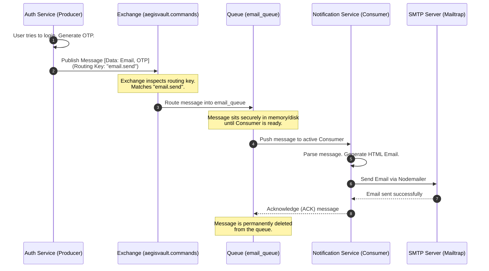

# RabbitMQ in AegisVault: A Detailed Deep Dive

This document explains exactly how RabbitMQ fits into the AegisVault microservices architecture, how it works conceptually, and where the code that interacts with it is located.

---

## 1. What is RabbitMQ?

RabbitMQ is a **message broker**. Think of it as a highly efficient, automated post office for your microservices. 

Instead of Service A calling Service B directly (which means Service A has to wait for Service B to finish its job), Service A simply drops a "message" into RabbitMQ. RabbitMQ then safely stores that message in a **queue** until Service B is ready to pick it up and process it. 

This architectural pattern is called **Asynchronous, Event-Driven Communication**. It ensures that your main services remain fast and responsive because they don't get bogged down waiting for background tasks (like sending emails) to finish.

---

## 2. RabbitMQ Architecture in AegisVault

In our architecture, RabbitMQ sits between the core banking services (Auth, Transaction) and the background worker service (Notification).

Here is the exact message flow used in AegisVault:

```mermaid
graph TD
    %% Producers
    subgraph "Producers (Message Senders)"
        Auth[Auth Service<br/>Port: 3001]
        Txn[Transaction Service<br/>Port: 3003]
    end

    %% RabbitMQ Infrastructure
    subgraph "RabbitMQ Broker (Infrastructure)"
        direction TB
        
        %% Exchanges
        subgraph "Exchanges (The Post Office Sorters)"
            CmdEx[aegisvault.commands<br/>(direct exchange)]
            EvtEx[aegisvault.events<br/>(topic exchange)]
        end
        
        %% Queues
        subgraph "Queues (The Mailboxes)"
            Eq[email_queue]
            Nq[notify_queue]
            Aq[audit_queue]
        end
        
        %% Routing
        CmdEx -- "routing key: email.send" --> Eq
        CmdEx -- "routing key: notify.send" --> Nq
        EvtEx -- "routing key: audit.log" --> Aq
    end

    %% Consumer
    subgraph "Consumer (Message Receiver)"
        Notif[Notification Service<br/>Port: 3004]
    end

    %% Connections
    Auth -- "Publish message" --> CmdEx
    Txn -- "Publish message" --> CmdEx
    Txn -- "Publish message" --> EvtEx
    
    Eq -- "Consume message" --> Notif
    Nq -- "Consume message" --> Notif
    Aq -- "Consume message" --> Notif
```

### The Key Components:

1.  **Producers (Auth & Transaction Services):** These are the services that generate messages. When a user logs in (Auth) or makes a transfer (Transaction), they publish a message containing data (like the user's email and OTP code) to RabbitMQ.
2.  **Exchanges:** When a Producer sends a message to RabbitMQ, it doesn't send it directly to a queue. It sends it to an Exchange. The Exchange looks at the message's "routing key" (like an address) and decides which queue it belongs in.
    *   *Direct Exchange (`aegisvault.commands`):* Routes messages to exactly one specific queue based on an exact match (e.g., "send this specific email").
    *   *Topic Exchange (`aegisvault.events`):* Routes messages to multiple queues based on patterns (e.g., "log this security event").
3.  **Queues:** These are the actual mailboxes inside RabbitMQ holding the messages securely in memory/disk until they are processed.
4.  **Consumers (Notification Service):** This service constantly listens to the queues. The moment a message arrives in the `email_queue`, the Notification Service pulls it out, reads the data, and sends the actual email using SMTP.

### Step-by-Step Communication Flow (Sequence Diagram)

To make the communication paths completely clear, here is a step-by-step sequence of exactly how a message travels from a Producer to a Consumer (using the "Send OTP Email" flow as an example):



---

## 3. Where is the Code?

As discussed, we don't write the code for RabbitMQ itself (it's pulled via Docker). We write the code that connects to it.

### The Producer Code (Sending Messages)
The logic to connect to RabbitMQ and publish messages is located in the utility folders of the producer services.

*   **Auth Service Producer:** `services/auth-service/src/utils/rabbitmq.js`
    *   *What it does:* Connects to the RabbitMQ container. Contains the `publishCommand()` function used to dispatch OTP emails to the `email.send` route when a user tries to log in.
*   **Transaction Service Producer:** `services/transaction-service/src/utils/notifier.js`
    *   *What it does:* After a successful transfer, this file uses RabbitMQ to dispatch an asynchronous `audit.log` event and a `notify.send` event so the user gets alerted without the HTTP request hanging.

### The Consumer Code (Receiving Messages)
The logic to actively listen to the queues and process the work lives in the Notification service.

*   **Notification Service Consumer:** `services/notification-service/src/consumers/index.js`
    *   *What it does:* Connects to RabbitMQ on startup. It binds to the `email_queue`, `notify_queue`, and `audit_queue`. It defines handler functions (`handleEmailMessage`, etc.) that execute the moment a new message drops into one of those queues. 

### Infrastructure Setup
*   **Docker Compose:** `docker-compose.yml` (Lines 37-43)
    *   *What it does:* Downloads the `rabbitmq:3-management-alpine` image and spins up the broker on port `5672` (for the microservices to connect to) and `15672` (for the RabbitMQ admin dashboard).
