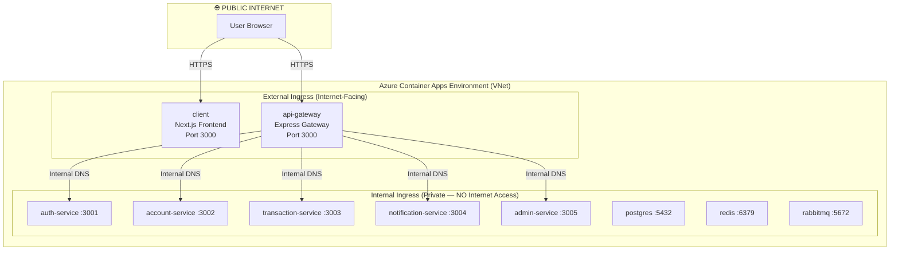
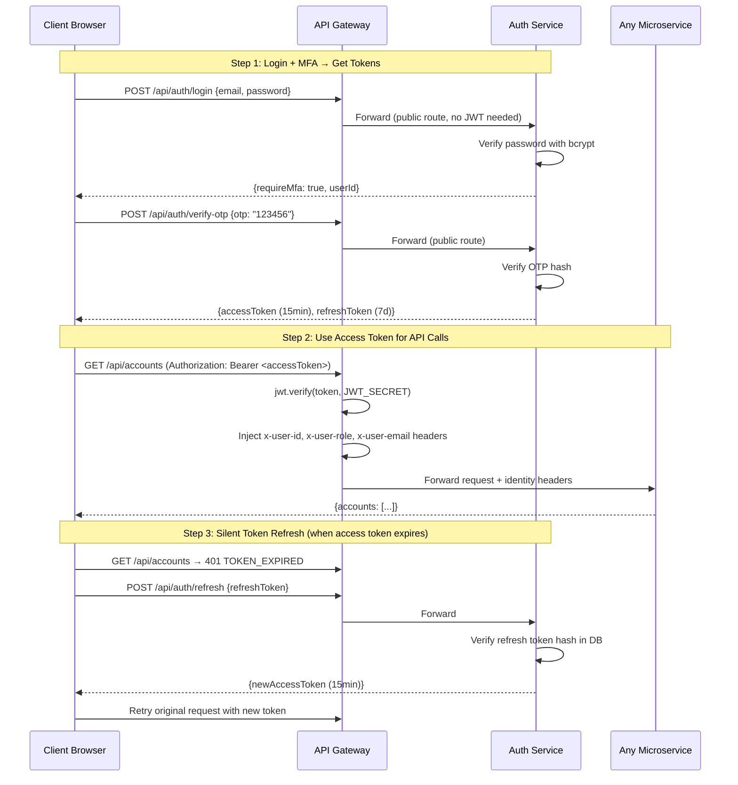
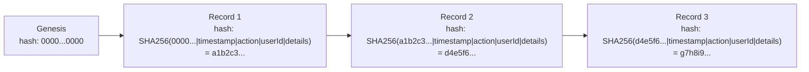

# AegisVault — Complete Service Architecture, Security Deep-Dive & Suggestions

> Full breakdown of every service, every file, every security mechanism, and every improvement opportunity.

---

## 1. Azure Portal — Your Resource Group at a Glance

The screenshot below shows your **`aegisvault-rg`** resource group in Azure Portal (East US region), containing **15 resources across 2 pages**:


### What Each Resource Does

| # | Resource Name | Type (from Azure Portal) | Purpose in AegisVault |
|---|---|---|---|
| 1 | `account-service` | Container App | Manages bank accounts, balances, fund transfers, loans, and bill payments |
| 2 | `admin-service` | Container App | Admin dashboard, user governance, KYC verification, fraud alert monitoring |
| 3 | `aegisvault-env` | Container Apps Environment | Shared hosting infrastructure — provides VNet, internal DNS, and managed TLS for all apps |
| 4 | `aegisvaultacrrw5v9v` | Container Registry (ACR) | Private Docker image registry — stores all 8 service images built by CI/CD |
| 5 | `api-gateway` | Container App | **PUBLIC** — Single entry point for all API traffic. JWT auth, rate limiting, reverse proxy |
| 6 | `auth-service` | Container App | User registration, MFA login, OTP verification, JWT token management, KYC |
| 7 | `client` | Container App | **PUBLIC** — Next.js 14 frontend serving the banking UI |
| 8 | `db-seed-job` | Container App Job | One-off job that runs Prisma migrations and seeds demo data after deployment |
| 9 | `notification-service` | Container App | Email delivery, in-app notifications, and cryptographic SHA-256 audit trail |
| 10 | `postgres` | Container App | PostgreSQL 16 database with 5 isolated schemas for each microservice |
| — | *(Page 2 resources)* | — | — |
| 11 | `redis` | Container App | Redis 7 cache for OTP storage (5-min TTL) and rate limit counters |
| 12 | `rabbitmq` | Container App | RabbitMQ 3 message broker for async email, notification, and audit events |
| 13 | `transaction-service` | Container App | Transaction orchestrator — coordinates transfers, fraud detection, ISO 8583 |

> [!IMPORTANT]
> **Only 2 resources are internet-facing:** `api-gateway` and `client` (both set to `external` ingress). Everything else uses `internal` ingress — completely invisible to the public internet.

---

## 2. Service-by-Service Deep Dive

---

### 🛡️ SERVICE 1: API Gateway (Port 3000)

**Role:** The "Security Guard + Traffic Cop" — the **only public-facing API endpoint**. Every single API request from the frontend goes through here first.

**Azure Config:** Container App with **external** ingress on port 3000.

#### NPM Dependencies (9 packages)

| Package | Version | What It Does in This Service |
|---|---|---|
| `express` | ^4.19.2 | HTTP server framework — handles routing and middleware pipeline |
| `cors` | ^2.8.5 | Cross-Origin Resource Sharing — allows frontend (port 8080) to call API (port 3000) |
| `helmet` | ^7.1.0 | Sets 15+ security HTTP headers (CSP, X-Frame-Options, HSTS, etc.) |
| `jsonwebtoken` | ^9.0.2 | Verifies JWT access tokens on every protected request |
| `http-proxy-middleware` | ^3.0.0 | Reverse proxy — forwards requests to the correct backend microservice |
| `express-rate-limit` | ^7.2.0 | Throttles requests per IP/user to prevent abuse |
| `rate-limit-redis` | ^4.2.0 | Redis backing store for rate limiter (distributed rate limiting across replicas) |
| `ioredis` | ^5.4.1 | Redis client with auto-reconnect and lazy connect |
| `winston` | ^3.13.0 | Structured JSON logging with timestamps and severity levels |

#### File Tree & Function of Each File

```
api-gateway/
├── Dockerfile                    # Single-stage Node 20 Alpine container (169 bytes)
├── package.json                  # Dependencies + start/dev scripts
├── .dockerignore                 # Excludes node_modules from Docker build
└── src/
    ├── index.js                  # ⭐ Entry point — assembles 9-layer middleware pipeline
    ├── config/
    │   ├── logger.js             # Winston JSON logger + HTTP request logging middleware
    │   └── redis.js              # Redis client (ioredis) with lazy connect + health check
    └── middleware/
        ├── jwtAuth.js            # ⭐ JWT verification + public route whitelist + user header injection
        ├── proxy.js              # ⭐ Reverse proxy routing to 5 backend services
        └── rateLimiter.js        # ⭐ Dual rate limiters (public 20/min, auth 100/min)
```

**How the middleware pipeline works in [index.js](file:///c:/Users/ADMIN/Desktop/Duothon_6.0_BigBug/services/api-gateway/src/index.js):**

```
Request → CORS → Helmet → Request Logger → Body Parser → Rate Limiter → JWT Auth → Reverse Proxy → Response
                                                                              ↓ (if fails)
                                                                         401 Unauthorized
```

**Key file details:**

- [jwtAuth.js](file:///c:/Users/ADMIN/Desktop/Duothon_6.0_BigBug/services/api-gateway/src/middleware/jwtAuth.js) — Maintains a whitelist of 7 public routes (`/health`, `/api/auth/register`, `/api/auth/login`, `/api/auth/verify-otp`, `/api/auth/refresh`, `/api/auth/forgot-password`, `/api/auth/reset-password`). For all other routes, it extracts the JWT from `Authorization: Bearer <token>` header or cookies, verifies it with `jwt.verify()`, and injects `x-user-id`, `x-user-role`, `x-user-email` headers before forwarding.

- [proxy.js](file:///c:/Users/ADMIN/Desktop/Duothon_6.0_BigBug/services/api-gateway/src/middleware/proxy.js) — Routes traffic to 5 services:
  - `/api/auth/*` and `/api/users/*` → Auth Service (`:3001`)
  - `/api/accounts/*`, `/api/payments/*`, `/api/loans/*` → Account Service (`:3002`)
  - `/api/transactions/*` → Transaction Service (`:3003`)
  - `/api/notifications/*`, `/api/audit/*` → Notification Service (`:3004`)
  - `/api/admin/*` → Admin Service (`:3005`)

- [rateLimiter.js](file:///c:/Users/ADMIN/Desktop/Duothon_6.0_BigBug/services/api-gateway/src/middleware/rateLimiter.js) — Two rate limiters: **public** (20 req/min per IP, applied to `/api/auth`) and **authenticated** (100 req/min per user ID, applied to all `/api/*`). Uses Redis store when available, falls back to in-memory.

#### API Endpoints (Gateway Level)
This service doesn't define business endpoints — it proxies all `/api/*` requests. The only direct endpoint is:
- `GET /health` — Returns service status and uptime

---

### 🔐 SERVICE 2: Auth Service (Port 3001)

**Role:** Identity & Access Management — everything related to who a user is and proving they are who they claim to be.

**Azure Config:** Container App with **internal** ingress on port 3001.

#### NPM Dependencies (12 packages)

| Package | Version | What It Does in This Service |
|---|---|---|
| `express` | ^4.19.2 | HTTP server framework |
| `@prisma/client` | ^5.11.0 | Auto-generated type-safe database client for `auth_db` schema |
| `prisma` | ^5.11.0 | ORM engine — schema definition, migrations, db push |
| `bcrypt` | ^5.1.1 | Password hashing with adaptive cost factor (12 rounds ≈ 250ms) |
| `jsonwebtoken` | ^9.0.2 | Creates and signs JWT access tokens (15min) and refresh tokens (7d) |
| `ioredis` | ^5.4.1 | Redis client for OTP caching with 5-minute TTL |
| `amqp-connection-manager` | ^5.0.0 | RabbitMQ connection with auto-reconnect |
| `amqplib` | ^2.0.1 | AMQP 0-9-1 protocol implementation for RabbitMQ |
| `axios` | ^1.6.8 | HTTP client for fallback notification delivery |
| `zod` | ^3.22.4 | Runtime schema validation for all request bodies |
| `helmet` | ^7.1.0 | Security HTTP headers |
| `winston` | ^3.13.0 | Structured JSON logging |

#### File Tree & Function of Each File

```
auth-service/
├── Dockerfile                    # Node 20 Alpine + OpenSSL (for Prisma) + prisma generate
├── package.json                  # 12 deps + test script (Jest)
├── init.sql                      # Raw SQL reference for auth_db tables (not used at runtime)
├── prisma/
│   ├── schema.prisma             # ⭐ User, RefreshToken, OtpRecord models → auth_db schema
│   └── generated/client/         # Auto-generated Prisma client code
├── src/
│   ├── index.js                  # ⭐ Entry point — runs prisma db push + seeds demo users on startup
│   ├── config/
│   │   ├── db.js                 # Prisma client singleton initialization
│   │   ├── logger.js             # Winston JSON logger
│   │   └── redis.js              # Redis client for OTP caching
│   ├── controllers/
│   │   ├── auth.controller.js    # ⭐ Register, MFA login, OTP verify, token refresh
│   │   └── user.controller.js    # Get/update profile, KYC document upload
│   ├── routes/
│   │   ├── auth.routes.js        # POST /register, /login, /verify-otp, /refresh
│   │   └── user.routes.js        # GET/PUT /profile, POST /kyc
│   └── utils/
│       ├── otp.js                # ⭐ Crypto-secure OTP generation, SHA-256 hashing, timing-safe verify
│       ├── rabbitmq.js           # RabbitMQ connection manager + publish methods
│       ├── validation.js         # ⭐ Zod schemas (register, login, OTP, profile, KYC)
│       └── notifier.js           # HTTP fallback notification sender
└── tests/
    └── auth.test.js              # Jest + Supertest unit/integration tests
```

#### Database Schema (`auth_db`)

| Table | Columns | Purpose |
|---|---|---|
| `users` | id (UUID), email (unique), phone (unique), nic (unique), password_hash, role (CUSTOMER/ADMIN/OFFICER), failed_attempts, is_locked, kyc_status (PENDING/VERIFIED/REJECTED), kyc_document, created_at, updated_at | Stores all user identity and authentication state |
| `refresh_tokens` | id, user_id → users, token_hash (unique), expires_at, created_at | Hashed refresh tokens — enables silent token refresh |
| `otp_records` | id, user_id → users, otp_hash, type (MFA_LOGIN), expires_at, created_at | Database fallback for OTP verification when Redis is down |

#### API Endpoints

| Method | Path | Auth? | What It Does |
|---|---|---|---|
| `POST` | `/api/auth/register` | ❌ Public | Create new user (email, phone, NIC, password) |
| `POST` | `/api/auth/login` | ❌ Public | Verify credentials → generate OTP → send via email |
| `POST` | `/api/auth/verify-otp` | ❌ Public | Verify 6-digit OTP → issue JWT access + refresh tokens |
| `POST` | `/api/auth/refresh` | ❌ Public | Exchange refresh token for new access token |
| `GET` | `/api/users/profile` | ✅ JWT | Get authenticated user's profile data |
| `PUT` | `/api/users/profile` | ✅ JWT | Update email or phone |
| `POST` | `/api/users/kyc` | ✅ JWT | Submit KYC document reference |

---

### 💰 SERVICE 3: Account Service (Port 3002)

**Role:** The "Bank Vault" — manages bank accounts, balances, ACID-compliant transfers, utility bill payments, and loan applications.

**Azure Config:** Container App with **internal** ingress on port 3002.

#### NPM Dependencies (6 packages)

| Package | Version | What It Does |
|---|---|---|
| `express` | ^4.19.2 | HTTP server |
| `@prisma/client` | ^5.11.0 | Type-safe DB client for `acct_db` schema |
| `cors` | ^2.8.5 | CORS headers |
| `helmet` | ^7.1.0 | Security headers |
| `winston` | ^3.13.0 | Logging |
| `zod` | ^3.22.4 | Input validation |

#### File Tree & Function of Each File

```
account-service/
├── Dockerfile                    # Node 20 Alpine + OpenSSL + prisma generate
├── package.json                  # 6 deps
├── init.sql                      # Raw SQL reference for acct_db tables
├── prisma/
│   ├── schema.prisma             # ⭐ Account, Loan, UtilityReceipt models → acct_db schema
│   └── generated/client/
├── src/
│   ├── index.js                  # Entry point — mounts accounts, payments, loans routes
│   ├── config/
│   │   ├── db.js                 # Prisma client singleton
│   │   └── logger.js             # Winston logger
│   ├── controllers/
│   │   ├── account.controller.js # ⭐ Create account, list accounts, balance check, ACID transfer, bill pay
│   │   └── loan.controller.js    # ⭐ Apply loan, list loans, amortization calculator
│   ├── routes/
│   │   ├── account.routes.js     # Account CRUD + transfer routes
│   │   ├── loan.routes.js        # Loan application + listing routes
│   │   └── payment.routes.js     # Utility bill payment routes
│   └── utils/
│       ├── accountGenerator.js   # Auto-generates unique 12-digit account numbers
│       ├── ledger.js             # Double-entry ledger utilities
│       ├── notifier.js           # HTTP notification sender
│       └── validation.js         # Zod schemas for accounts, loans, payments
```

#### Database Schema (`acct_db`)

| Table | Columns | Purpose |
|---|---|---|
| `accounts` | id, user_id, account_number (unique, 12 digits), account_type (SAVINGS/CURRENT/BUSINESS), balance (Decimal 15,2), currency (LKR), status (ACTIVE/FROZEN/CLOSED) | Bank account records |
| `loans` | id, user_id, account_id → accounts, amount, interest_rate, term_months, monthly_payment, status (PENDING/APPROVED/REJECTED/ACTIVE/PAID) | Loan applications with amortization |
| `utility_receipts` | id, user_id, account_id → accounts, biller, account_reference, amount, receipt_number (unique), status | Bill payment receipts |

#### API Endpoints

| Method | Path | What It Does |
|---|---|---|
| `POST` | `/api/accounts` | Create new bank account with auto-generated 12-digit number |
| `GET` | `/api/accounts` | List all accounts for authenticated user |
| `GET` | `/api/accounts/:id/balance` | Check balance (used internally by Transaction Service) |
| `POST` | `/api/accounts/execute-transfer` | ⭐ **ACID atomic transfer** — debit sender + credit receiver in one SQL transaction |
| `POST` | `/api/accounts/debit` | Direct debit (used by Transaction Service for external transfers) |
| `POST` | `/api/accounts/credit` | Direct credit (used by Transaction Service for external transfers) |
| `POST` | `/api/payments/bill` | Pay utility bill — debits account, creates receipt |
| `POST` | `/api/loans/apply` | Apply for loan — calculates amortization schedule |
| `GET` | `/api/loans` | List all loans for authenticated user |
| `POST` | `/api/loans/calculate` | Loan amortization calculator (no DB write) |

---

### 🔄 SERVICE 4: Transaction Service (Port 3003)

**Role:** The "Transaction Orchestrator" — coordinates between Account Service, Fraud Engine, ISO 8583 simulator, and notifications to process fund transfers.

**Azure Config:** Container App with **internal** ingress on port 3003.

#### NPM Dependencies (10 packages)

| Package | Version | What It Does |
|---|---|---|
| `express` | ^4.19.2 | HTTP server |
| `@prisma/client` | ^5.11.0 | DB client for `txn_db` schema |
| `amqp-connection-manager` | ^5.0.0 | RabbitMQ auto-reconnect |
| `amqplib` | ^2.0.1 | AMQP protocol |
| `axios` | ^1.6.8 | HTTP client to call Account Service for balance checks and transfers |
| `cors` | ^2.8.5 | CORS headers |
| `helmet` | ^7.1.0 | Security headers |
| `winston` | ^3.13.0 | Logging |
| `zod` | ^3.22.4 | Input validation |
| `prisma` | ^5.11.0 | ORM (dev) |

#### File Tree & Function of Each File

```
transaction-service/
├── Dockerfile                    # Node 20 Alpine + OpenSSL + prisma generate
├── package.json                  # 10 deps + test script
├── init.sql                      # Raw SQL reference for txn_db tables
├── prisma/
│   ├── schema.prisma             # ⭐ Transaction, FraudAlert models → txn_db schema
│   └── generated/client/
├── src/
│   ├── index.js                  # Entry point — mounts transaction routes
│   ├── config/
│   │   ├── db.js                 # Prisma client singleton
│   │   └── logger.js             # Winston logger
│   ├── controllers/
│   │   └── transaction.controller.js  # ⭐ Internal/external transfer orchestrator, history, receipts
│   ├── routes/
│   │   └── transaction.routes.js # Transfer, history, receipt routes
│   └── utils/
│       ├── fraudEngine.js        # ⭐ 3-rule real-time fraud detection engine
│       ├── iso8583.js            # ⭐ ISO 8583 interbank clearing message simulator
│       ├── notifier.js           # Fire-and-forget async notification + audit dispatch via RabbitMQ
│       ├── rabbitmq.js           # RabbitMQ connection + publish methods
│       └── validation.js         # Zod schemas for transfers
└── tests/
    └── transaction.test.js       # Jest + Supertest tests
```

#### Database Schema (`txn_db`)

| Table | Columns | Purpose |
|---|---|---|
| `transactions` | id, user_id, from_account_id, to_account_id, amount (Decimal 15,2), currency, type (TRANSFER/PAYMENT/DEPOSIT), status (PENDING/SUCCESS/FAILED/FLAGGED), reference_number (unique), fraud_flag, description | Every financial transaction record |
| `fraud_alerts` | id, transaction_id → transactions, rule_triggered, risk_score, status (FLAGGED/REVIEWED/CLEARED) | Fraud rules that fired for flagged transactions |

#### API Endpoints

| Method | Path | What It Does |
|---|---|---|
| `POST` | `/api/transactions/transfer` | ⭐ Internal transfer — balance check → fraud scan → ACID transfer → notify |
| `POST` | `/api/transactions/external-transfer` | External/interbank transfer — adds ISO 8583 clearing simulation |
| `GET` | `/api/transactions` | Paginated transaction history with type/date filters |
| `GET` | `/api/transactions/:id` | Single transaction detail |
| `GET` | `/api/transactions/:id/receipt` | Formatted printable receipt |

---

### 📬 SERVICE 5: Notification Service (Port 3004)

**Role:** The "Communication Hub" — handles email delivery, in-app notifications, and the **cryptographic SHA-256 audit trail**. The only service that **consumes** RabbitMQ messages.

**Azure Config:** Container App with **internal** ingress, **always-on** (min-replicas: 1) because it must continuously listen to RabbitMQ queues.

#### NPM Dependencies (10 packages)

| Package | Version | What It Does |
|---|---|---|
| `express` | ^4.19.2 | HTTP server |
| `@prisma/client` | ^5.11.0 | DB client for `notif_db` schema |
| `nodemailer` | ^6.9.12 | ⭐ **Unique to this service** — SMTP email sender for OTP and transaction alerts |
| `amqp-connection-manager` | ^5.0.0 | RabbitMQ auto-reconnect consumer |
| `amqplib` | ^2.0.1 | AMQP protocol |
| `axios` | ^1.6.8 | HTTP client |
| `cors` | ^2.8.5 | CORS headers |
| `helmet` | ^7.1.0 | Security headers |
| `winston` | ^3.13.0 | Logging |
| `zod` | ^3.22.4 | Input validation |

#### File Tree & Function of Each File

```
notification-service/
├── Dockerfile                    # Node 20 Alpine + OpenSSL + prisma generate
├── package.json                  # 10 deps
├── init.sql                      # Raw SQL reference for notif_db tables
├── prisma/
│   ├── schema.prisma             # ⭐ Notification, AuditLog models → notif_db schema
│   └── generated/client/
├── src/
│   ├── index.js                  # ⭐ Entry point — starts Express + connects 3 RabbitMQ consumers
│   ├── config/
│   │   ├── db.js                 # Prisma client singleton
│   │   └── logger.js             # Winston logger
│   ├── consumers/
│   │   └── index.js              # ⭐ RabbitMQ message handlers — creates mock req/res to reuse controllers
│   ├── controllers/
│   │   ├── notification.controller.js  # ⭐ Store notification + send email, list notifications, mark read
│   │   └── audit.controller.js   # ⭐ Record audit log, list audit logs, verify hash chain integrity
│   ├── routes/
│   │   ├── internal.routes.js    # POST /internal/notify, /internal/email, /internal/audit
│   │   ├── notification.routes.js # GET /api/notifications, PUT /mark-read
│   │   └── audit.routes.js       # GET /api/audit, GET /api/audit/verify-chain
│   └── utils/
│       ├── auditEngine.js        # ⭐ SHA-256 cryptographic hash chain — record + verify functions
│       ├── mailer.js             # ⭐ Nodemailer SMTP sender with mock fallback + HTML templates
│       └── rabbitmq.js           # RabbitMQ connection + consume method
```

#### Database Schema (`notif_db`)

| Table | Columns | Purpose |
|---|---|---|
| `notifications` | id, user_id, title, message, type, channel (EMAIL/PUSH), is_read, created_at, updated_at | In-app notification records |
| `audit_logs` | id, user_id, action, resource, resource_id, ip_address, details, **hash** (unique), **previous_hash**, created_at | ⭐ Cryptographic hash chain — each record's hash links to the previous record |

#### RabbitMQ Consumers (3 queues)

| Queue | Exchange | Routing Key | Triggered By | Handler |
|---|---|---|---|---|
| `email_queue` | `aegisvault.commands` (direct) | `email.send` | Auth Service (OTP emails) | Sends HTML email via Nodemailer |
| `notify_queue` | `aegisvault.commands` (direct) | `notify.send` | Transaction Service (transfer alerts) | Stores DB notification + sends email |
| `audit_queue` | `aegisvault.events` (topic) | `audit.log` | Transaction Service (audit trail) | Records SHA-256 hash chain entry |

---

### 👑 SERVICE 6: Admin Service (Port 3005)

**Role:** Back-office administration — dashboard metrics, user governance, KYC verification, and fraud alert monitoring.

**Azure Config:** Container App with **internal** ingress on port 3005.

#### NPM Dependencies (7 packages)

| Package | Version | What It Does |
|---|---|---|
| `express` | ^4.19.2 | HTTP server |
| `@prisma/client` | ^5.11.0 | DB client — ⭐ **accesses 4 schemas** (admin_db, auth_db, acct_db, txn_db) |
| `axios` | ^1.6.8 | HTTP client for cross-service calls |
| `cors` | ^2.8.5 | CORS headers |
| `helmet` | ^7.1.0 | Security headers |
| `winston` | ^3.13.0 | Logging |
| `zod` | ^3.22.4 | Input validation |

#### File Tree & Function of Each File

```
admin-service/
├── Dockerfile                    # Node 20 Alpine + OpenSSL + prisma generate
├── package.json                  # 7 deps
├── init.sql                      # Raw SQL reference for admin_db + cross-schema tables
├── prisma/
│   ├── schema.prisma             # ⭐ SPECIAL: accesses admin_db + auth_db + acct_db + txn_db (cross-schema)
│   └── generated/client/
├── src/
│   ├── index.js                  # Entry point — mounts admin routes
│   ├── config/
│   │   ├── db.js                 # Prisma client singleton
│   │   └── logger.js             # Winston logger
│   ├── controllers/
│   │   └── admin.controller.js   # ⭐ Dashboard metrics, user CRUD, suspend/unlock, KYC verify, fraud alerts
│   ├── routes/
│   │   └── admin.routes.js       # All admin endpoint definitions
│   └── utils/
│       └── notifier.js           # HTTP notification sender
```

#### Database Schema (`admin_db` + cross-schema access)

| Table | Schema | Access Type | Purpose |
|---|---|---|---|
| `system_metrics` | admin_db | Read/Write | Historical dashboard metric snapshots |
| `admin_actions` | admin_db | Read/Write | Audit trail of admin governance actions |
| `users` | auth_db | Read/Write | User management (suspend, unlock, verify KYC) |
| `accounts` | acct_db | Read-only | Account aggregation for dashboard |
| `transactions` | txn_db | Read-only | Transaction metrics and fraud alert listing |

#### API Endpoints

| Method | Path | What It Does |
|---|---|---|
| `GET` | `/api/admin/dashboard` | Real-time platform metrics (users, KYC pending, accounts, transactions, fraud) |
| `GET` | `/api/admin/users` | Paginated user list with search/filter |
| `PUT` | `/api/admin/users/:id/suspend` | Lock a user account + record AdminAction |
| `PUT` | `/api/admin/users/:id/unlock` | Unlock locked account + reset failed attempts |
| `PUT` | `/api/admin/users/:id/verify` | Approve KYC verification |
| `GET` | `/api/admin/fraud-alerts` | List all flagged transactions from txn_db |

---

### 🌐 SERVICE 7: Client (Next.js Frontend — Port 8080)

**Role:** Server-rendered React UI for customers and admins.

**Azure Config:** Container App with **external** ingress on port 3000 (mapped to 8080 locally).

**Tech:** Next.js 14 (TypeScript) + Tailwind CSS + Framer Motion + Axios

**Key file:** [api.ts](file:///c:/Users/ADMIN/Desktop/Duothon_6.0_BigBug/client/src/lib/api.ts) — Axios HTTP client with:
- **Request interceptor:** Auto-attaches JWT from cookies/localStorage to every request
- **Response interceptor:** On 401 → queues pending requests → refreshes token → retries all queued requests
- This implements the **silent token refresh pattern**

---

### 🗄️ INFRASTRUCTURE: PostgreSQL, Redis, RabbitMQ

| Service | Image | Azure Config | Purpose |
|---|---|---|---|
| **PostgreSQL 16** | `postgres:16-alpine` | Internal, TCP, always-on | Single DB with 5 schemas: `auth_db`, `acct_db`, `txn_db`, `notif_db`, `admin_db` |
| **Redis 7** | `redis:7-alpine` | Internal, TCP, always-on | OTP cache (5-min TTL keys `aegis_otp:login:<email>`) + rate limit counters (`aegis_rl_public:`, `aegis_rl_auth:`) |
| **RabbitMQ 3** | `rabbitmq:3-management-alpine` | Internal, always-on | Async messaging: 2 exchanges (`aegisvault.commands` direct, `aegisvault.events` topic) → 3 queues (`email_queue`, `notify_queue`, `audit_queue`) |

---

## 3. Security Architecture — Full Deep Dive

---

### 🔒 3.1 Internal/External Ingress Split (Network Isolation)

**What it is:** Azure Container Apps lets you set each app's ingress as either `external` (accessible from the internet) or `internal` (only accessible from within the same Container Apps Environment's virtual network).

**How we implement it:**



**Why this matters for security:**
- An attacker **cannot** directly reach your database, Redis, RabbitMQ, or any microservice from the internet
- The only way to interact with the backend is through the API Gateway, which enforces JWT auth and rate limiting on every request
- Internal services communicate via Azure's private DNS (e.g., `https://auth-service.internal.aegisvault-env.azurecontainerapps.io`)

**Where it's configured:** [provision.azcli L47-L71](file:///c:/Users/ADMIN/Desktop/Duothon_6.0_BigBug/infrastructure/provision.azcli#L47-L71)

---

### 🔒 3.2 JWT Authentication (JSON Web Tokens)

**What it is:** JWT is a token-based authentication mechanism. Instead of storing sessions on the server, the server issues a signed token that the client sends with every request.

**How it works in AegisVault:**



**Technical details:**
- **Algorithm:** HS256 (HMAC-SHA256) — symmetric signing with a shared secret
- **Access token expiry:** 15 minutes — short-lived to limit damage if stolen
- **Refresh token expiry:** 7 days — stored as SHA-256 hash in `refresh_tokens` table
- **Token extraction:** Checks `Authorization: Bearer <token>` header first, then falls back to `accessToken` cookie
- **Header injection:** After verification, injects `x-user-id`, `x-user-role`, `x-user-email` into the request — downstream services trust these headers because they only arrive through the gateway

**Key files:**
- [jwtAuth.js](file:///c:/Users/ADMIN/Desktop/Duothon_6.0_BigBug/services/api-gateway/src/middleware/jwtAuth.js) — Gateway-level JWT verification
- [auth.controller.js](file:///c:/Users/ADMIN/Desktop/Duothon_6.0_BigBug/services/auth-service/src/controllers/auth.controller.js) — Token issuance and refresh

---

### 🔒 3.3 MFA (Multi-Factor Authentication) via OTP Email

**What it is:** Even after entering the correct password, the user must enter a 6-digit One-Time Password sent to their email. This is "something you know" (password) + "something you have" (email access).

**How it works:**

1. **OTP Generation:** Uses `crypto.randomInt()` — the Node.js cryptographically secure random number generator (not `Math.random()`!). Generates a 6-digit number between 100000 and 999999.

2. **OTP Storage:** The OTP is **never stored in plaintext**. It's hashed with SHA-256 and stored in:
   - **Redis** — Key: `aegis_otp:login:<email>`, TTL: 5 minutes (auto-deletes after expiry)
   - **PostgreSQL** — `otp_records` table (fallback if Redis is down)

3. **OTP Delivery:** Published to RabbitMQ `email_queue` → Notification Service sends HTML email via Nodemailer/SMTP

4. **OTP Verification:** Uses `crypto.timingSafeEqual()` — **constant-time comparison** that takes the same amount of time whether the OTP is correct or wrong (prevents timing attacks where an attacker measures response time to guess characters one-by-one)

**Code from [otp.js](file:///c:/Users/ADMIN/Desktop/Duothon_6.0_BigBug/services/auth-service/src/utils/otp.js):**
```javascript
// Constant-time OTP verification (prevents timing attacks)
const verifyOtpHash = (otp, hash) => {
  const generatedHash = hashOtp(otp);  // SHA-256 hash the provided OTP
  if (generatedHash.length !== hash.length) return false;
  return crypto.timingSafeEqual(Buffer.from(generatedHash), Buffer.from(hash));
};
```

---

### 🔒 3.4 bcrypt Password Hashing (Cost Factor 12)

**What it is:** bcrypt is an adaptive password hashing algorithm that intentionally takes a long time to compute, making brute-force attacks impractical.

**How it works in AegisVault:**
- **Cost factor 12** means `2^12 = 4,096` iterations of the hashing algorithm
- Each hash takes **~250ms** to compute
- An attacker trying to brute-force passwords can only test ~4 passwords/second (vs. billions with MD5)
- bcrypt automatically generates and embeds a **salt** (random data), so identical passwords produce different hashes

**Why cost 12:** OWASP recommends cost 10-12 for web applications. Higher is more secure but slower. 12 is the sweet spot for banking applications.

---

### 🔒 3.5 Account Lockout (5 Failed Attempts)

**What it is:** After 5 consecutive failed login attempts, the user's account is **permanently locked** (`isLocked: true`). Only an admin can unlock it.

**How it works:**
1. Each failed password → `failedAttempts` counter increments by 1
2. When `failedAttempts >= 5` → `isLocked = true`
3. Locked accounts get `403 Forbidden: Your account has been locked`
4. Admin can call `PUT /api/admin/users/:id/unlock` to reset `failedAttempts = 0` and `isLocked = false`
5. Successful login resets `failedAttempts = 0`

**Why permanent (not timed):** Timed lockouts (e.g., "try again in 30 minutes") still allow slow brute-force. Permanent lockout with admin unlock is stronger for banking applications.

---

### 🔒 3.6 Rate Limiting (Dual Redis-Backed Limiters)

**What it is:** Rate limiting restricts how many requests a client can make within a time window, preventing brute-force attacks and DDoS.

**Two rate limiters in [rateLimiter.js](file:///c:/Users/ADMIN/Desktop/Duothon_6.0_BigBug/services/api-gateway/src/middleware/rateLimiter.js):**

| Limiter | Applied To | Limit | Key | Purpose |
|---|---|---|---|---|
| **Public** | `/api/auth/*` (login, register, OTP) | 20 req/min per IP | `aegis_rl_public:<IP>` | Prevents login brute-force |
| **Authenticated** | All `/api/*` routes | 100 req/min per user | `aegis_rl_auth:user:<userId>` | Prevents API abuse by logged-in users |

**Graceful fallback:** If Redis is down, both limiters switch to in-memory stores automatically (no crash, no unlimited access).

**Response when rate-limited:** HTTP `429 Too Many Requests` with `retryAfterSeconds: 60` and RateLimit headers (`X-RateLimit-Limit`, `X-RateLimit-Remaining`, `X-RateLimit-Reset`).

---

### 🔒 3.7 Helmet.js Security Headers

**What it is:** Helmet is an Express middleware that sets 15+ HTTP security headers to protect against common web vulnerabilities.

**Headers set by `app.use(helmet())` in [index.js](file:///c:/Users/ADMIN/Desktop/Duothon_6.0_BigBug/services/api-gateway/src/index.js#L26):**

| Header | Value | Protects Against |
|---|---|---|
| `X-Content-Type-Options` | `nosniff` | MIME type sniffing attacks |
| `X-Frame-Options` | `SAMEORIGIN` | Clickjacking (prevents embedding in iframes) |
| `X-XSS-Protection` | `0` (disabled, replaced by CSP) | Legacy XSS filter |
| `Content-Security-Policy` | Default policy | Cross-site scripting (XSS), code injection |
| `Strict-Transport-Security` | `max-age=15552000; includeSubDomains` | Forces HTTPS (HSTS) |
| `X-DNS-Prefetch-Control` | `off` | DNS prefetch information leaks |
| `X-Download-Options` | `noopen` | IE file download execution |
| `X-Permitted-Cross-Domain-Policies` | `none` | Flash/PDF cross-domain access |
| `Referrer-Policy` | `no-referrer` | Information leakage via Referer header |
| `Cross-Origin-Opener-Policy` | `same-origin` | Side-channel attacks (Spectre) |
| `Cross-Origin-Resource-Policy` | `same-origin` | Cross-origin resource access |

---

### 🔒 3.8 Zod Input Validation

**What it is:** Zod is a TypeScript-first schema validation library. Every request body is validated against a strict schema before the controller processes it.

**Schemas defined in [validation.js](file:///c:/Users/ADMIN/Desktop/Duothon_6.0_BigBug/services/auth-service/src/utils/validation.js):**

| Schema | Fields Validated | Rules |
|---|---|---|
| `registerSchema` | email, phone, nic, password, role | Email format, phone ≥9 digits, NIC ≥8 chars, password must have uppercase + lowercase + number + special char + min 8 chars |
| `loginSchema` | email, password | Valid email format, password not empty |
| `verifyOtpSchema` | email/userId, otp | OTP exactly 6 digits, email or userId required |
| `refreshTokenSchema` | refreshToken | Not empty |
| `updateProfileSchema` | email, phone | Valid email format, phone ≥9 digits |
| `kycUploadSchema` | nic, kycDocument | Document reference not empty |

**How validation works:**
```javascript
// Middleware factory — wraps Zod parse in Express middleware
const validate = (schema) => (req, res, next) => {
  try {
    req.body = schema.parse(req.body);  // Throws ZodError if invalid
    next();
  } catch (err) {
    return res.status(400).json({
      success: false, error: 'Validation failed',
      details: err.errors.map(e => ({ field: e.path.join('.'), message: e.message }))
    });
  }
};

// Usage in routes:
router.post('/register', validate(registerSchema), authController.register);
```

**Why this matters:** Without validation, attackers could send malformed data (SQL injection strings, oversized payloads, wrong types) that could crash the server or corrupt the database.

---

### 🔒 3.9 SHA-256 Cryptographic Audit Trail (Hash Chain)

**What it is:** A blockchain-inspired tamper-evident audit log. Every financial event is recorded with a SHA-256 hash that chains to the previous record, making it mathematically impossible to modify historical records without detection.

**How the hash chain works in [auditEngine.js](file:///c:/Users/ADMIN/Desktop/Duothon_6.0_BigBug/services/notification-service/src/utils/auditEngine.js):**



**Hash formula:** `hash = SHA256(previousHash | timestamp | action | userId | details)`

**Tamper detection:** If anyone modifies Record 1's data (e.g., changing the amount), Record 1's hash changes, which means Record 2's `previousHash` no longer matches Record 1's `hash`, which breaks the entire chain from that point forward.

**Verification algorithm (called via `GET /api/audit/verify-chain`):**
1. Load all audit records in chronological order
2. Start with genesis hash (`0000...0000`)
3. For each record:
   - Check that `record.previousHash` matches the expected previous hash
   - Recalculate what the hash SHOULD be: `SHA256(previousHash | timestamp | action | userId | details)`
   - If calculated hash ≠ stored hash → **CHAIN BROKEN** (tampering detected)
4. If all records pass → chain is valid ✅

---

### 🔒 3.10 ACID Transactions (Atomic Fund Transfers)

**What it is:** ACID stands for Atomicity, Consistency, Isolation, Durability. For fund transfers, this means either BOTH the debit AND the credit happen, or NEITHER does — no partial transfers.

**How it works in `execute-transfer`:**
```javascript
// Inside account.controller.js — the entire transfer is wrapped in a Prisma transaction
const result = await prisma.$transaction(async (tx) => {
  // 1. Lock & fetch sender → verify ACTIVE status
  const sender = await tx.account.findUnique({ where: { id: fromAccountId } });
  
  // 2. Check sufficient funds
  if (sender.balance < amount) throw new Error('Insufficient funds');
  
  // 3. Lock & fetch receiver → verify ACTIVE and different from sender
  const receiver = await tx.account.findUnique({ where: { id: toAccountId } });
  
  // 4. Debit sender
  await tx.account.update({ where: { id: fromAccountId }, data: { balance: { decrement: amount } } });
  
  // 5. Credit receiver
  await tx.account.update({ where: { id: toAccountId }, data: { balance: { increment: amount } } });
  
  return { sender, receiver };
});
// If ANY step throws → entire transaction rolls back automatically
```

**Why this matters:** Without ACID, a crash between debit and credit could cause money to "disappear" (debited from sender but never credited to receiver).

---

### 🔒 3.11 Real-Time Fraud Detection Engine

**What it is:** A rule-based engine in [fraudEngine.js](file:///c:/Users/ADMIN/Desktop/Duothon_6.0_BigBug/services/transaction-service/src/utils/fraudEngine.js) that evaluates every transfer against 3 risk rules before execution.

| Rule | Condition | Risk Score | Example |
|---|---|---|---|
| `RULE_1_HIGH_AMOUNT` | Transfer amount > 500,000 LKR | 40/100 | Transferring 1,000,000 LKR triggers this |
| `RULE_2_HIGH_VELOCITY` | > 3 transfers in last 10 minutes from same account | 35/100 | 4th transfer within 10 min triggers this |
| `RULE_3_NEW_RECIPIENT_LARGE_AMOUNT` | Amount > 100,000 LKR to a never-before-used recipient | 25/100 | First-ever 200,000 LKR transfer to a new account |

**Behavior:** Flagged transactions are **still executed** (not blocked) but marked as `FLAGGED` with a `FraudAlert` record for admin review. The total risk score is the sum of all triggered rules (max 100).

**Fail-safe:** If a database query errors during rule evaluation, the engine returns `isFlagged: false` rather than blocking the transaction. This ensures the fraud engine never prevents legitimate banking operations.

---

### 🔒 3.12 ISO 8583 Interbank Clearing Simulation

**What it is:** ISO 8583 is the real-world message format used by VISA, Mastercard, and SWIFT for interbank payment processing. The [iso8583.js](file:///c:/Users/ADMIN/Desktop/Duothon_6.0_BigBug/services/transaction-service/src/utils/iso8583.js) utility simulates this process for external transfers.

**Simulated fields:** MTI (Message Type Indicator: 0200/0210), STAN (System Trace Audit Number), RRN (Retrieval Reference Number), Authorization Code, Response Code (00 = approved, 05 = decline, 91 = issuer switch error).

**Success rate:** 99.9% approval (0.1% simulated decline for realism).

---

## 4. All Security Suggestions (Prioritized)

### 🔴 HIGH PRIORITY — Must Fix

| # | Issue | Risk | Fix |
|---|---|---|---|
| 1 | **Hardcoded DB password** in [provision-dbs.azcli L17](file:///c:/Users/ADMIN/Desktop/Duothon_6.0_BigBug/infrastructure/provision-dbs.azcli#L17): `POSTGRES_PASSWORD=securep@ss123` | Anyone reading the repo can access the DB | Use a script parameter: `POSTGRES_PASSWORD="${1:?Provide password}"` |
| 2 | **RabbitMQ default credentials** `guest/guest` in [provision.azcli L66](file:///c:/Users/ADMIN/Desktop/Duothon_6.0_BigBug/infrastructure/provision.azcli#L66) and [cd.yml L165](file:///c:/Users/ADMIN/Desktop/Duothon_6.0_BigBug/.github/workflows/cd.yml#L165) | Well-known default — first thing attackers try | Generate unique credentials, store in GitHub Secrets |
| 3 | **Demo OTP backdoor** `123456` always accepted in auth.controller.js | Bypasses MFA entirely for any account | Gate behind `if (process.env.DEMO_MODE === 'true')` env var |
| 4 | **JWT secret fallback** in [cd.yml L143](file:///c:/Users/ADMIN/Desktop/Duothon_6.0_BigBug/.github/workflows/cd.yml#L143) and [jwtAuth.js L9](file:///c:/Users/ADMIN/Desktop/Duothon_6.0_BigBug/services/api-gateway/src/middleware/jwtAuth.js#L9) | Source code readers can forge valid JWTs | Fail deployment if `JWT_SECRET` is missing: `if [ -z "$JWT_SECRET" ]; then exit 1; fi` |
| 5 | **CORS set to `*`** in [index.js L20](file:///c:/Users/ADMIN/Desktop/Duothon_6.0_BigBug/services/api-gateway/src/index.js#L20): `origin: process.env.CORS_ORIGIN || '*'` | Allows ANY website to make API requests with credentials | Set explicit origin: `CORS_ORIGIN=https://client.azurecontainerapps.io` |

### 🟡 MEDIUM PRIORITY — Important for Hardening

| # | Issue | Risk | Fix |
|---|---|---|---|
| 6 | **ACR admin credentials** for registry auth | Admin credentials are static and powerful | Switch to Azure Managed Identity: `az containerapp identity assign --system-assigned` + `AcrPull` role |
| 7 | **No Azure Key Vault** — secrets are plain-text env vars | Env vars can be viewed via `az containerapp show` | Store secrets in Key Vault: `az keyvault create --name aegisvault-kv` |
| 8 | **No centralized logging alerts** — Winston logs go to Log Analytics but no KQL alerts are set up | Hard to proactively respond to incidents | Actively use KQL queries for alerts and transaction tracing |
| 9 | **No health/liveness probes** on Container Apps | Azure can't auto-restart unhealthy containers | Add probes: `az containerapp update --probe-path /health --probe-type liveness` |
| 10 | **Single DB user** `aegis_admin` for all services | If one service is compromised, attacker gets full DB access | Create per-service DB users with schema-specific `GRANT` permissions |

### 🟢 LOW PRIORITY — Production Enhancements

| # | Issue | Benefit | How |
|---|---|---|---|
| 11 | **No Azure Front Door / WAF** | OWASP Top 10 protection (SQL injection, XSS at network edge) | `az afd profile create` + WAF policy with managed rulesets |
| 12 | **Postgres as Container App** (no backups) | Point-in-time recovery if data is corrupted | Migrate to Azure Database for PostgreSQL Flexible Server |
| 13 | **No request signing** between internal services | A compromised service could impersonate another | Add HMAC request signing with a shared internal secret |
| 14 | **RabbitMQ as Container App** (no persistence guarantees) | Messages could be lost on container restart | Migrate to Azure Service Bus (managed, guaranteed delivery) |
| 15 | **No secret rotation** | Long-lived secrets increase risk over time | Implement Key Vault secret rotation with version-based deployment |

---

## 5. Summary

### What You're Doing Well ✅
- **Network isolation** — Only 2 services exposed to internet, 11 are private
- **Defense in depth** — JWT + MFA + Rate limiting + Validation + Fraud detection
- **Cryptographic audit** — SHA-256 hash chain provides tamper-evident logging
- **ACID compliance** — No partial transfers possible
- **Cost optimization** — Scale-to-zero, Basic ACR, containerized infra services
- **CI/CD automation** — Incremental builds, parallel deploys, automated seeding

### What Needs Attention ⚠️
- Remove all hardcoded passwords and fallback secrets
- Fix the OTP backdoor and wildcard CORS
- Add Azure-native security (Key Vault, Managed Identity, Log Analytics)
- Add health probes and centralized monitoring
